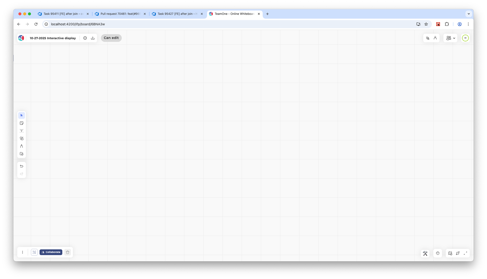

# First Post

This is the first post! Just to test out the system. 

# Headers

# Header 1

## Header 2

### Header 3

#### Header 4

##### Header 5

###### Header 6

# Lists

1. Ordered Item 1
2. Ordered Item 2

- Unordered Item 1
- Unordered Item 2
- Unordered Item 3

# Code

With proper syntax highlighting:

```html
<h1>Hello, World!</h1>
```

```css
body {
  background-color: red;
}
```

```typescript
const a = 1;
const b = 2;
const c = a + b;
console.log(c);
```

# Images



# Links

[Google](https://www.google.com)

This is a link that opens a new tab to <a target="_blank" href="https://www.google.com">Google</a>.

# Tables

| Name | Age | City |
|------|-----|------|
| John | 25  | New York |
| Jane | 30  | Los Angeles |
| Jim  | 35  | Chicago |

# Blockquotes

> Live, Love, Learn

# Inline Code

You are about to see an inline code example: `const a = 1;`.

# Bold

**Bold Text**

# Italic

_Italic Text_

# Math

## Inline Math
$\int_0^\infty x^2 dx$

## Block Math

$$
\int_0^\infty x^2 dx
$$


## 中文字

這裡會有中文字。

## ひらがな

ひらがな

## カタカナ

カタカナ

## 漢字

漢字

## Paragraph Text
> This text is AI-generated, just to test multi-line content.

In this digital age, we are surrounded by an overwhelming amount of information every day. From the moment we wake up and reach for our phones to the last message we read before falling asleep, technology has become deeply woven into the fabric of our lives. Yet, has this convenience also brought costs we have yet to fully recognize?

As we grow accustomed to instant messaging, social media, and endless content streams, do we still remember those quiet moments of reading a book, having face-to-face conversations with friends, or simply gazing out the window lost in thought? Perhaps true wisdom lies not in acquiring more information, but in learning to choose what truly deserves our attention.

Every choice is a trade-off, every click a decision. In this attention economy, our most precious resource is not money, but our time and focus. May we all find our own direction in this vast ocean of information.
