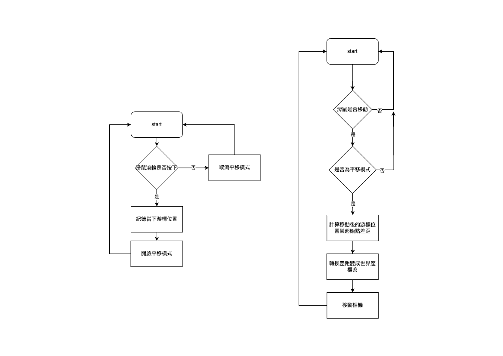
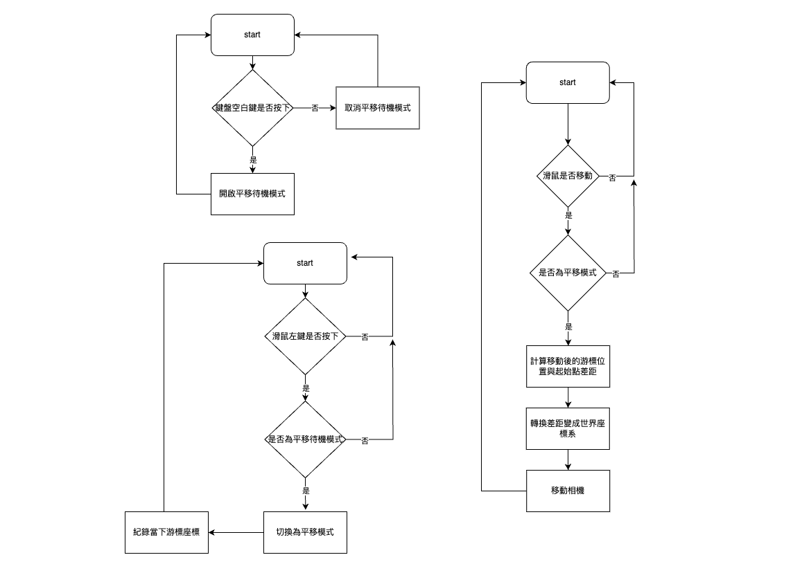

今天要來實作無限畫布三本柱之一：平移 (pan)

那我們廢話不多說，直接進入正題。

我們主要會支援三種使用者輸入方式：鍵盤滑鼠、觸控板、螢幕觸控（主要針對手機以及平板）

今天會專注在鍵盤滑鼠以及觸控板，螢幕觸控的部分會留到明天。

觸控板的部分因為我手邊只有 macbook，所以在這裡我只能夠針對 macbook 的觸控板作調整。(好像叫做巧控板)

如果有 windows 的讀者，可能要請你們幫我試試看，如果可以的話，跟大家回報觸控板的實作是不是如預期或是有需要做什麼調整，謝謝你們的幫忙！

我這邊會示範跟大部分無限畫布差不多的操作邏輯。

如果你有需要加入不一樣的操作邏輯，也歡迎留言或是補充其他的操作邏輯。

## 鍵盤滑鼠

如果你有使用過 Figma 的話，那你應該知道如果用鍵盤滑鼠操作，(1)按住滑鼠滾輪或是(2)按住空白鍵進入平移模式再加上滑鼠左鍵都可以平移整個畫布。

我們今天的目標就是會兩種都實作！

- 按住滑鼠滾輪 
- 按住空白鍵進入平移模式再加上滑鼠左鍵

這兩種模式運作的原理是差不多的：計算移動滑鼠前跟移動滑鼠後的游標在視窗上的距離差距，然後將這個差距轉換到世界座標系之後去等效平移畫布。

按住滑鼠滾輪的流程圖大概會長這個樣子



按住空白鍵後進入平移模式的流程圖大概會長這個樣子 



那我們開始實作吧！

### 按住滑鼠滾輪 

在 `src` 資料夾裡面先新增一個 `keyboard-mouse-input.ts` 檔案。

這個是我們要處理鍵盤滑鼠輸入的 class 會在的地方。

然後我們先建立一個 class：`KeyboardMouseInput`，然後給它一個空的 constructor。

`keyboardmouse-input.ts`
```typescript
class KeyboardMouseInput {
    constructor(){}
}
```

首先我們需要知道什麼時候滑鼠的滾輪按鈕被按下，這個很簡單，已經有一個 event listener 是為了這個存在的。

這邊有兩種 event 可以處理這個問題。 `pointerdown` 跟 `mousedown` 。

[`pointerdown` MDN](https://developer.mozilla.org/en-US/docs/Web/API/Element/pointerdown_event)

[`mousedown` MDN](https://developer.mozilla.org/en-US/docs/Web/API/Element/mousedown_event)

※：`pointerdown` 跟 `mousedown` 在這個應用場合兩種都可以就看你自己的偏好，如果使用 `pointerdown` 需要特別注意觸控也會觸發這種 event。

使用 `pointerdown` 需要用 `event.pointerType` 去過濾，只需要滑鼠的 event 即可。 [event.pointerType](https://developer.mozilla.org/en-US/docs/Web/API/PointerEvent/pointerType)

我這邊示範會使用 `pointerdown` 。

而要知道是不是滑鼠滾論觸發這個 event 可以用 `event.button` 這個 property。[event.button](https://developer.mozilla.org/en-US/docs/Web/API/MouseEvent/button)

`event.button` 如果是滾輪按鈕通常是 `1` 可能會有例外但是我們只能針對大多數的情況去做處理，如果有例外則是遇到再想辦法。

我們先在 `keyboard-mouse-input.ts` 裡面先寫好 event listener 的 callback 就好，先不用急著把它加到 canvas 上。

所以我們先新增一個 `pointerdownHandler`在 `KeyboardMouseInput` 類別裡面，然後檢查是滑鼠的滾輪觸發的，不是的話就不處理。

`keyboardmouse-input.ts`
```typescript
class KeyboardMouseInput{

    constructor(){}

    pointerdownHandler(event: PointerEvent): void {
        if(event.pointerType !== "mouse"){
            return;
        }
        if(event.button !== 1){
            return;
        }
    }

}
```

接下來我先講解一下實作背後的原理。

首先我們需要先記住按下滑鼠滾輪時的滑鼠座標。

這個座標是我們進入平移模式前的最後座標。

接下來我們需要有一個方式去記住我們的畫布已經切換為平移模式。

需要紀錄是否在平移模式的原因是：我們需要在滑鼠移動時 (`mousemove`或`pointermove`) 都要去紀錄滑鼠移動的座標。

但在不是平移模式時，移動滑鼠時我們並不需要去紀錄滑鼠移動的座標。

你可能會想為什麼不紀錄最初跟最後的座標然後直接計算之間的差距再去平移就好，中間的座標都需要去做計算嗎？

這邊就是使用者操作體驗的考量了，如果只紀錄最初（按下滑鼠滾輪）跟最終（鬆開滑鼠滾輪）的座標，中間使用者在移動的時候畫布都是不會有反應的。

然後在鬆開滑鼠滾輪的剎那，畫布會瞬間移動到最終位置，因此使用者必需要自己在腦海記住自己所有滑鼠移動的操作並且自己想像畫布目前可能在的位置。

很明顯，這會是一個很糟糕的體驗！

在 `pointermove` 的我們會紀錄滑鼠的座標，而紀錄滑鼠的座標時還需要先判斷目前是否是在平移模式中。

要達成這件事我們只需要簡單在 `KeyboardMouseInput` 類別中加上一個 `boolean` 的 flag， `isPanning`。 並且初始為 `false`

再來我們需要一個變數去紀錄每次平移的初始的滑鼠座標。在這裡命名為 `panStartPoint`，這裡會需要 import 向量計算時定義的 type `Point`。

`keyboardmouse-input.ts`
```typescript
import { Point } from "./vector";

class KeyboardMouseInput{

    private isPanning: boolean;
    private panStartPoint: Point;

    constructor(){
        this.isPanning = false;
        this.panStartPoint = {x: 0, y: 0};
    }

    pointerdownHandler(event: PointerEvent): void {
        if(event.pointerType !== "mouse"){
            return;
        }
        if(event.button !== 1){
            return;
        }
    }

}

```

接下來我們可以在 `pointerdownHandler` 裡面切換 `isDragging` 以及將當下滑鼠座標存在 `panStartPoint` 裡。

滑鼠的座標可以從 `pointerevent` 裡面的 `clientX` 以及 `clientY` 當中取得。

`keyboardmouse-input.ts`
```typescript
// 上略
class KeyboardMouseInput{

    private isPanning: boolean;
    private panStartPoint: Point;

    constructor(){
        this.isPanning = false;
        this.panStartPoint = {x: 0, y: 0};
    }

    pointerdownHandler(event: PointerEvent): void {
        if(event.pointerType !== "mouse"){
            return;
        }
        if(event.button !== 1){
            return;
        }
        this.isPanning = true;
        this.panStartPoint = {x: event.clientX, y: event.clientY};
    }

}

// 下略

```

之後我們可以開始實作 `pointermove` 的時候要紀錄所有在平移模式中滑鼠移動到哪裡的座標。

我這邊所說的紀錄所有並不是指我們需要把他們全部存在一個資料結構中，而是我們需要在滑鼠移動時去紀錄他停下來的座標，並且轉換平移畫布，讓畫布看起來是有在跟隨滑鼠移動。

我們加上 `pointermoveHandler` 在 `KeyboardMouseInput` 類別中。

我們只處理在平移模式中的滑鼠移動，因此需要加上判斷當下是否在平移模式。

`keyboardmouse-input.ts`
```typescript
// 上略
class KeyboardMouseInput{

    private isPanning: boolean;
    private panStartPoint: Point;

    constructor(){
        this.isPanning = false;
        this.panStartPoint = {x: 0, y: 0};
    }

    pointerdownHandler(event: PointerEvent): void {
        if(event.pointerType !== "mouse"){
            return;
        }
        if(event.button !== 1){
            return;
        }
        this.isPanning = true;
        this.panStartPoint = {x: event.clientX, y: event.clientY};
    }

    pointermoveHandler(event: PointerEvent): void {
        if(!this.isPanning){
            return;
        }
    }

}

// 下略

```

接下來我們需要去計算當下滑鼠座標跟剛切換成平移模式時滑鼠座標的差距。

這時候就需要使用我們在前面向量計算介紹到的向量之間的減法。

`vectorSubtraction(vectorA: Point, vectorB: Point): Point`

我們要先記得 import `vectorSubtraction`

`keyboardmouse-input.ts`
```typescript
import { Point, vectorSubtraction } from "./vector";


// 上略
class KeyboardMouseInput{

    private isPanning: boolean;
    private panStartPoint: Point;

    constructor(){
        this.isPanning = false;
        this.panStartPoint = {x: 0, y: 0};
    }

    pointerdownHandler(event: PointerEvent): void {
        if(event.pointerType !== "mouse"){
            return;
        }
        if(event.button !== 1){
            return;
        }
        this.isPanning = true;
        this.panStartPoint = {x: event.clientX, y: event.clientY};
    }

    pointermoveHandler(event: PointerEvent): void {
        if(!this.isPanning){
            return;
        }

        const curPosition = {x: event.clientX, y: event.clientY};
        const diff = vectorSubtraction(this.panStartPoint, curPosition);
    }

}

// 下略

```

接下來我們需要把這個差距轉換成平移畫布需要的向量。

這邊雖然不是座標系轉換但是概念十分相近。(其實本質上就是一樣的)

我們需要做的事情是根據目前相機的狀態（旋轉角度、縮放程度）去轉換差距。

這時候不需要考慮相機位置的原因是我們是計算兩個滑鼠座標點的差距，相機位置造成的偏移(offset)會在相減的時候抵銷掉。

這個在"視窗裡"的差距（也就是在相機視角中）在世界會是什麼。

跟座標系轉換一樣，我們需要根據相機的縮放程度去縮放這個差距向量的長度，以及根據相機的旋轉角度去旋轉這個差距向量。

我們可以使用昨天的轉換座標系，然後再去兩個座標的差距。

或是我們可以先找差距然後再轉換差距，這邊我會示範這個。

可以把之前的 `camera.ts` 類別再打開起來。

加入一個 function `transformVector2WorldSpace`。

`camera.ts`
```typescript

class Camera {
    // 上略 
    transformVector2WorldSpace(vector: Point): Point{
        return rotateVector(multiplyByScalar(vector, 1 / this._zoomLevel), this._rotation);
    }

    // 下略
}

```

我們需要轉換向量時我們會需要相機幫我們做這件事，因此我們需要在 `KeyboardMouseInput` 加入一個相機的參考。

並且讓初始化這個類別的外部使用者來傳入那個被控制的相機。

我們在 `KeyboardMouseInput` 類別裡面加入一個 camera 的變數。

並且在建構子裡面加入一個參數相機。

記得也要先 import 。

`keyboardmouse-input.ts`
```typescript
import { Camera } from "./camera";
// 上略
class KeyboardMouseInput{

    private isPanning: boolean;
    private panStartPoint: Point;
    private camera: Camera;

    constructor(camera: Camera){
        this.camera = camera;
        this.isPanning = false;
        this.panStartPoint = {x: 0, y: 0};
    }

    // 下略
}

// 下略

```

這樣我們就可以在 `KeyboardMouseInput` 裡面使用我們剛剛在 `Camera` 類別裡面加入的 `transformVector2WorldSpace`。

在 `pointermoveHandler` 函式裡面計算完 `diff` 之後使用相機將 `diff` 轉換成世界座標中的 `diffInWorld`。

這邊計算 `diff` 是用平移起始點去減掉目前滑鼠游標的位置，為什麼不是反過來：用現在的座標減掉初始點？因為我們在平移的時候，其實我們腦海中想像的操作是抓住底下的畫布然後移動，所以我們相機移動的方向應該要是我們操作的反方向。

`keyboardmouse-input.ts`
```typescript
// 上略
class KeyboardMouseInput{

    private isPanning: boolean;
    private panStartPoint: Point;
    private camera: Camera;

    constructor(camera: Camera){
        this.camera = camera;
        this.isPanning = false;
        this.panStartPoint = {x: 0, y: 0};
    }

    pointerdownHandler(event: PointerEvent): void {
        if(event.pointerType !== "mouse"){
            return;
        }
        if(event.button !== 1){
            return;
        }
        this.isPanning = true;
        this.panStartPoint = {x: event.clientX, y: event.clientY};
    }

    pointermoveHandler(event: PointerEvent): void {
        if(!this.isPanning){
            return;
        }

        const curPosition = {x: event.clientX, y: event.clientY};
        const diff = vectorSubtraction(this.panStartPoint, curPosition);
        const diffInWorld = this.camera.transformVector2WorldSpace(diff);
    }

}

// 下略

```

有了 `diffInWorld` 之後我們知道相機需要移動的距離了！

我們這邊先直接傳給 `camera` ，`Camera` 類別中有一個 function 是 `setPosition`。

但是我們有的是“差距”，而不是相機要移動到的目的地，所以我們需要新增一個 function 是 `setPositionBy`，來處理只有差距的情況。

在 `Camera.ts` 裡面 `Camera` 類別裡面加上 `setPositionBy` 這個 function。

`camera.ts`
```typescript
// 上略
class Camera {
    private _position: Point;
    private _zoomLevel: number;
    private _rotation: number;
    
    setPosition(destination: Point){
        this._position = destination;
    }

    // 加在這裏
    setPositionBy(offset: Point){
        const destination = vectorAddition(this._position, offset);
        this.setPosition(destination);
    }
    
    setZoomLevel(targetZoom: number){
        this._zoomLevel = targetZoom;
    }
    
    setRotation(rotation: number){
        this._rotation = rotation;
    }

    transformVector2WorldSpace(vector: Point): Point{
        return rotateVector(multiplyByScalar(vector, this._zoomLevel), this._rotation); // 跟示意圖一樣要經過旋轉跟延長或縮短向量來達成轉換。
    }
}

```

然後我們就可以在 `pointermoveHandler` 裡面把移動相機的邏輯加進去。

`keyboardmouse-input.ts`
```typescript

// 上略
class KeyboardMouseInput{

    private isPanning: boolean;
    private panStartPoint: Point;
    private camera: Camera;

    constructor(camera: Camera){
        this.camera = camera;
        this.isPanning = false;
        this.panStartPoint = {x: 0, y: 0};
    }

    pointerdownHandler(event: PointerEvent): void {
        if(event.pointerType !== "mouse"){
            return;
        }
        if(event.button !== 1){
            return;
        }
        this.isPanning = true;
        this.panStartPoint = {x: event.clientX, y: event.clientY};
    }

    pointermoveHandler(event: PointerEvent): void {
        if(!this.isPanning){
            return;
        }

        const curPosition = {x: event.clientX, y: event.clientY};
        const diff = vectorSubtraction(this.panStartPoint, curPosition);
        const diffInWorld = this.camera.transformVector2WorldSpace(diff);

        // 在這裡移動相機
        this.camera.setPositionBy(diffInWorld);
    }

}

// 下略

```

移動完相機之後，我們需要把 `panStartPoint` 也移動到當下的滑鼠的位置。

需要這麼做是因為目前滑鼠移動的距離，我們已經等效將相機也移動了。

如果我們沒有更新平移起始點的位置，下次計算平移差距時，會把之前的平移也都疊加進來。

所以我們在 `this.camera.setPositionBy(diffInWorld)` 這行之後再加上

```typescript
this.panStartPoint = {x: event.clientX, y: event.clientY};
```

`keyboardmouse-input.ts`
```typescript

class KeyboardMouseInput{

    // 上略
    pointermoveHandler(event: PointerEvent): void {
        if(!this.isPanning){
            return;
        }

        const curPosition = {x: event.clientX, y: event.clientY};
        const diff = vectorSubtraction(this.panStartPoint, curPosition);
        const diffInWorld = this.camera.transformVector2WorldSpace(diff);

        this.camera.setPositionBy(diffInWorld);

        // 移動完相機後需要更新 panStartPoint 
        this.panStartPoint = {x: event.clientX, y: event.clientY};
    }
    // 下略
}

```

`pointermoveHandler` 完成後我們基本上就完成讓畫布隨著滑鼠移動的功能。

但是！我們缺少一個很重要的，我們要怎麼告訴畫布 “就是這裡了，你停在這裡！”。

通常都是在放開滑鼠滾輪的那一刻，畫布就不會再繼續跟著滑鼠移動了。

所以我們還缺一個 `pointerupHandler`，來告訴畫布該停止平移的時機！

`keyboardmouse-input.ts`
```typescript

// 上略
class KeyboardMouseInput{

    private isPanning: boolean;
    private panStartPoint: Point;
    private camera: Camera;

    constructor(camera: Camera){
        this.camera = camera;
        this.isPanning = false;
        this.panStartPoint = {x: 0, y: 0};
    }

    pointerdownHandler(event: PointerEvent): void {
        if(event.pointerType !== "mouse"){
            return;
        }
        if(event.button !== 1){
            return;
        }
        this.isPanning = true;
        this.panStartPoint = {x: event.clientX, y: event.clientY};
    }

    pointermoveHandler(event: PointerEvent): void {
        if(!this.isPanning){
            return;
        }

        const curPosition = {x: event.clientX, y: event.clientY};
        const diff = vectorSubtraction(curPosition, this.panStartPoint);
        const diffInWorld = this.camera.transformVector2WorldSpace(diff);

        this.camera.setPositionBy(diffInWorld);

        this.panStartPoint = {x: event.clientX, y: event.clientY};
    }

    pointerupHandler(event: PointerEvent): void {

    }

}

// 下略

```

跟前面 `pointerdownHandler` 一樣，我們需要檢查放開的是否為滑鼠的滾輪。

另外，我們還需要額外檢查的是，目前是否在 `isPanning` 這樣才能夠確定我們確實在平移模式，並且我們接下來想要做的事情才會有意義（解除平移模式）

`keyboardmouse-input.ts`
```typescript

// 上略
class KeyboardMouseInput{

    private isPanning: boolean;
    private panStartPoint: Point;
    private camera: Camera;

    constructor(camera: Camera){
        this.camera = camera;
        this.isPanning = false;
        this.panStartPoint = {x: 0, y: 0};
    }

    pointerdownHandler(event: PointerEvent): void {
        if(event.pointerType !== "mouse"){
            return;
        }
        if(event.button !== 1){
            return;
        }
        this.isPanning = true;
        this.panStartPoint = {x: event.clientX, y: event.clientY};
    }

    pointermoveHandler(event: PointerEvent): void {
        if(!this.isPanning){
            return;
        }

        const curPosition = {x: event.clientX, y: event.clientY};
        const diff = vectorSubtraction(this.panStartPoint, curPosition);
        const diffInWorld = this.camera.transformVector2WorldSpace(diff);

        // 在這裡移動相機
        this.camera.setPositionBy(diffInWorld);
    }

    pointerupHandler(event: PointerEvent): void {
        if(!this.isPanning){
            return;
        }
        if(event.pointerType !== "mouse"){
            return;
        }
        if(event.button !== 1){
            return;
        }
        this.isPanning = false;
    }

}

// 下略

```

另外當滑鼠離開 canvas 範圍時，我們也需要把平移模式解除。

當然你也可以有不同的行為，有些人會希望就算移開了還是保留平移模式，這邊我會一律做離開就解除的邏輯會比較不那麼複雜。

所以我們這邊就需要 `pointerleave` 這個 event 的 listener

`keyboardmouse-input.ts`
```typescript
// 上略
class KeyboardMouseInput{

    // 上略
    
    pointerleaveHandler(event: PointerEvent){
        this.isPanning = false;
    }
    
    // 下略
}

// 下略

```

到這裡 `KeyboardMouseInput` 的平移邏輯大致上就完成了。

記得最後把 `KeyboardMouseInput` export 出來。

`keyboardmouse-input.ts`
```typescript
export { KeyboardMouseInput };
```

我們到 `main.ts` 把這個東西加上去吧！

`main.ts` 的位置在專案的 root directory 裡面。

之前 Day 07 跟 Day 08 都有稍微提到，我們要接著前面的東西繼續實作下去。

接下來我們就要建立一個 `KeyboardMouseInput` 的實例，把 Day 08 的 `camera` 實例當作參數傳進去給 `KeyboardMouseInput`

`main.ts`
```typescript
import { KeyboardMouseInput } from "./src/keyboardmouse-input";
// 上略
const camera = new Camera();
const keyboardMouseInput = new KeyboardMouseInput(camera); // 加在這裡
// 下略
```

有了這個 `keyboardMouseInput` 之後我們可以把 event listener 都建立起來了。

`main.ts`
```typescript
canvas.addEventListener("pointerdown", keyboardMouseInput.pointerdownHandler);
canvas.addEventListener("pointermove", keyboardMouseInput.pointermoveHandler);
canvas.addEventListener("pointerup", keyboardMouseInput.pointerupHandler);
canvas.addEventListener("pointerleave", keyboardMouseInput.pointerleaveHandler);
```

這時候如果你在瀏覽器測試應該會發現平移根本沒有作用，怎麼會這樣？

因為這個系列並不是 JavaScript 的教學，所以我不會很深入的探討這個錯誤背後的原因。

簡單來說，就是此 this 非彼 this。

在 `pointerdownHandler`、`pointermoveHandler` 跟 `pointerupHandler` 傳給 `addEventListener` 之後他們 function 裡面 this 指的東西便不再是他們所在的 `keyboardMouseInput` 這個實例了。

解決的辦法很簡單，我們會需要 `bind` 就是把這些 function 的 this 指到 `keyboardMouseInput` 就好。

我們可以在 `KeyboardMouseInput` 的建構子裡面做這件事，或是在傳進去 `addEventlistener` 的時候做。

這裡我選擇在 `KeyboardMouseInput` 這個類別裡面做。

`keyboardmouse-input.ts`
```typescript
class KeyboardMouseInput {
// 上略
    constructor(camera: Camera){
        this.camera = camera;
        this.isPanning = false;
        this.panStartPoint = {x: 0, y: 0};
        this.pointerdownHandler = this.pointerdownHandler.bind(this);
        this.pointermoveHandler = this.pointermoveHandler.bind(this);
        this.pointerupHandler = this.pointerupHandler.bind(this);
        this.pointerleaveHandler = this.pointerleaveHandler.bind(this);
    }
// 下略
}

```

如果你有滑鼠的話應該就可以直接測試了，按下滑鼠滾輪之後移動滑鼠會讓 canvas 裡面的座標系跟原點開始移動。

要記得跑 Day 07 提到的 dev server。用 `npm run dev` 這個指令。

### 按住空白鍵進入平移模式再加上滑鼠左鍵

接下來我們要來實作另外一種平移操作。

這個操作其實跟上面按住滑鼠滾輪很類似，只是我們要把判斷條件新增一個可能，就是當按下滑鼠左鍵時如果空白鍵是按下的，也會觸發平移模式。

我們先處理空白鍵的部分。

其實跟滑鼠按鈕類似，我們需要另外兩個 event listener：`keypressHandler` 以及 `keyupHandler`

然後還有一個 `spacebarPressed` 的 boolean flag。

`keyboardmouse-input.ts`
```typescript
class KeyboardMouseInput {
// 上略
    
    // 新增的變數，去紀錄空白鍵有沒有被按下；等於是檢查是否進入平移待機模式
    private spacebarPressed: boolean;

    constructor(camera: Camera){
        this.camera = camera;
        this.isPanning = false;
        this.spacebarPressed = false; // 在這裡初始化
        this.panStartPoint = {x: 0, y: 0};
        this.pointerdownHandler = this.pointerdownHandler.bind(this);
        this.pointermoveHandler = this.pointermoveHandler.bind(this);
        this.pointerupHandler = this.pointerupHandler.bind(this);
        this.pointerleaveHandler = this.pointerleaveHandler.bind(this);
    }
// 下略
}

```

`keyboardmouse-input.ts`
```typescript
class KeyboardMouseInput {
// 上略
    keydownHandler(event: KeyboardEvent){
        if(event.key === " "){
            this.spacebarPressed = true;
        }
    }

    keyupHandler(event: KeyboardEvent){
        if(event.key === " "){
            this.spacebarPressed = false;
            this.isPanning = false; // 因為空白鍵是平移模式的必要條件，所以我們可以直接跳脫平移模式；不過這樣就會造成如果我們是按滑鼠滾輪與空白鍵進入平移模式的，如果我們把空白鍵放開，平移模式就會取消，就算滑鼠滾輪還是按著的，這邊就跟 figma 不太一樣，大家可以自己調整自己想要的邏輯！
        }
    }
// 下略
}

```

記得也要把這兩個 event listener 都使用 `bind` 

`keyboardmouse-input.ts`
```typescript
class KeyboardMouseInput {
// 上略
    constructor(camera: Camera){
        this.camera = camera;
        this.isPanning = false;
        this.spacebarPressed = false;
        this.panStartPoint = {x: 0, y: 0};
        this.pointerdownHandler = this.pointerdownHandler.bind(this);
        this.pointermoveHandler = this.pointermoveHandler.bind(this);
        this.pointerupHandler = this.pointerupHandler.bind(this);
        this.pointerleaveHandler = this.pointerleaveHandler.bind(this);
        this.keydownHandler = this.keydownHandler.bind(this); // 新增的兩個 listener
        this.keyupHandler = this.keyupHandler.bind(this); // 新增的兩個 listener
    }
// 下略
}

```

接下來我們要在 `pointerdownHandler` 跟 `pointerupHandler` 裡面多加一些判斷。

需要加上滑鼠左鍵加上空白鍵的組合檢查，不過其實現在這個判斷式會讓空白鍵加上滑鼠滾輪也切換成平移模式，這個行為與 Figma 是一樣的。還算是符合操作體驗所以暫時不會改動。

`keyboardmouse-input.ts`
```typescript

// 上略
class KeyboardMouseInput{
    
    // 上略
    pointerdownHandler(event: PointerEvent): void {
        
        if(event.pointerType !== "mouse"){
            return;
        }
        // 這裡要加上當滑鼠左鍵按下時也算是可以觸發平移模式
        if(event.button !== 0 && event.button!== 1){
            return;
        }
        // 需要加上滑鼠左鍵加上空白鍵的組合檢查，不過其實這個檢查會讓空白鍵加上滑鼠滾輪也切換成平移模式，這個行為與 Figma 是一樣的。還算是符合操作體驗所以暫時不會改動。
        if(event.button === 0 && !this.spacebarPressed){
            return;
        }
        this.isPanning = true;
        this.panStartPoint = {x: event.clientX, y: event.clientY};
    }

    pointerupHandler(event: PointerEvent): void {
        if(!this.isPanning){
            return;
        }
        if(event.pointerType !== "mouse"){
            return;
        }
        // 在這裡加上滑鼠左鍵的條件
        if(event.button !== 1 && event.button !== 0){
            return;
        }
        if(event.button === 0 && !this.spacebarPressed){
            return;
        }
        this.isPanning = false;
    }

    // 下略

}

// 下略

```

大致上 `KeyboardMouseInput` 在平移方面的功能就完成了。

我們要記得把 `keydownHandler` 以及 `keyupHandler` 加進去 window 的 event listener

要注意是 `window` 的 event listener 不是 `canvas` 的 不然會偵測不到！

在 `main.ts` 裡面，跟前面加上 pointer event 一樣的地方。

`main.ts`
```typescript
canvas.addEventListener("pointerdown", keyboardMouseInput.pointerdownHandler);
canvas.addEventListener("pointermove", keyboardMouseInput.pointermoveHandler);
canvas.addEventListener("pointerup", keyboardMouseInput.pointerupHandler);
window.addEventListener("keydown", keyboardMouseInput.keydownHandler);
window.addEventListener("keyup", keyboardMouseInput.keyupHandler);
```

## 觸控板

前面講解滑鼠鍵盤組合的操作就花這麼多篇幅了（汗

因為我手邊還沒有 windows 筆電可以測試，所以目前以下的內容會是針對 macbook 上面的操作為主。

日後我如果能夠在 windows 筆電上面測試，有需要調整的地方的話，我會再上來改。

觸控板的平移我們需要借助 `wheel event`。 [wheel event MDN 文件](https://developer.mozilla.org/en-US/docs/Web/API/WheelEvent)

在 macbook 上如果你以兩隻手指頭去做平移的操作，會觸發瀏覽器的 `wheel event`。

這個 event 使用滑鼠滾輪同樣也會被觸發。因此如果同時使用滑鼠滾輪也會導致我們判斷平移操作發生，至於要怎麼去防止或是最佳化操作體驗，我會留到後面再討論。

因為使用觸控板去做縮放的操作也同樣是觸發 `wheel event`，不過跟雙指平移會有一個不同， "pinch"（捏？） 這個動作還會外帶一個 `event.ctrlKey` 為 `true`。

我們可以使用這個屬性去判斷現在是平移還是縮放的操作。

來開始實作吧！

我們先在 `KeyboardMouseInput` class 裡加上一個新的 event handler，先稱之為 `wheelHandler`。

`keyboardmouse-input.ts`
```typescript
class KeyboardMouseInput {
    // 上略

    wheelHandler(event: WheelEvent){

    }

    // 下略
}
```

再加上一個 `event.preventDefault` 因為當手指由左往右滑時，很容易會觸發瀏覽器的“回上一頁”這個動作。

`keyboardmouse-input.ts`
```typescript
class KeyboardMouseInput {
    // 上略

    wheelHandler(event: WheelEvent){
        event.preventDefault();
    }

    // 下略
}
```
我們需要先簡單篩選 `event.ctrlKey` 是 `true` 的 `event`，這個是要留給縮放操作的。

`keyboardmouse-input.ts`
```typescript
class KeyboardMouseInput {
    // 上略

    wheelHandler(event: WheelEvent){
        event.preventDefault();
        if(event.ctrlKey){
            // 這邊是要留給縮放的操作
        }
    }

    // 下略
}
```

接下來我們就只需要照著流程圖去實作即可。

因為 `wheel event` 會自己攜帶 `deltaX` 以及 `deltaY` 這兩個 properties ，我們不需要像滑鼠鍵盤那樣去紀錄平移起始點。

我們可以直接用 `deltaX` 以及 `deltaY` 當作我們平移的差距，不過在使用這兩個 properties 之前還是需要先經過轉換。

`keyboardmouse-input.ts`
```typescript
class KeyboardMouseInput {
    // 上略

    wheelHandler(event: WheelEvent){
        event.preventDefault();
        if(event.ctrlKey){
            // 縮放操作
        } else {
            // 平移操作
            const diff = {x: event.deltaX, y: event.deltaY};
            const diffInWorld = this.camera.transformVector2WorldSpace(diff);
        }
    }

    // 下略
}
```

接下來把 `diffInWorld` 傳給 `camera` 讓它知道要平移多少。

`keyboardmouse-input.ts`
```typescript
class KeyboardMouseInput {
    // 上略

    wheelHandler(event: WheelEvent){
        event.preventDefault();
        if(event.ctrlKey){
            // 縮放操作
        } else {
            // 平移操作
            const diff = {x: event.deltaX, y: event.deltaY};
            const diffInWorld = this.camera.transformVector2WorldSpace(diff);
            this.camera.setPositionBy(diffInWorld);
        }
    }

    // 下略
}
```

就是這麼簡單！

記得也要在 `constructor` 裡面 `bind`

`keyboardmouse-input.ts`
```typescript
class KeyboardMouseInput {
    // 上略

    // 上略
    constructor(camera: Camera){
        this.camera = camera;
        this.isPanning = false;
        this.spacebarPressed = false;
        this.panStartPoint = {x: 0, y: 0};
        this.pointerdownHandler = this.pointerdownHandler.bind(this);
        this.pointermoveHandler = this.pointermoveHandler.bind(this);
        this.pointerupHandler = this.pointerupHandler.bind(this);
        this.keydownHandler = this.keydownHandler.bind(this);
        this.keyupHandler = this.keyupHandler.bind(this);
        this.wheelHandler = this.wheelHandler.bind(this);
    }
// 下略
}
```

接下來再到 `main.ts` 裡面把 event listener 加進去就好

`main.ts`
```typescript
canvas.addEventListener("wheel", keyboardMouseInput.wheelHandler);
```

今天篇幅很長，辛苦大家了！

可以先去試試看平移的功能是否如你預期的樣子運作！

今天的進度在[這裡](https://github.com/niuee/infinite-canvas-tutorial/tree/Day10)

我們明天見～

