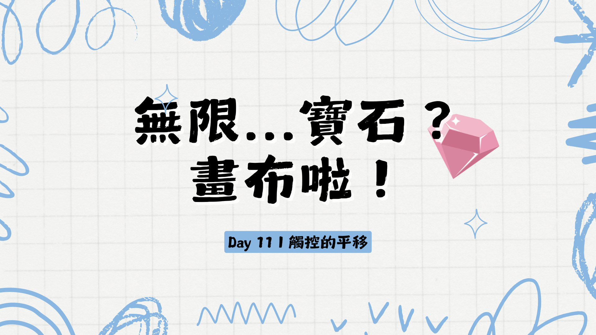

今天我們要接續實作平移，主要是觸控的部分。

我會示範一種觸控平移的操作：一隻手指頭滑動。

這個會是比較簡單但是可以示範基本的觸控操作可以怎麼實作的範例。

之後如果你想要有其他變化的話可以再從這個基礎往後延伸。

觸控主要會有幾個 event 是我們會需要用到的： `touchstart`、`touchend`、`touchcancel`、以及`touchmove`。

實作邏輯也是跟滑鼠鍵盤還有觸控板類似。

就是需要紀錄一個平移開始的起始點，以及手指滑動到的終點，然後去計算他們之間的差距，並且將相機平移。

首先我們先在 `src` 裡面建立一個新的檔案 `touch-input.ts` 。

然後加入一個新的 class `TouchInput`。並且給他一個空的 constructor。

`touch-input.ts`
```typescript
class TouchInput {
    
    constructor(){

    }
}
```

我們也是先實作 `touchstart` event 的 handler，去啟動我們平移的流程。

`touch-input.ts`
```typescript
class TouchInput {

    // 上略
    touchstartHandler(event: TouchEvent){

    }
    // 下略
}
```

在平移的時候，我們的操作邏輯是一隻手指頭按住移動。因此我們只需要處理一隻手指頭的 event ，兩隻手指頭或以上的 event 會留給縮放以及其他操作。

我們先篩選只需要 1 個觸控點的 event。

`touch-input.ts`
```typescript
class TouchInput {

    // 上略
    touchstartHandler(event: TouchEvent){
        if(event.targetTouches.length == 1){
            
        }
    }
    // 下略
}
```

接下來，我們跟滑鼠鍵盤一樣需要紀錄一開始點下的位置。

我們需要一個 instance variable `panStartPoint`。

還有另外一個 instance variable `isPanning` 去紀錄是否是在平移模式中。

一樣要先記得從 `./vector` import `Point` 這個 type 。

`touch-input.ts`
```typescript
import { Point } from "./vector";

class TouchInput {

    private panStartPoint: Point;
    private isPanning: boolean;

    constructor(){
        this.panStartPoint = {x: 0, y: 0};
        this.isPanning = false;
    }

    touchstartHandler(event: TouchEvent){
        if(event.targetTouches.length == 1){
            this.panStartPoint = {x: event.targetTouches[0].clientX, y: event.targetTouches[0].clientY};
            this.isPanning = true;
        }
    }
}
```

接下來我們也是要跟 `KeyboardMouseInput` 一樣的流程，當手指開始移動時 `touchmove` 這個 event 會被觸發。

因此我們在 `TouchInput` 加上一個 `touchmoveHandler`。

因為手指滑動也很容易觸發重新整理或是上一頁的動作，所以我們也要加上 `event.preventDefault()`

`touch-input.ts`
```typescript
class TouchInput {
    
    // 上略

    touchmoveHandler(event: TouchEvent) {
        event.preventDefault();
    }

    // 下略

}
```

一樣也是要檢查有幾個觸控點，外加上 `isPanning` 這個 instance variable 是否為 `true`。

`touch-input.ts`
```typescript
class TouchInput {
    
    // 上略

    touchmoveHandler(event: TouchEvent) {
        event.preventDefault();
        if(this.isPanning && event.targetTouches.length == 1){
            
        }
    }

    // 下略

}
```

接下來我們需要計算手指現在的位置跟平移起始點的差距。

記得要把向量相減計算的 function import 進來。

`touch-input.ts`
```typescript
import { Point, vectorSubtraction } from "./vector";

class TouchInput {
    
    // 上略

    touchmoveHandler(event: TouchEvent) {
        event.preventDefault();
        if(this.isPanning && event.targetTouches.length == 1){
            const curTouchPoint = {x: event.targetTouches[0].clientX, y: event.targetTouches[0].clientY};
            const diff = vectorSubtraction(this.panStartPoint, curTouchPoint);
        }
    }

    // 下略

}
```

然後把這個差距進行座標系的轉換，這時我們也要仰賴 `Camera` 這個類別裡面的 `transformVector2WorldSpace`。

所以我們也需要一個 `camera` 在 `TouchInput` 裡面。

記得要從 `camera.ts` import `Camera`。

`touch-input.ts`
```typescript
import { Camera } from "./camera";

class TouchInput {

    // 略

    private camera: Camera;

    // 略

    constructor(camera: Camera) {
        this.camera = camera;
        this.panStartPoint = {x: 0, y: 0};
        this.isPanning = false;
    }

    //略
}
```

然後我們可以在 `touchmoveHandler` 裡面去做座標系轉換。

`touch-input.ts`
```typescript
class TouchInput {
    
    // 上略

    touchmoveHandler(event: TouchEvent) {
        event.preventDefault();
        if(this.isPanning && event.targetTouches.length == 1){
            const curTouchPoint = {x: event.targetTouches[0].clientX, y: event.targetTouches[0].clientY};
            const diff = vectorSubtraction(this.panStartPoint, curTouchPoint);
            const diffInWorld = this.camera.transformVector2WorldSpace(diff);
        }
    }

    // 下略

}
```

接下來跟 `KeyboardMouseInput` 也都一樣，我們需要移動相機然後紀錄新的平移起始點。

`touch-input.ts`
```typescript
class TouchInput {
    
    // 上略

    touchmoveHandler(event: TouchEvent) {
        event.preventDefault();
        if(this.isPanning && event.targetTouches.length == 1){
            const curTouchPoint = {x: event.targetTouches[0].clientX, y: event.targetTouches[0].clientY};
            const diff = vectorSubtraction(this.panStartPoint, curTouchPoint);
            const diffInWorld = this.camera.transformVector2WorldSpace(diff);
            this.camera.setPositionBy(diffInWorld);
            this.panStartPoint = curTouchPoint;
        }
    }

    // 下略

}
```

剩下的就是當手指離開螢幕後，我們需要取消平移模式。

這裡有兩個 event 是我們需要注意的：`touchcancel` 以及 `touchend`

我這邊不會詳細解釋這兩個 event 有什麼差別，如果有興趣的讀者可以延伸閱讀。

[touchcancel MDN](https://developer.mozilla.org/en-US/docs/Web/API/Element/touchcancel_event)
[touchend MDN](https://developer.mozilla.org/en-US/docs/Web/API/Element/touchend_event)

我們在 `TouchInput` 裡面加上這兩個 event 的 Handler。

`touch-input.ts`
```typescript
class TouchInput {
    // 上略

    touchendHandler(event: TouchEvent) {

    }

    touchcancelHandler(event: TouchEvent) {

    }

    // 下略
}
```

這兩個 Handler 我們只需要做把 `isPanning` 設為 `false` 即可。

因為我們是手指處碰到螢幕就開始平移了，這個可能不一定是最理想的狀態，有可能你會想要有一個按鈕，按下去才會是平移模式。

那你只需要在外面再加一層用按鈕 toggle 的 flag 然後那個 flag 是 `true` 的狀態的時候才有後面這些東西就好。

在這個系列裡我會先以目前這樣的操作邏輯為主，如果你有需要我補充示範如何把切換平移模式的邏輯移到別的地方的話再跟我說。我再另外補充。

`touch-input.ts`
```typescript
class TouchInput {
    // 上略

    touchendHandler(event: TouchEvent) {
        this.isPanning = false;
    }

    touchcancelHandler(event: TouchEvent) {
        this.isPanning = false;
    }

    // 下略
}
```

到這邊觸控的平移大致上就完成了！

不過還有一些些東西需要處理主要就是 `bind` 跟 export 這個 `TouchInput` 類別。

`touch-input.ts`
```typescript
class TouchInput {
    // 上略

    constructor(camera: Camera) {
        this.camera = camera;
        this.panStartPoint = {x: 0, y: 0};
        this.isPanning = false;
        this.touchstartHandler = this.touchstartHandler.bind(this);
        this.touchmoveHandler = this.touchmoveHandler.bind(this);
        this.touchendHandler = this.touchendHandler.bind(this);
        this.touchcancelHandler = this.touchcancelHandler.bind(this);
    }

    // 下略
}
```

`touch-input.ts`
```typescript
export { TouchInput };
```

接下來是要在 `main.ts` 加入觸控的邏輯。

先來 import `TouchInput` 以及建立一個實例。

記得要傳 `camera` 進去 `TouchInput` 的建構子裡面～

`main.ts`
```typescript
import { TouchInput } from "./src/touch-input";

const touchInput = new TouchInput(camera);
```

然後就可以把 event listener 掛到 canvas 上了。

`main.ts`
```typescript
canvas.addEventListener("touchstart", touchInput.touchstartHandler);
canvas.addEventListener("touchmove", touchInput.touchmoveHandler);
canvas.addEventListener("touchend", touchInput.touchendHandler);
canvas.addEventListener("touchcancel", touchInput.touchcancelHandler);
```

另外因為沒有 `touchleave` 這種 event 所以觸控的手指移開 canvas 還是會延續觸控模式，如果要處理這部分的邏輯需要自己再另外想。我這邊就先留白，因為目前我還沒有這個需求，如果哪天我實作出來再來跟大家更新。

這樣就完成平移的所有操作邏輯了。

恭喜你！這算是這個系列的一個里程碑！

接下來我會示範一些平移相關的進階實作，主要是限制相機可以平移到的目的地以及限制的模式。

啊對了，如果你想要測試觸控的平移你可以用你的手機或是平板，跟你的電腦連到同一個 wifi 然後再看看你電腦的 IP 位置是多少，通常會很像是 "192.168.0.110" 之類的一串數字。

應該可以去電腦的設定 -> wifi 然後看你現在連到的網路的細節裡面可以找到 IP。

然後在跑 vite 的時候可以給他 `--host` 這個 flag 給它，或是在 `vite.config.js` 裡面給 `server.host` 設定 `true` 或是 `0.0.0.0` [詳細說明](https://vitejs.dev/config/server-options)

假設 IP 真的是 "192.168.0.110"，用你的手機或平板的瀏覽器在網址欄打下 "192.168.0.110:5173"。（記得是要用你的 port 不一定是 5173）

不過這邊有一個坑，就是如果是你用 iPhone 的話，因為 webkit 對 `context.reset` 的實作跟 chrome 還有 firefox 不太一樣，它並不會清空畫布，所以用手機可能會看起來怪怪的。

這個之後的實作會處理到，我們會用 `clearRect` 來清空畫布。

今天的進度在[這裡](https://github.com/niuee/infinite-canvas-tutorial/tree/Day11)

那我們明天見！


