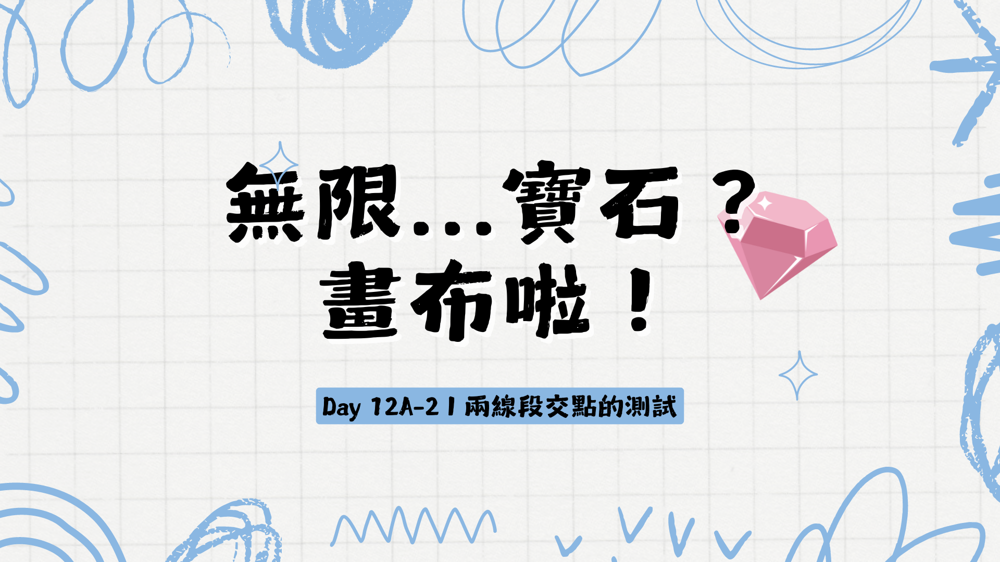

因為我需要從頭解釋這個中間的原理，所以我們才沒有先寫測試。

因為真的塞不太下進去同一篇文章，所以我把 `getLineSegmentIntersection` 的測試相關的測資放在這裡。

在 `test` 資料夾裡面新增一個 `vector.test.ts` 檔案。

接下來可以把不同的測資放進去，目前我就先直接貼全部，我有在每個測試的標題寫下一些描述，如果有不懂的地方，再跟我說我再補充。

`vector.test.ts`
```typescript
import { getLineSegmentIntersection } from '../src/vector';
import { expect, test, describe } from 'vitest';

describe("linear intersection of two line segments", ()=>{
    test("two line segments parallel to each other but not of the same linear equation", ()=>{
        const startPoint = {x: 0, y: 0};
        const endPoint = {x: 1, y: 1};

        const startPoint2 = {x: 0, y: 1};
        const endPoint2 = {x: 1, y: 2};

        const result = getLineSegmentIntersection(startPoint, endPoint, startPoint2, endPoint2);
        expect(result.intersects).toBe(false);
    });

    test("two line segments with the same linear equation and connects at the end of the first segment and the start of the second segment", ()=>{
        const startPoint = {x: 0, y: 0};
        const endPoint = {x: 1, y: 1};

        const startPoint2 = {x: 1, y: 1};
        const endPoint2 = {x: 2, y: 2};

        const result = getLineSegmentIntersection(startPoint, endPoint, startPoint2, endPoint2);
        expect(result.intersects).toBe(true);
        if(result.intersects){
            expect(result.intersections.intersectionType).toBe("point");
        }
        if(result.intersects && result.intersections.intersectionType === "point"){
            expect(result.intersections.intersectionType).toBe("point");
            expect(result.intersections.intersectionPoint).toEqual({x: 1, y: 1});
            expect(result.intersections.ratio).toBe(1);
        }
        
    });

    test("two line segments with the same linear equation and connects at the end of the first segment and the end of the second segment", ()=>{
        const startPoint = {x: 0, y: 0};
        const endPoint = {x: 1, y: 1};

        const startPoint2 = {x: 2, y: 2};
        const endPoint2 = {x: 1, y: 1};

        const result = getLineSegmentIntersection(startPoint, endPoint, startPoint2, endPoint2);
        expect(result.intersects).toBe(true);
        if(result.intersects){
            expect(result.intersections.intersectionType).toBe("point");
        }
        if(result.intersects && result.intersections.intersectionType === "point"){
            expect(result.intersections.intersectionType).toBe("point");
            expect(result.intersections.intersectionPoint).toEqual({x: 1, y: 1});
            expect(result.intersections.ratio).toBe(1);
        }
        
    });
    
    test("two line segments with the same linear equation and connects at the start of the first segment and the start of the second segment", ()=>{
        const startPoint = {x: 0, y: 0};
        const endPoint = {x: 1, y: 1};

        const startPoint2 = {x: 0, y: 0};
        const endPoint2 = {x: -1, y: -1};

        const result = getLineSegmentIntersection(startPoint, endPoint, startPoint2, endPoint2);
        expect(result.intersects).toBe(true);
        if(result.intersects){
            expect(result.intersections.intersectionType).toBe("point");
        }
        if(result.intersects && result.intersections.intersectionType === "point"){
            expect(result.intersections.intersectionType).toBe("point");
            expect(result.intersections.intersectionPoint).toEqual({x: 0, y: 0});
            expect(result.intersections.ratio).toBe(0);
        }
        
    });

    test("two line segments with the same linear equation and connects at the start of the first segment and the end of the second segment", ()=>{
        const startPoint = {x: 0, y: 0};
        const endPoint = {x: 1, y: 1};

        const startPoint2 = {x: -1, y: -1};
        const endPoint2 = {x: 0, y: 0};

        const result = getLineSegmentIntersection(startPoint, endPoint, startPoint2, endPoint2);
        expect(result.intersects).toBe(true);
        if(result.intersects){
            expect(result.intersections.intersectionType).toBe("point");
        }
        if(result.intersects && result.intersections.intersectionType === "point"){
            expect(result.intersections.intersectionType).toBe("point");
            expect(result.intersections.intersectionPoint).toEqual({x: 0, y: 0});
            expect(result.intersections.ratio).toBe(0);
        }
        
    });

    test("two line segments with the same linear equation and the first segment completely include the entire second segment", ()=>{
        const startPoint = {x: 0, y: 0};
        const endPoint = {x: 5, y: 5};

        const startPoint2 = {x: 1, y: 1};
        const endPoint2 = {x: 3, y: 3};

        const result = getLineSegmentIntersection(startPoint, endPoint, startPoint2, endPoint2);
        expect(result.intersects).toBe(true);
        if(result.intersects){
            expect(result.intersections.intersectionType).toBe("interval");
        }
        if(result.intersects && result.intersections.intersectionType === "interval"){
            expect(result.intersections.intersectionType).toBe("interval");
            expect(result.intersections.intervalStartPoint.x).toBeCloseTo(1);
            expect(result.intersections.intervalStartPoint.y).toBeCloseTo(1);
            expect(result.intersections.intervalEndPoint.x).toBeCloseTo(3);
            expect(result.intersections.intervalEndPoint.y).toBeCloseTo(3);
            expect(result.intersections.startRatio).toBe(0.2);
            expect(result.intersections.endRatio).toBe(0.6);
        }
        
    });

    test("two line segments with the same linear equation and the first segment completely include the entire second segment with opposite direction", ()=>{
        const startPoint = {x: 5, y: 5};
        const endPoint = {x: 0, y: 0};

        const startPoint2 = {x: 1, y: 1};
        const endPoint2 = {x: 3, y: 3};

        const result = getLineSegmentIntersection(startPoint, endPoint, startPoint2, endPoint2);
        expect(result.intersects).toBe(true);
        if(result.intersects){
            expect(result.intersections.intersectionType).toBe("interval");
        }
        if(result.intersects && result.intersections.intersectionType === "interval"){
            expect(result.intersections.intersectionType).toBe("interval");
            expect(result.intersections.intervalStartPoint.x).toBeCloseTo(3);
            expect(result.intersections.intervalStartPoint.y).toBeCloseTo(3);
            expect(result.intersections.intervalEndPoint.x).toBeCloseTo(1);
            expect(result.intersections.intervalEndPoint.y).toBeCloseTo(1);
            expect(result.intersections.startRatio).toBe(0.4);
            expect(result.intersections.endRatio).toBe(0.8);
        }
        
    });

    test("two line segments with the same linear equation and with overlap", ()=>{
        const startPoint = {x: 0, y: 0};
        const endPoint = {x: 5, y: 5};
        const startPoint2 = {x: 4, y: 4};
        const endPoint2 = {x: 6, y: 6};
        const result = getLineSegmentIntersection(startPoint, endPoint, startPoint2, endPoint2);
        expect(result.intersects).toBe(true);
        if(result.intersects){
            expect(result.intersections.intersectionType).toBe("interval");
        }
        if(result.intersects && result.intersections.intersectionType === "interval"){
            expect(result.intersections.intervalStartPoint.x).toBeCloseTo(4);
            expect(result.intersections.intervalStartPoint.y).toBeCloseTo(4);
            expect(result.intersections.intervalEndPoint.x).toBeCloseTo(5);
            expect(result.intersections.intervalEndPoint.y).toBeCloseTo(5);
            expect(result.intersections.startRatio).toBe(0.8);
            expect(result.intersections.endRatio).toBe(1);
        }
    });

    test("two line segments with the same linear equation and with overlap but with different directions", ()=>{
        const startPoint = {x: 5, y: 5};
        const endPoint = {x: 0, y: 0};
        const startPoint2 = {x: 4, y: 4};
        const endPoint2 = {x: 6, y: 6};
        const result = getLineSegmentIntersection(startPoint, endPoint, startPoint2, endPoint2);
        expect(result.intersects).toBe(true);
        if(result.intersects){
            expect(result.intersections.intersectionType).toBe("interval");
        }
        if(result.intersects && result.intersections.intersectionType === "interval"){
            expect(result.intersections.intervalStartPoint.x).toBeCloseTo(5);
            expect(result.intersections.intervalStartPoint.y).toBeCloseTo(5);
            expect(result.intersections.intervalEndPoint.x).toBeCloseTo(4);
            expect(result.intersections.intervalEndPoint.y).toBeCloseTo(4);
            expect(result.intersections.startRatio).toBe(0);
            expect(result.intersections.endRatio).toBe(0.2);
        }
    });

    test("two line segments with the same linear equation but without overlap", ()=>{
        const startPoint = {x: 5, y: 5};
        const endPoint = {x: 0, y: 0};
        const startPoint2 = {x: 6, y: 6};
        const endPoint2 = {x: 10, y: 10};
        const result = getLineSegmentIntersection(startPoint, endPoint, startPoint2, endPoint2);
        expect(result.intersects).toBe(false);
    });

    test("two line segments with different linear equations and with one intersection", ()=>{

        const startPoint = {x: 0, y: 0};
        const endPoint = {x: 1, y: 1};

        const startPoint2 = {x: 0, y: 1};
        const endPoint2 = {x: 1, y: 0};

        const result = getLineSegmentIntersection(startPoint, endPoint, startPoint2, endPoint2);
        expect(result.intersects).toBe(true);
        if(result.intersects){
            expect(result.intersections.intersectionType).toBe("point");
        }
        if(result.intersects && result.intersections.intersectionType === "point"){
            expect(result.intersections.intersectionPoint).toEqual({x: 0.5, y: 0.5});
            expect(result.intersections.ratio).toBe(0.5);
        }

    });
});
```

