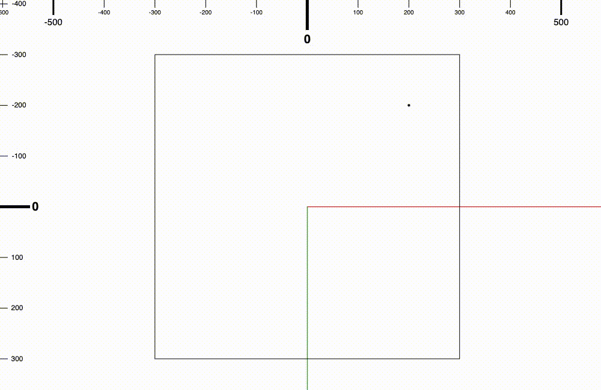

## 前情提要

在前一篇的最後我們幾乎實作完了縮放功能，為什麼說幾乎呢？

因為它的使用體驗似乎跟其他無限畫布不太一樣，縮放是縮放了沒錯

但是為什麼沒有跟著滑鼠的位置縮放，而是跟著視窗的中心點縮放？

## 問題是什麼？

沒錯，為什麼沒有跟著滑鼠的位置呢？

如果想要鎖定滑鼠游標的位置縮放，那滑鼠游標所指的地方必須要是在同一個點！（你在說廢話嗎 = =）

“我在滾滑鼠滾輪的時候我的游標都沒動啊！但它還是不在游標的位置縮放啊！”

這邊指的是世界座標系的滑鼠座標，在視窗中滑鼠座標看起來像是沒有移動，但是實際上它在世界座標系裡已經偷偷移動過了！


_圖中上方跟左邊的尺規是世界座標系的，方框是相機的視窗，而黑點是游標的位置（游標因為是在視窗上，所以滑鼠不動它會是視窗座標系座標不變），可以看到黑點是跟著相機縮放在世界座標系的位置也是會變動的_

當我們了解問題後，需要解決的方法也很簡單！

## 解決方案

我們就把移動過的距離移動回來就好了！

### 記錄縮放前的滑鼠位置

我們先在昨天加入縮放邏輯的地方加上一個紀錄縮放之前的滑鼠游標位置，記得要是世界座標系的喔！

因為要轉換成世界座標系的話我們需要有 canvas 的一個 reference 去做轉換，所以我們先新增一個 `canvas` 的 class variable 在 `KeyboardMouseInput` 裡面。

然後在 constructor 裡面加上 canvas 參數。

`keyboardmouse-input.ts`
```typescript
class KeyboardMouseInput {

    // 上略
    private canvas: HTMLCanvasElement;

    // 記得參數也要加喔！
    constructor(camera: Camera, canvas: HTMLCanvasElement){
        this.camera = camera;
        this.isPanning = false;
        this.spacebarPressed = false;
        this.panStartPoint = {x: 0, y: 0};
        this.pointerdownHandler = this.pointerdownHandler.bind(this);
        this.pointermoveHandler = this.pointermoveHandler.bind(this);
        this.pointerupHandler = this.pointerupHandler.bind(this);
        this.keydownHandler = this.keydownHandler.bind(this);
        this.keyupHandler = this.keyupHandler.bind(this);
        // 加入一個 reference canvas 的 variable
        this.canvas = canvas;
    }

    // 下略
}
```

### 轉換滑鼠位置至世界座標系

接下來我們來把縮放之前的滑鼠游標位置轉換成世界座標系。

`keyboardmouse-input.ts`
```typescript
class KeyboardMouseInput {
    // 上略

    wheelHandler(event: WheelEvent){
        event.preventDefault();
        if(event.ctrlKey){
            // 縮放操作
            const cursorPosition = {x: event.clientX, y: event.clientY};
            const boundingBox = this.canvas.getBoundingClientRect();
            const topLeftCorner = {x: boundingBox.left, y: boundingBox.top};
            const viewPortCenter = {x: topLeftCorner.x + this.canvas.width / 2, y: topLeftCorner.y + this.canvas.height / 2};
            const cursorPositionInViewPortSpace = {x: cursorPosition.x - viewPortCenter.x, y: cursorPosition.y - viewPortCenter.y};
            // 我們先記錄一下在縮放之前，游標的位置在世界座標系是哪裡
            const originalCursorPositionInWorld = this.camera.transformViewPort2WorldSpace(cursorPositionInViewPortSpace);
            const deltaZoomLevel = -event.deltaY * this.camera.zoomLevel * 0.025;
            this.camera.setZoomLevelBy(deltaZoomLevel);
        } else {
            // 平移操作
            const diff = {x: event.deltaX, y: event.deltaY};
            const diffInWorld = this.camera.transformVector2WorldSpace(diff);
            this.camera.setPositionBy(diffInWorld);
        }
    }

    // 下略
}
```

### 計算縮放後的位置變化

接下來我們可以在縮放完畢之後計算一下滑鼠游標被移動到哪裡去了。（世界座標系的座標）

`keyboardmouse-input.ts`
```typescript
class KeyboardMouseInput {
    // 上略

    wheelHandler(event: WheelEvent){
        event.preventDefault();
        if(event.ctrlKey){
            // 縮放操作
            const cursorPosition = {x: event.clientX, y: event.clientY};
            const boundingBox = canvas.getBoundingClientRect();
            const topLeftCorner = {x: boundingBox.left, y: boundingBox.top};
            const viewPortCenter = {x: topLeftCorner.x + canvas.width / 2, y: topLeftCorner.y + canvas.height / 2};
            const cursorPositionInViewPortSpace = {x: clicked.x - viewPortCenter.x, y: clicked.y - viewPortCenter.y};
            const originalCursorPositionInWorld = this.camera.transformViewPort2WorldSpace(cursorPositionInViewPortSpace);
            const deltaZoomLevel = -event.deltaY * this.camera.zoomLevel * 0.025;
            this.camera.setZoomLevelBy(deltaZoomLevel);
            // 接下來我們可以再算一次游標在縮放後，位置在世界座標系的哪裡
            const postZoomCursorPositionInWorld = this.camera.transformViewPort2WorldSpace(cursorPositionInViewPortSpace);
        } else {
            // 平移操作
            const diff = {x: event.deltaX, y: event.deltaY};
            const diffInWorld = this.camera.transformVector2WorldSpace(diff);
            this.camera.setPositionBy(diffInWorld);
        }
    }

    // 下略
}
```

### 調整相機位置

我們把被移動的差距計算一下，然後把相機的中心移回去。

`keyboardmouse-input.ts`
```typescript
class KeyboardMouseInput {
    // 上略

    wheelHandler(event: WheelEvent){
        event.preventDefault();
        if(event.ctrlKey){
            // 縮放操作
            const cursorPosition = {x: event.clientX, y: event.clientY};
            const boundingBox = canvas.getBoundingClientRect();
            const topLeftCorner = {x: boundingBox.left, y: boundingBox.top};
            const viewPortCenter = {x: topLeftCorner.x + canvas.width / 2, y: topLeftCorner.y + canvas.height / 2};
            const cursorPositionInViewPortSpace = {x: clicked.x - viewPortCenter.x, y: clicked.y - viewPortCenter.y};
            const originalCursorPositionInWorld = this.camera.transformViewPort2WorldSpace(cursorPositionInViewPortSpace);
            const deltaZoomLevel = -event.deltaY * this.camera.zoomLevel * 0.025;
            this.camera.setZoomLevelBy(deltaZoomLevel);
            const postZoomCursorPositionInWorld = this.camera.transformViewPort2WorldSpace(cursorPositionInViewPortSpace);
            // 接下來我們就要把相機移回到游標是在同樣位置的地方，游標的位置才會看起來不動
            const diff = vectorSubtraction(originalCursorPositionInWorld, postZoomCursorPositionInWorld);
            this.camera.setPositionBy(diff);
        } else {
            // 平移操作
            const diff = {x: event.deltaX, y: event.deltaY};
            const diffInWorld = this.camera.transformVector2WorldSpace(diff);
            this.camera.setPositionBy(diffInWorld);
        }
    }

    // 下略
}
```

最後我們需要在 `main.ts` 裡面在建立 `KeyboardMouseInput` 那邊新增一個 canvas 的參數。

`main.ts`
```typescript
const keyboardMouseInput = new KeyboardMouseInput(camera, canvas);
```

## 結語

這樣就解決了只能對相機中心點縮放的問題。

當然也會有人希望是針對相機視窗的中心點當作錨點去做縮放，所以這個功能可以實作成是可以開關的，或是你可以選擇完全不做，但是為了降低使用者的操作體驗差距，有一個方案是跟其他無限畫布一致的也是有益無害。

那我們今天就先分享到這邊！

今天的進度在[這裡](https://github.com/niuee/infinite-canvas-tutorial/tree/Day14)

我們明天見！

