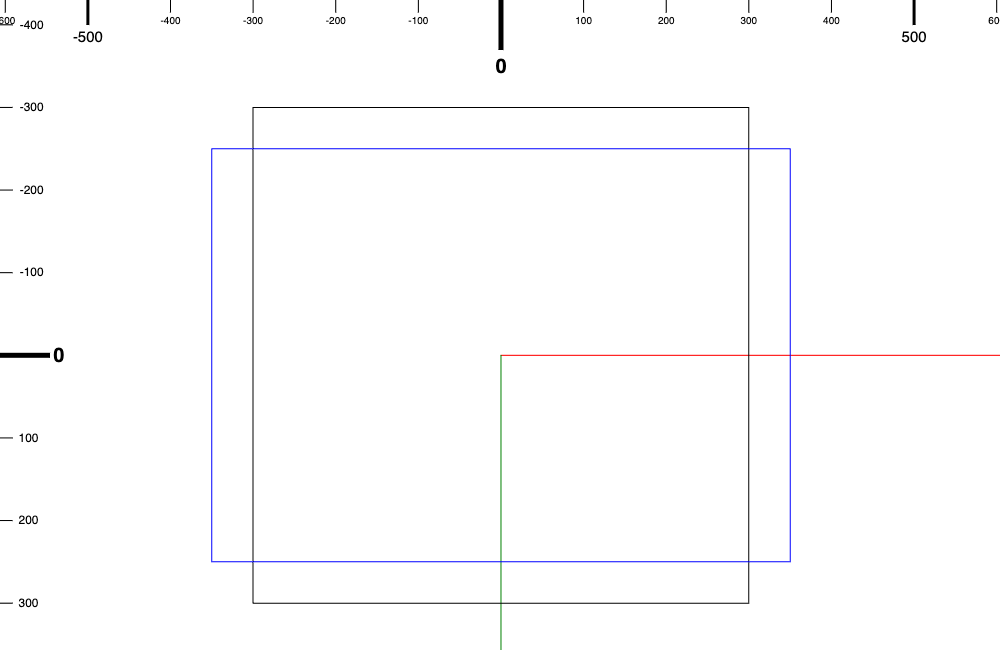
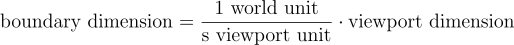
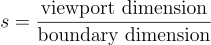
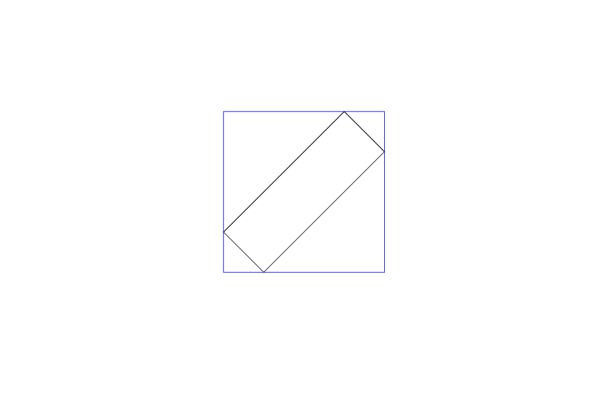
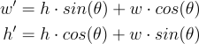
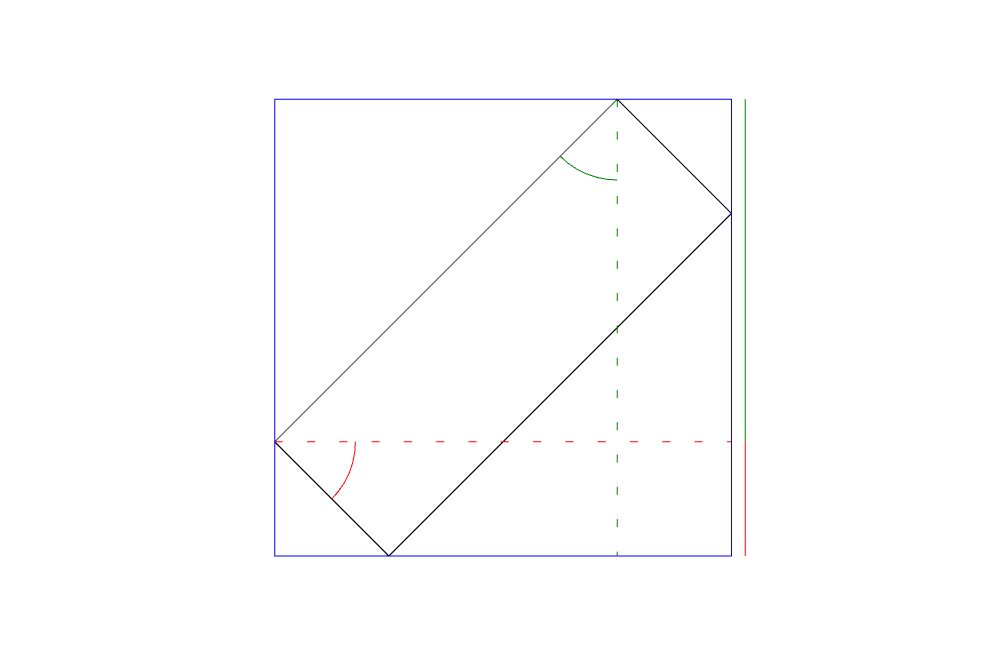
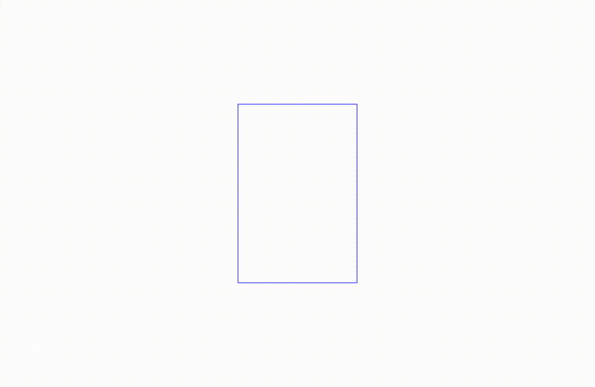

# 為什麼用起來好像怪怪的
前幾篇我們有實作了限制整個視窗的平移功能。

如果你有自己亂玩看看你可能會遇到一個奇怪的現象。

如果你的縮放倍率縮放到最小（數字最小，有可能可以讓視窗可以看到整個畫布），你平移的話可能會開始閃爍然後畫布就看起來怪怪的。

這個問題出在，當你的縮放倍率允許視窗可以涵蓋整個畫布的話，計算限制視窗平移的邏輯會算出視窗的所有角落都是超過邊界的，然後每個角落都想要把相機移到它不會超出邊界的地方。註：視窗本身長或寬會比畫布尺寸還要大！


_藍色矩形是視窗，黑色方框是畫布邊界，這邊可以看到當相機縮小到一定的程度之後，視窗會涵蓋到畫布邊界外面，這在限制整個視窗都不要超出邊界的邏輯沒有辦法計算出要怎麼移動視窗，因為怎麼移動視窗的角落都會超出邊界_

# 那要怎麼解決？
所以正常來說如果我們要限制整個視窗的平移的話，我們也會需要限制最小的縮放倍率，要不然使用者就會遇到我們遇到的 bug。

所以今天我們就是需要找出，如果我們要限制整個視窗的平移時，我們要如何找出這個視窗允許的最小縮放倍率是多少？

其時它沒有想像中的那麼困難！

首先我們需要算出畫布的邊界在縮放倍率等於多少的時候可以填滿整個視窗。

這個時候就是我們的公式時間！其實就是很簡單的單位換算啦！

假設我們現在視窗的尺寸是 500 x 500 (視窗單位) ，然後我們邊界寬度是 10000 x 10000 (世界單位)

當倍率是 1 時，視窗單位跟世界單位是 1 比 1 換算過來的，所以視窗只佔了畫布邊界的一小部分。

視窗單位要轉換成世界單位需要乘上這個 1 世界單位 / s 視窗單位的單位轉換係數，因為所有世界單位的東西在畫在視窗裡面時，它都會先被延伸 s 倍，如果要換回世界單位就要除上這個縮放倍率 s。

所以我們只需要找到一個 s 讓視窗的寬度轉換成世界單位後是跟邊界的寬度是一模一樣的就好。

把等式列出來就會比較好理解：


要找出 s 就是：


所以 500 x 500 在 1000 x 1000 的邊界中，如果要可以限制整個視窗不要超出邊界，可以允許的縮放最小是到 0.5 。(500 / 1000)

然後我們還有一個小小的問題需要處理。

好啦，好像不小。

## 額外可能需要處理的狀況
因為我們的相機是可以旋轉的，所以我們必須要考慮相機在各個角度中不一樣的長寬。

如果你沒有想要讓相機旋轉的意思，你可以只考慮視窗寬對上邊界寬，以及視窗長對上邊界長這兩個可能就好。

## 基本的實作 （相機不旋轉）
我們先處理不旋轉的場合。

可以用剛剛的公式去算出兩個縮放倍率（高、寬個別計算），當這兩個其中一個比目前縮放倍率允許的最小值還要大的時候就需要更新允許值。我們只限縮，不擴充允許的縮放倍率範圍，所以當算出來的縮放倍率比目前的最小值還小的話，我們不更新縮放倍率範圍。

### 計算可允許的最小縮放倍率
我們可以在 `camera.ts` 裡面實作一下。

先加上一個 `getMinZoomLevel` 的 function

`camera.ts`
```typescript
export function getMinZoomLevel(viewPortWidth: number, viewPortHeight: number, positionBoundary: PositionBoundary): number{

}
```

接下來我們按照公式計算出長跟寬允許的縮放倍率最小值。 (s = 視窗寬度 / 邊界寬度)

`camera.ts`
```typescript
export function getMinZoomLevel(viewPortWidth: number, viewPortHeight: number, positionBoundary: PositionBoundary): number {
    const minZoomLevelBasedOnWidth = viewPortWidth / (positionBoundary.max.x - positionBoundary.min.x);
    const minZoomLevelBasedOnHeight = viewPortHeight / (positionBoundary.max.y - positionBoundary.min.y);
}
```

接下來我們來比較看哪個最小值比較大，因為比較大的那個才需要更新（我們只縮減允許範圍，不擴大）

`camera.ts`
```typescript
export function getMinZoomLevel(viewPortWidth: number, viewPortHeight: number, positionBoundary: PositionBoundary): number {
    const minZoomLevelBasedOnWidth = viewPortWidth / (positionBoundary.max.x - positionBoundary.min.x);
    const minZoomLevelBasedOnHeight = viewPortHeight / (positionBoundary.max.y - positionBoundary.min.y);
    return minZoomLevelBasedOnWidth > minZoomLevelBasedOnHeight ? minZoomLevelBasedOnWidth : minZoomLevelBasedOnHeight;
}
```

接下來我們只需要在邊界改變或是視窗大小改變時去計算最小可以允許的縮放倍率然後再去更新就好。

### 在必要時修改最小可允許的縮放倍率
這邊就需要我之前在 Day 06 | 說好的無限呢？ 這篇提到的我們要去監聽 canvas 的大小，因為 canvas 的大小就是我們視窗的大小。

而邊界我們目前是沒有設定成可以更改的，不過要改成可以更改的話也不會太難，只是就是要記得如果有限制整個視窗大小的話，要記得在設定邊界大小的時候也調整可縮放倍率的最小值。

我們先回到監聽 canvas 尺寸的部分，這裡我們需要借用 `MutationObserver` 這個 API。詳細可以參考[MDN的文件](https://developer.mozilla.org/en-US/docs/Web/API/MutationObserver)

我們先定義一個 callback 來處理 canvas 尺寸更改。

這個 callback 會吃兩個參數 一個 `MutationRecord` 的陣列、一個 `MutationObserver` 的參考。[MDN的文件](https://developer.mozilla.org/en-US/docs/Web/API/MutationObserver/MutationObserver)

`main.ts`
```typescript
function attributeCallback(mutations: MutationRecord[], observer: MutationObserver){

}
```

接下來我們在 callback 裡面過濾 mutation list 裡面的 mutation 看它是不是 `width` 跟 `height` 的改變。

記得也要把 `limitEntireViewPort` 的條件也考量進去，因為如果沒有要限制整個視窗的話就沒有必要跟著視窗大小去調整縮放倍率。

`main.ts`
```typescript
function attributeCallback(mutations: MutationRecord[], observer: MutationObserver){

    for(let mutation of mutations){
        if(mutation.type === "attributes" && (mutation.attributeName === "width" || mutation.attributeName === "height") && camera.limitEntireViewPort){
        }
    }
}
```

確認是 `width` 或是 `height` 的改變以後，我們就可以計算可允許的縮放倍率最小值會不會需要改變。

這邊我們先來在 `Camera` 類別裡面加上一些 accessor 把相機縮放倍率允許範圍拉出來。
`camera.ts`
```typescript
// 上略
class Camera {
    // 上略
    get positionBoundary(): PositionBoundary {
        return this._positionBoundary;
    }

    get zoomLevelBoundary(): ZoomLevelBoundary {
        return this._zoomLevelBoundary;
    }

    set zoomLevelBoundary(zoomLevelBoundary: ZoomLevelBoundary){
        if (zoomLevelBoundary.min > zoomLevelBoundary.max){
            const temp = zoomLevelBoundary.min;
            zoomLevelBoundary.min = zoomLevelBoundary.max;
            zoomLevelBoundary.max = temp;
        }
        this._zoomLevelBoundary = zoomLevelBoundary;
    }
    // 下略
}
// 下略
```

接下來，我們來計算根據目前的視窗以及邊界尺寸，最小允許的縮放倍率是多少？要記得 import `getMinZoomLevel` 這個 function。

`main.ts`
```typescript
import { getMinZoomLevel } from "./src/camera";
// 下略

function attributeCallback(mutations: MutationRecord[], observer: MutationObserver){

    for(let mutation of mutations){
        if(mutation.type === "attributes" && (mutation.attributeName === "width" || mutation.attributeName === "height") && camera.limitEntireViewPort){
            camera.viewPortWidth = canvas.width;
            camera.viewPortHeight = canvas.height;
            const updatedMinZoomLevel = getMinZoomLevel(canvas.width, canvas.height, camera.positionBoundary);
        }
    }
}

// 下略
```

如果新計算出來的縮放倍率比目前的最小縮放倍率還要大的話，我們就需要更新目前的最小縮放倍率。

`main.ts`
```typescript
function attributeCallback(mutations: MutationRecord[], observer: MutationObserver){

    for(let mutation of mutations){
        if(mutation.type === "attributes" && (mutation.attributeName === "width" || mutation.attributeName === "height") && camera.limitEntireViewPort){
            camera.viewPortWidth = canvas.width;
            camera.viewPortHeight = canvas.height;
            const updatedMinZoomLevel = getMinZoomLevel(canvas.width, canvas.height, camera.positionBoundary);
            if(updatedMinZoomLevel > camera.zoomLevelBoundary.min){
                camera.zoomLevelBoundary = {min: updatedMinZoomLevel, max: camera.zoomLevelBoundary.max};
            }
        }
    }
}
```

以上就是如果沒有考慮要讓相機可以旋轉的話，在限制整個視窗不能超出邊界的情況下我們需要針對縮放倍率的調整。

## 處理旋轉
如果要考慮相機可以旋轉的情況的話，我們計算的時候需要把旋轉角度也考量進去。因為相機旋轉之後視窗的尺寸就不會完美跟邊界尺寸是同樣的方向，我們需要的是視窗的 AABB，只看文字可能比較難理解，下面有一些輔助的圖，看過可能會比較好懂！

我目前能夠想到的做法是把相機視窗大小的旋轉角度從 0 到 90 度 一個一個去計算，看看最大的長寬是多少，然後再去計算最小的縮放倍率，然後去取所有縮放倍率的最大值。

但是我沒有辦法把所有角度都計算一遍，只能夠盡可能地縮小計算的角度之間的差距。所以這個算法其實應該還是可以最佳化的，再請各位先進以及各路大神一起想想有沒有什麼辦法可以處理這個情況。

這裡我們在 `camera.ts` 裡面先加進去一個 `getMinZoomLevelWithCameraRotation` 這個 function 

`camera.ts`
```typescript
export function getMinZoomLevelWithCameraRotation(viewPortWidth: number, viewPortHeight: number, positionBoundary: PositionBoundary): number {

}
```

這邊也會需要一點三角函數。

當相機的視窗有旋轉時，我們需要計算的東西其實就是相機視窗的 AABB (Axis-Aligned Bounding Box)，換句話來說就是把相機視窗匡起來的矩形。

_圖中藍色的矩形就是旋轉過後的矩形的 AABB_

準確一點來說我們只要知道長度就好，並不需要知道四個角的座標。

旋轉過後的 AABB 長寬計算的公式是：



這邊的長寬其實有點標示不清楚，應該比較像是 h 是 y 軸的部分（還沒有旋轉時，跟 y 軸平行的那邊），而 w 是 x 軸的部分（還沒有旋轉時，跟 x 軸平行的那邊）。


_從這張圖可以看到寬高貢獻的 AABB 的高（好繞口令 xD），可以跟公式對照一下，可能會比較好理解_

我們需要涵蓋的角度是從 0 到 90 度。這個 90 度可以涵蓋所有 AABB 的長寬長度，剩下的角度都是這些角度的鏡射，不過鏡射對長度沒有影響所以我們就不要浪費去計算多餘的角度。


_視窗旋轉 90 度的過程 AABB 的變化_

我們先寫一個 `for` 迴圈，來 loop 整個 90 度，我們可以事先決定好步數，這樣如果我們不滿意結果可以增加步數來提升涵蓋的計算角度。

`camera.ts`
```typescript
export function getMinZoomLevelWithCameraRotation(viewPortWidth: number, viewPortHeight: number, positionBoundary: PositionBoundary): number {
    const steps = 10;
    let rotation = 0;
    const increment = Math.PI / (2 * steps);
    for(let i = 0;  i < steps + 1; i++){
        
        rotation += increment;
    }
}
```

我們也先把邊界的寬高計算起來。放在 `boundaryWidth` 以及 `boundaryHeight` 裡面。

接下來我們加一個 `maxMinWidthZoomLevel` 跟一個 `maxMinHeightZoomLevel` variable 去紀錄最大的寬高允許的最小縮放倍率。

我們先以 0 度計算 `maxMinWidthZoomLevel` 、 `maxMinHeightZoomLevel` 的初始值。

`camera.ts`
```typescript
export function getMinZoomLevelWithCameraRotation(viewPortWidth: number, viewPortHeight: number, positionBoundary: PositionBoundary): number {
    const steps = 10;
    const rotation = 0;
    const increment = Math.PI / (2 * steps);
    const boundaryWidth = positionBoundary.max.x - positionBoundary.min.x;
    const boundaryHeight = positionBoundary.max.y - positionBoundary.min.y;
    let maxMinWidthZoomLevel = viewPortWidth / boundaryWidth;
    let maxMinHeightZoomLevel = viewPortHeight / boundaryHeight;

    for(let i = 0;  i < steps + 1; i++){

        rotation += increment;
    }
}
```

接下來我們需要在每個角度計算 AABB 的寬高，然後計算最小的倍率允許。

再寫一下 AABB 的寬高計算如下：

w' = h * sin(theta) + w * cos(theta)
h' = h * cos(theta) + w * sin(theta)

`camera.ts`
```typescript
export function getMinZoomLevelWithCameraRotation(viewPortWidth: number, viewPortHeight: number, positionBoundary: PositionBoundary): number {
    const steps = 10;
    const rotation = 0;
    const increment = Math.PI / (2 * steps);
    const boundaryWidth = positionBoundary.max.x - positionBoundary.min.x;
    const boundaryHeight = positionBoundary.max.y - positionBoundary.min.y;
    let maxMinWidthZoomLevel = viewPortWidth / boundaryWidth;
    let maxMinHeightZoomLevel = viewPortHeight / boundaryHeight;

    for(let i = 0;  i < steps + 1; i++){
        const widthPrime = viewPortHeight * Math.sin(rotation) + viewPortWidth * Math.cos(rotation);
        const heightPrime = viewPortHeight * Math.cos(rotation) + viewPortWidth * Math.sin(rotation);

        maxMinWidthZoomLevel = Math.max(maxMinWidthZoomLevel, widthPrime / boundaryWidth);
        maxMinHeightZoomLevel = Math.max(maxMinHeightZoomLevel, heightPrime / boundaryHeight);
        rotation += increment;
    }
}
```

最後 return 之前我們把 寬跟高的允許最小倍率比較一下返回比較大的那個。

`camera.ts`
```typescript
export function getMinZoomLevelWithCameraRotation(viewPortWidth: number, viewPortHeight: number, positionBoundary: PositionBoundary): number {
    const steps = 10;
    const rotation = 0;
    const increment = Math.PI / (2 * steps);
    const boundaryWidth = positionBoundary.max.x - positionBoundary.min.x;
    const boundaryHeight = positionBoundary.max.y - positionBoundary.min.y;
    let maxMinWidthZoomLevel = viewPortWidth / boundaryWidth;
    let maxMinHeightZoomLevel = viewPortHeight / boundaryHeight;

    for(let i = 0;  i < steps + 1; i++){
        const widthPrime = viewPortHeight * Math.sin(rotation) + viewPortWidth * Math.cos(rotation);
        const heightPrime = viewPortHeight * Math.cos(rotation) + vewPortWidth * Math.sin(rotation);

        maxMinWidthZoomLevel = Math.max(maxMinWidthZoomLevel, widthPrime / boundaryWidth);
        maxMinHeightZoomLevel = Math.max(maxMinHeightZoomLevel, heightPrime / boundaryHeight);
        rotation += increment;
    }
    return maxMinWidthZoomLevel > maxMinHeightZoomLevel ? maxMinWidthZoomLevel : maxMinHeightZoomLevel;
}
```

之後我們把 `attributeCallback` 裡面計算的 function `getMinZoomLevel` 替換成 `getMinZoomLevelWithCameraRotation` 即可。

今天的進度在[這裡](https://github.com/niuee/infinite-canvas-tutorial/tree/Day16)

今天大概就是這樣了！ 我們明天見～

