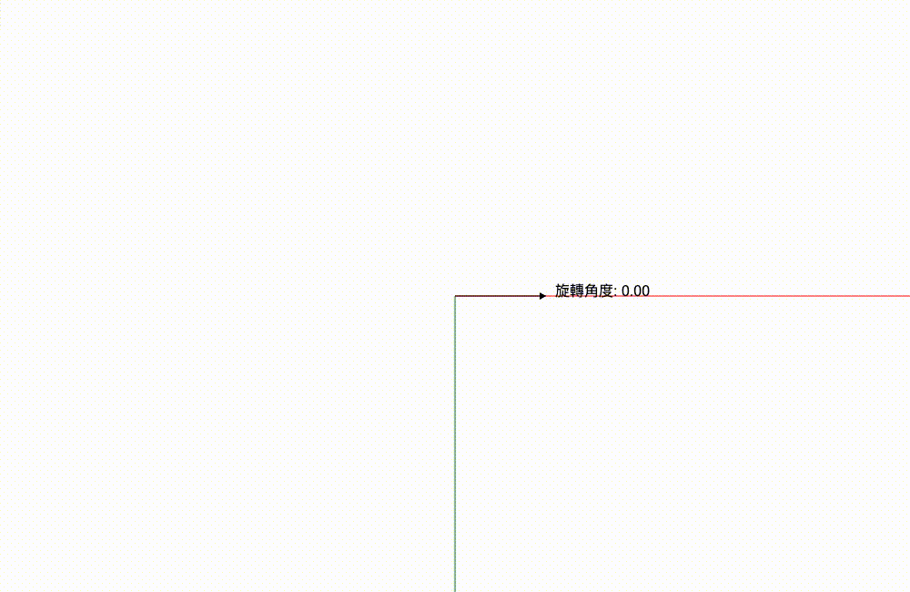
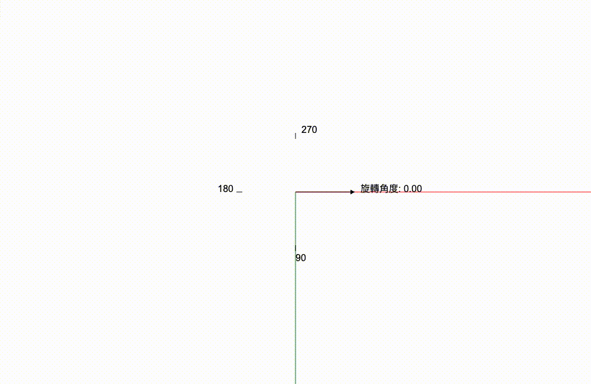

不知不覺好像已經超過一半的篇數了！大家加油！

今天我們要講的是相機旋轉的部分。

這是一個不是每個人都會想要或是需要實作的東西，就是看大家斟酌自己的使用場合來決定今天的內容是不是要跳過。

不過其實旋轉這個功能你不去動它，它安靜的待著也不會影響其他的部分，所以也可以試著做看看不需要擔心會用壞其他地方。

因為大部分的無限畫布都沒有旋轉相機這個功能，所以我其實也不知道怎麼樣直覺地控制相機的旋轉角度。

很久之前，我有做出一個類似羅盤的轉盤，然後轉盤可以使用點擊或是滑鼠滾輪或是觸控板滑動的去轉動，而轉盤的旋轉角度是直接連接到相機的旋轉角度的。

這大概是我能想到最直覺的操作方式。

可以在這裡試試看 [連結](https://vntchang.dev/vCanvasDemo/)

不過這裡我應該不會實作這個部分，因為我知道不一定所有人都同意這種用法，我相信很多人都有自己的想法，所以我這裡只會把能夠讓相機旋轉底下需要的基礎建立起來。

如果有需要的話留到後面的篇幅再去介紹我之前控制相機旋轉角度的方法。(但有可能放不下)

## 我要怎麼知道旋轉到哪裡是哪裡？

旋轉有辦法像座標一樣可以準確的表示位置嗎？

可以！你需要的就是角度！（又在說廢話）

旋轉角度有點像是時鐘那樣，可以讓你知道幾度是在圓上的哪裡。

就像有人跟你說 7 點的時候，你可以想像在時鐘上面會長怎樣。（不過我有認識一些小朋友好像不太會看指針式的時鐘...）

而旋轉角度也是有方向的，就像是時鐘有順時針跟逆時針一樣。

就像之前的篇章有介紹過的，不同的座標系，旋轉角度的方向是不一樣的

- 在 y 方向往下是正的座標系中，順時針是旋轉的正方向（這個座標系好像叫做左手座標系）
- 在 y 方向往上是正的座標系中，逆時針會是旋轉的正方向。

但是我們在做計算的時候，我們不在乎正方向是順時針還是逆時針，我們只要知道角度是正還是負就好。

應該是說只要我們座標系是一致的話，我們的計算就是沒問題的。

舉例來說，你在 y 方向往下是正的座標系中，順時針就是你的旋轉的正方向（這個座標系好像叫做左手座標系）

不能你在 y 方向往下是正的座標系中，你還是用逆時針當作旋轉的正方向，因為這樣就不一致了。

以下我都會用左手座標系當作示範。

通常會是 x 軸所在的方向會是 0 度。

所以旋轉正 90 度時，它應該會是跟 y 軸一樣的往下指，這個位置就是我們在圓上的 90 度。（在 y 軸向下的座標系）

_從 0 度旋轉到 90 度的位置_

如果箭頭旋轉 270 度時，它應該會變成往上指的箭頭。這個位置就是我們在圓上的 270 度。

我們圓上的刻度範圍是從 [0, 2pi] radian，也就是 [0, 360] degree，畫出來就一個完整的圓圈。

_從 0 度旋轉到 360 度的位置_

## 你是我，我也是你？！

假設今天我們從 45 度的地方要旋轉 -90 度，它到達的位置刻度是多少呢？

如果我們計算一下的話， 45 + (-90) = -45 我們是到 -45 度的位置。

但是如果你直接從圓上觀察 45 逆時針轉 90 度，我們會落在 315 度。

什麼？！不一樣？！為什麼會有兩個答案？因為旋轉有一個特性就是它是會循環的，跨過了原點之後就會重複一樣的角度。

上面的 315 度跟 -45 度指的是同樣的位置。

你是不是預期會看到蜘蛛人的梗圖？

其實我本來也想貼蜘蛛人的梗圖，但我覺得返校的你是我，我也是你的情況可能比較貼切。

所以我們需要把角度固定在 [0, 360] 度的範圍內，不然太多角度都表示同一個位置我們會瘋掉！

第一個要加的 helper function 就是 `normalizeAngle`。

`camera.ts`
```typescript
function normalizeAngle(angle: number): number {

}
```

要怎麼把角度限制在 [0, 360] 呢？

我們先考慮負數的，也就是超過 0 那一邊的狀況。

假設是 -45 度 的話，它其實是 0 - 45 出現的刻度，而 0 度同時也是 360 度所以我們把它換成 360 - 45 變成 315 才是我們想要的“正確”刻度。

那如果是往負數方向走，但是它走超過一圈變成 -45 - 360 = -405 呢？ 這時候我們就要把有“多轉”的“完整”圈數扣掉。

所以如果是多兩圈 -45 - 360 - 360 = -765 度呢？就會是 -765 + 360 = -405 然後 -405 + 360 = -45度。

有沒有 % 的影子出現了。沒錯，我們就用餘數去找出負的不足一圈的角度是多少，然後再用 360 去減掉這個角度變成 315 度這樣。

理解完這個之後，往正超過 360 度的角度就比較容易理解。

超過 360 的角度更簡單，我們只需要把多餘的完整圈數扣掉就好，扣完之後不用像負數一樣還要用 360 度去轉換成 [0, 360]度的區間。

我們實作的時候會用 radian 去做計算而不是度。

我們先用 % 的部分，就是扣除多餘的完整圈數。

`camera.ts`
```typescript
function normalizeAngle(angle: number): number {
    let normalizedAngle = angle;
    normalizedAngle = normalizedAngle % (2 * Math.PI);
}
```

如果剩下的度數是正的，我們就直接返回這個角度，如果是負的我們還要處理以 360 度去反轉。

`camera.ts`
```typescript
function normalizeAngle(angle: number): number {
    let normalizedAngle = angle;
    normalizedAngle = normalizedAngle % (2 * Math.PI);
    if (normalizedAngle >= 0){
        return normalizedAngle;
    }
    return normalizedAngle + Math.PI * 2;
}
```

這樣子我們就成功把角度限制在 [0, 360]了，又能夠是同一個位置。

`Phaserjs` 的 normalize angle 也是差不多的實作。[GitHub 連結](https://github.com/phaserjs/phaser/blob/v3.80.0/src/math/angle/Normalize.js)

接下來我們來寫兩個 helper function 把角度的 degree 跟 radian 互相轉換。因為我們做計算的時候都是用 radian 但是我們人看的時候 degree 比較直覺。

`camera.ts`
```typescript
function deg2rad(degree: number): number {
    return degree * Math.PI / 180;
}

function rad2deg(radian: number): number {
    return radian * 180 / Math.PI;
}
```
## 我想從這裡到那裡
接下來我們來試想一個情況，就是今天我們在 135 度的位置的話，想要移動到 90 度的位置時我們要怎麼移動？

你可能會想說這不是廢話嗎，就旋轉90 - 135 = -45 度就好了啊！ 目的地減掉起點。完事。

事情可能沒有那麼單純ＱＡＱ，因為我們可是可以從另外一邊旋轉到同一個位置的；也就是 135 旋轉 315 度也是可以到 90 度的位置。

你可能會想幹嘛要那麼麻煩，誰會想要用比較大的角度旋轉過去。

沒錯誰會想要用比較大的角度旋轉過去，如果今天我們起點在 359 度 終點在 2 度，如果還是用“目的地減掉起點”的算法，我們會得到 -357 度。

這樣就會是用比較大的角度旋轉過去了。

所以我們現在也要寫一個 helper function `angleSpan` 去找出從起點到目的地的旋轉角度往哪一邊是比較小的。

`camera.ts`
```typescript
function angleSpan(from: number, to: number): number {
    
}
```

我們需要先把起點跟目的地都換成 [0, 360] 之間的角度。

`camera.ts`
```typescript
function angleSpan(from: number, to: number): number {
    const normalizedFrom = normalizeAngle(from);
    const normalizedTo = normalizeAngle(to);
}
```

接下來我們直接把它們相減，然後可以得到一個可能是比較小也可能是比較大的旋轉角度。

`camera.ts`
```typescript
function angleSpan(from: number, to: number): number {
    const normalizedFrom = normalizeAngle(from);
    const normalizedTo = normalizeAngle(to);

    const diff = normalizedTo - normalizedFrom;
}
```

如果是比較大的角度，我們需要用 360 減掉去取得比較小的那邊。

因為比較小跟比較大的角度合起來會是一個完整的圓。

那我們要怎麼知道它是比較小還是比較大的角度呢？

我們可以用 180 度來判斷！如果是超過 180 度的話就一定是比較大的，如果比 180 度小就一定是比較小的。

如果是比較小的角度，我們就可以直接回傳了！

`camera.ts`
```typescript
function angleSpan(from: number, to: number): number {
    const normalizedFrom = normalizeAngle(from);
    const normalizedTo = normalizeAngle(to);

    const diff = normalizedTo - normalizedFrom;
    if(Math.abs(diff) <= Math.PI){
        return diff;
    }

}
```

如果我們得到的 `diff` 是比較大的話，我們需要旋轉的比較小的角度一定是反方向的。

所以如果是正方向的旋轉超過 180 度，我們需要反過來負方向旋轉 diff - 360 度。

如果是負方向的旋轉超過 180 度，我們需要反過來正方向旋轉 diff + 360 度。

`camera.ts`
```typescript
function angleSpan(from: number, to: number): number {
    const normalizedFrom = normalizeAngle(from);
    const normalizedTo = normalizeAngle(to);

    const diff = normalizedTo - normalizedFrom;
    if(Math.abs(diff) <= Math.PI){
        return diff;
    }
    if (diff < 0){
        return diff + Math.PI * 2;
    }
    return diff - Math.PI * 2;
}
```

以上大概就是我們目前需要的 helper function。

為了跟前面平移跟縮放的實作邏輯保持一致，我們來限制一下旋轉的角度吧。

我們先建立一個新的 type。

`camera.ts`
```typescript
type RotationBoundary = {
    start: number;
    end: number;
    positiveDirection: boolean;
    startForTieBreak: boolean;
}
```

先來解釋一下這些東西是什麼。

`start` 跟 `end` 就是很直覺的範圍的起點跟終點。

`positiveDirection` 則是這個限制的範圍是否是從 `start` 沿著旋轉的正方向到 `end`

`startForTieBreak` 這個則是用在如果有超出這個範圍的角度，如果需要 clamp 的話，如果這個角度到 `start` 跟 `end` 是同樣的距離，那我們是否要取 `start`，反之則取 `end`。

沒錯，接下來我們就來 clamp 一下。

在 clamp 之前，我們需要決定一個角度是不是在旋轉範圍裡面。

所以又要寫一個 helper function `rotationWithinBoundary`。

`camera.ts`
```typescript
function rotationWithinBoundary(rotation: number, rotationBoundary: RotationBoundary): boolean {

}
```

凡是拿到一個新的旋轉角度，我們都先強制把它限制在 [0, 360] 度這個區間。

`camera.ts`
```typescript
function rotationWithinBoundary(rotation: number, rotationBoundary: RotationBoundary): boolean {
    const normalizedRotation = normalizeAngle(rotation);
}
```

接下來我們要判斷這個旋轉角度跟起點的距離。

有一點需要注意的是我們要跟著旋轉範圍的方向去做。

如果是正方向，所有差距都要是正的方向。

如果是負方向，所有差距都要是負的方向。

`camera.ts`
```typescript
function rotationWithinBoundary(rotation: number, rotationBoundary: RotationBoundary): boolean {
    const normalizedRotation = normalizeAngle(rotation);
    let angleFromStart = normalizedRotation - rotationBoundary.start;
    if (angleFromStart < 0){
        angleFromStart += (Math.PI * 2);
    }
    if (!rotationBoundary.positiveDirection && angleFromStart > 0){
        angleFromStart = Math.PI * 2 - angleFromStart;
    }
}
```

接著我們可以判斷從旋轉範圍的起點到終點順著範圍的方向差距是多少。

這個東西你也可以選擇記在 `RotationBoundary` 裡面，就是每次更新起點或終點或是方向的時候都要重新計算一次。這樣看起來好像是蠻划算的，我已經開始考慮這樣做了哈哈哈。（可能等之後重構的話我會把這個列入重構項目）

計算完旋轉範圍的度數之後我們就可以進行比較了，如果到角度的距離比到終點的距離還遠我們就可以知道這個角度是在旋轉範圍外面。

`camera.ts`
```typescript
function rotationWithinBoundary(rotation: number, rotationBoundary: RotationBoundary): boolean {
    const normalizedRotation = normalizeAngle(rotation);

    let angleFromStart = normalizedRotation - rotationBoundary.start;
    if (angleFromStart < 0){
        angleFromStart += (Math.PI * 2);
    }
    if (!rotationBoundary.positiveDirection && angleFromStart > 0){
        angleFromStart = Math.PI * 2 - angleFromStart;
    }

    let angleRange = rotationBoundary.end - rotationBoundary.start;
    if(angleRange < 0){
        angleRange += (Math.PI * 2);
    }
    if(!rotationBoundary.positiveDirection && angleRange > 0){
        angleRange = Math.PI * 2 - angleRange;
    }

    return angleRange >= angleFromStart;
}
```

接下來我們就把它用在 clamping 裡面了。如果角度是在範圍裡面，就直接回傳。

`camera.ts`
```typescript
function clampRotation(rotation: number, rotationBoundary: RotationBoundary): number {
    if(rotationWithinBoundary(rotation, rotationBoundary)){
        return rotation;
    }
}
```

之後我們就可以來判斷一下，看目標角度是離起點還是離終點比較近。

這時候之前的 `startForTieBreak` 就會用到了。

`camera.ts`
```typescript
function clampRotation(rotation: number, rotationBoundary: RotationBoundary): number {
    if(rotationWithinBoundary(rotation, rotationBoundary)){
        return rotation;
    }
    const angleFromStart = angleSpan(rotationBoundary.start, rotation);
    const angleFromEnd = angleSpan(rotationBoundary.end, rotation);
    if (Math.abs(angleFromStart) < Math.abs(angleFromEnd)){
        return rotationBoundary.start;
    }
    if (Math.abs(angleFromStart) == Math.abs(angleFromEnd) && rotationBoundary.startForTieBreak){
        return rotationBoundary.start;
    }
    return rotationBoundary.end;
}
```

接下來我們回到 `Camera` 類別裡面的 `setRotation` 然後把它加上一些檢查條件。

不過我可能會把旋轉範圍變成是 optional 的因為相機的旋轉不一定需要範圍。

我們先來加個 variable `_rotationBoundary` 。

這裡我就先不在 `constructor` 裡給預設值了。

多設一個 setter 去設定，不過我覺得應該需要加上一些 validation 例如，起點跟終點是否都是 [0, 360] 這個區間。

`camera.ts`
```typescript
class Camera {
    // 略
    private _rotationBoundary?: RotationBoundary;

    set rotationBoundary(rotationBoundary: RotationBoundary) {
        const validatedRotationBoundary = {...rotationBoundary};
        if (rotationBoundary.start > Math.PI * 2 || rotationBoundary.start < 0){
            validatedRotationBoundary.start = normalizeAngle(rotationBoundary.start);
        }
        if (rotationBoundary.end > Math.PI * 2 || rotationBoundary.end < 0){
            validatedRotationBoundary.end = normalizeAngle(rotationBoundary.end);
        }
        this._rotationBoundary = rotationBoundary;
    }
    // 略
}
```

之後在 `setRotation` 裡面加上旋轉範圍的檢查。

然後對 `rotation` 施行 `normalizeAngle`。 

`camera.ts`
```typescript
class Camera {
    // 略

    setRotation(rotation: number){
        if(this._rotationBoundary != undefined && !rotationWithinBoundary(rotation, this._rotationBoundary)){
            return;
        }
        this._rotation = normalizeAngle(rotation);
    }

    // 略
}
```

我們也是加上 `setRotationBy` 讓之後我們可以只需要丟要旋轉幾度給相機就好。

`camera.ts`
```typescript
class Camera {
    // 略

    setRotationBy(deltaRotation: number){
        let targetAngle = normalizeAngle(this._rotation + deltaRotation);
        this.setRotation(targetAngle);
    }

    // 略
}
```

來加上剛剛寫很久的 `clampRotation` 吧。

`camera.ts`
```typescript
class Camera {
    // 略

    setRotationBy(deltaRotation: number){
        let targetAngle = normalizeAngle(this._rotation + deltaRotation);
        if(this._rotationBoundary){
            targetAngle = clampRotation(targetAngle, this._rotationBoundary);
        }
        this.setRotation(targetAngle);
    }

    // 略
}
```

那旋轉的部分大概就是這樣子，會比平移跟縮放的篇幅還要少主要還是因為沒有真的開給使用者有一個操作是可以控制相機的旋轉。

但是還是可以透過程式的方式去控制相機的旋轉角度。

到這裡無限畫布的三本柱：平移、縮放、旋轉（旋轉應該不算三本柱啦，因為大部分的好像都沒有特別強調旋轉，所以只有二本柱？）我們都有實作了。

所以接下來的文章會比較著重在示範無限畫布可以做到什麼應用以及可以重構的方向。

另外，有沒有發現我們的 `camera.ts` 開始在膨脹了，三本柱的後面基本上很多都塞進去了 `camera.ts`，所以後面我們也會開始講一些重構的東西，還有一些可能的最佳化方向。

恭喜你跟著走到了這個系列的一個大里程碑，我們不知不覺也超過一半了！

今天的進度在[這裡](https://github.com/niuee/infinite-canvas-tutorial/tree/Day17)

那我們明天見～

