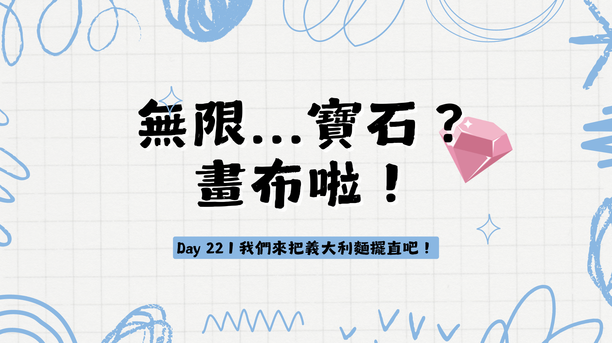
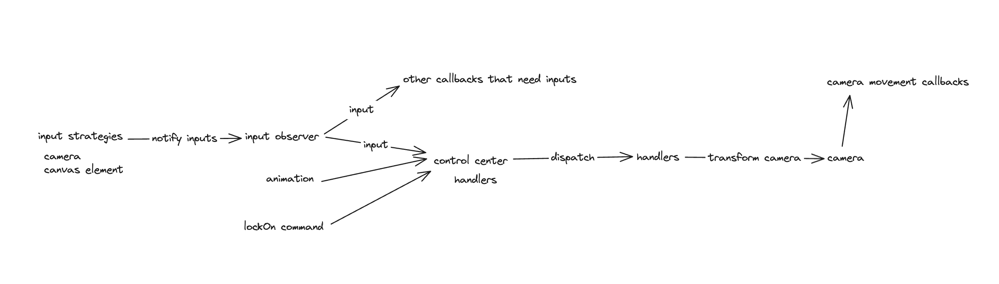
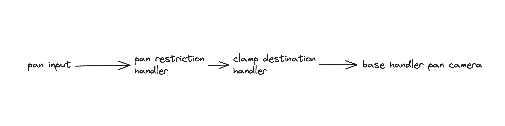

今天跟明天會大概講一些重構跟最佳化方面的內容，後天就會進到應用的部分。

昨天有跟大家介紹了一下“板班”，其實在板班之前，我有做過兩個類似的東西。

最一開始的版本就是我的賽道製作工具，它是一個非常簡化版的貝茲曲線編輯器。([如果有興趣連結在這裡](https://vntchang.dev/racetrack-maker/)，然後[這裡是 repo 連結](https://github.com/niuee/hrracetrack-maker) (操作說明可以參考 repo 裡面的 readme)

最初是參考[這個 codepen](https://codepen.io/chengarda/pen/wRxoyB)為原型，然後加上一些自己覺得能夠改善使用體驗的功能。

後來用一用才知道這個東西好像就叫做無限畫布；應該是之後我會有需要重複利用的東西，所以嘗試把它用到自己的 component library 裡面。（這個 component library 後來被我放棄了 xD）

在 component library 裡面的版本是稍微比較容易重複使用的，但是是基於 web component 的 api 去實作的。（[原始碼連結在這](https://github.com/niuee/vnt-component-library/tree/main/src/components/canvas)）

經過在 component library 裡面的掙扎，我放棄了把它元件化的這個方向。後來是參考其他類似 library 的做法，我只處理使用者操作跟無限畫布的移動部分。其他的就留給開發人員自己負責，才不會有額外諸多的限制。

經過這兩個版本之後才是漸漸發展到 `board` 現在的狀態，不過 `board` 我也是重構了好幾次，有一些東西也是反反覆覆改了又改。

而以這個系列大家一起實作的東西到現在的狀態，有幾個重構是我會想要去實行的。

1. 把 `TouchInput` 跟 `KeyboardMouseInput` 裡面呼叫相機移動的方法 `setPositionBy`、`setZoomLevelBy` 等等的方法移出。換成發出使用者想要平移的信號出來，讓別的地方去處理實際呼叫相機移動的方法。
2. 把相機移動的處理邏輯改成一個 pipeline 的模式。例如前面 Day 20 說到的限制 x y 方向的邏輯應該是要可以跟限制相機邊界的邏輯是串在一起的，這樣就不用寫很多 if else 去處理了。

大方向會是這兩個，接下來我來個別說明一下。

當然還有很多可以重構的地方，那些就留給未來的各位吧！

1. 要把實際移動相機的程式碼移出 `Input` 類型的原因是想要把 `Input` 跟相機拆分開來，然後讓其他的部分如果有需要的話可以截走輸入或是知道使用者做了移動相機的輸入。

實際上我在接收輸入之後到相機之前還有再隔開一層。因為我需要知道移動相機的輸入是來自哪裡？這樣給我了可以有除了使用者輸入以外的其他輸入，例如因為動畫需要移動相機等等的。

_我實際上分層的示意圖_

當然這是我個人的需要，如果你沒有這種需求你可以直接把使用者輸入就直接接到相機，中間不需要經過其他部分。

2. pipeline 模式
其實 pipeline 就有點像是 責任鏈 或是 裝飾者模式的變體。

這邊套用 pipeline 主要的原因是有可能會有太多種組合。例如說，我沒有要限制相機邊界，但是我需要限制使用者操作，這會是一種可能。或是我要限制相機邊界而且也要限制使用者操作，這又是另外一種可能。這種對相機輸入的指令未來可能的組合只會增加並不會減少，持續發展之後，我需要針對每一種新的要求在現有的組合上，再去新增擴充的組合，遲早有一天我應該會瘋掉。

這兩個是目前可以做到的大方向，其實看現在這個狀態需要怎麼發展下去，重構的方向還有更多，我這邊算是點出其中一條路，是我過去走的那條，大家可以針對自己的想法以及需求走出自己的路。

其實目前開發 board 主要的方向也是重構為優先，盡可能地降低各個模組之間的耦合程度。
如果你只是想要用 input 相關的模組去做使用者操作解析，剩下的功能都不用也是沒有問題的。

重構沒有一條路是完全正確的，全然看你願意為了得到什麼而犧牲什麼。

今天的內容就到這邊，我們明天見！
