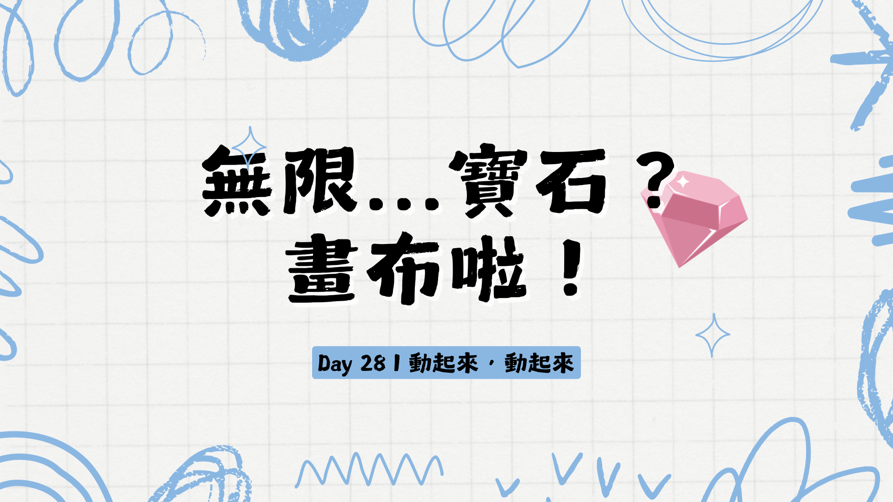

今天的應用主要會是動畫方面的！

但是大家知道的，因為我真的有很嚴重的弊帚自珍症 (Not Invented Here Syndrome) [NIH 是什麼？](https://zh.wikipedia.org/zh-tw/%E9%9D%9E%E6%88%91%E6%89%80%E5%89%B5)

所以又是一個我自己寫的小 library。

除了流程圖（因為我還沒支援流程圖 xD），還有重構的說明圖以外其他所有的圖都是使用 `board` 跟 `bounce` 製作出來的。(不過我的 banner 是用 Canva 做的啦！)

`bounce` 是我另外自己寫出來製作動畫的 library 在 npm 上面可以用 `@niuee/bounce` 找到。

然後 `bounce` 跟 `bolt` 一樣都是蠻原始的 library ，就是我還沒有花時間去寫太多說明文件。

但是它絕對是還堪用的等級？應...該..啦。

所以今天的 Demo 會是延續前面我有用到動畫的地方（因為我今天的實作還沒有做出來 xD，請再等我幾天。）

剛剛有說到，前面在解釋的篇幅裡面的說明圖片有動起來的地方都是使用 `bounce` 來完成的。

後來發現好像用 web animations api 就好，不過因為自己對動畫這方面的實作還是很好奇，所以就像是 `board` 一樣就做了一個自己的版本，有需要改動的時候或是需要增加新功能的時候也比較好下手。

這個系列的 demo 畢竟重點不是在如何實作，所以我就不講解太多 `bounce` 相關的實作。

給大家先去看看之前的文章裡面有哪些是有用到動畫的。

目前用最多動畫的應該是前面幾篇手寫應用的那篇，這篇拆開來主要是因為我有另外一個應用的實作，不過因為人算不如天算，目前還沒有完全完工，所以還沒有辦法公開出來 QQ 大家再等我一小段時間。

明天是倒數第二篇也是應用的最後一篇，是結合 D3 的部分，因為我實作也是還沒有完全完成，所以可能只能看到輪廓而已ＱＡＱ，請大家再給我幾天的時間去完成。

那我們今天就先這樣，最近這 3、4 天的內容都偏水，不過因為是應用的 demo 算是一個讓大家腦力激盪的一個小段落啦，等我完成所有應用的實作就會看起來比較有內容了！

那我們明天見！

