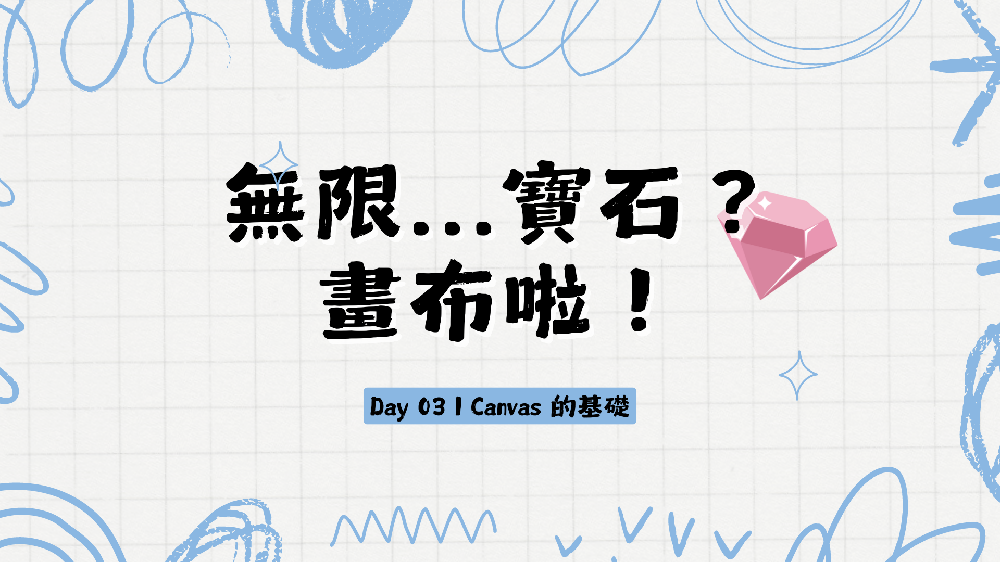

## Canvas 到底怎麼用？

canvas 是一種 HTML 的標籤，它在 flash 式微消失後成為在網頁上創作的主要手段。

很多 2D 圖像的表現都可以用 canvas 來達成，甚至可以用 WebGL、WebGPU 去做更多的應用。

canvas 提供的 API 很多，但是在這個系列文的前半段我們只會著重在其中的三個。
- [translate (平移)](https://developer.mozilla.org/en-US/docs/Web/API/CanvasRenderingContext2D/translate)
- [scale (縮放)](https://developer.mozilla.org/en-US/docs/Web/API/CanvasRenderingContext2D/scale)
- [rotate (旋轉)](https://developer.mozilla.org/en-US/docs/Web/API/CanvasRenderingContext2D/rotate)

有沒有覺得這三個很熟悉？沒錯它們就是我們無限畫布所需要實作的三個基本功能。

所以這三個下一下就有無限畫布了嗎？ 那我們可以下課ㄌ，大家解散！

威～當然不是，前方的路還很長～

就讓我們接著走下去吧。

### `Context` 

在 canvas 作畫都需要先有一個 `context` ，你可以把這個 `context` 想像成一個架在畫布上的機器畫筆。

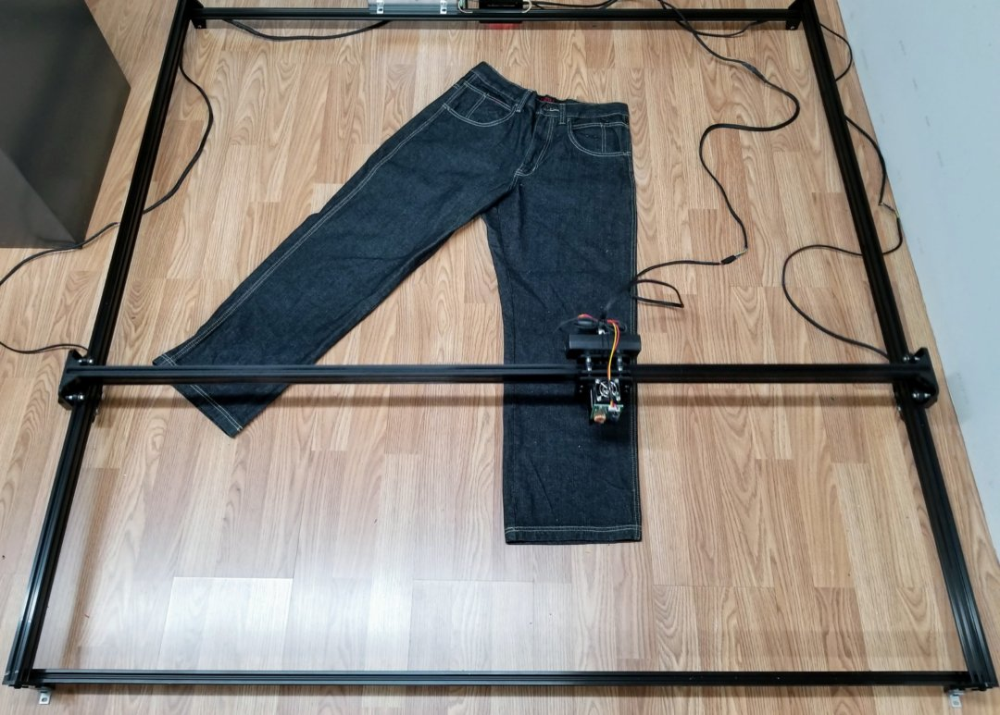
_圖片取自 [OpenBuilds ACRO 頁面](https://openbuilds.com/builds/openbuilds-acro-system.5416/)。（謎之音：這個東西蠻好用ㄉ我自己也有一台）_

要畫東西都是用它，要移動也是移動它，縮放跟旋轉也都是。

如果你現在還不懂 `context` 到底是在做什麼的也沒關係，之後看到範例或是後面其他實作應該就會越來越瞭解了。

不過 `context` 有個地方如果越早理解的話後面會比較輕鬆：_`context` 有自己的座標系_。

`canvas` 提供一個拿取 `context` 的方法:

```javascript
// canvas 是一個 html canvas element 
// 你可以用 document.querySelector("canvas") 或其他方法取得例如: document.getElementById(“你 canvas 的 ID”)
const ctx = canvas.getContext("2d");
```

因為我們還沒有要開始實作，你可以在 MDN 的 playground 裡面自己試試看。([連結在這裏](https://developer.mozilla.org/en-US/play))

今天後面一點的實戰部分，我會一步一步帶你做，你也可以等到那個時候再開。

### Translate （平移）

好的，我們終於進到今天的正題了！

第一個要介紹的是平移的函數！

首先，我們先看看它長怎樣！
```javascript
translate(x, y)
```

它有兩個參數 `x` 跟 `y` 。

`x` 是水平位移的距離

`y` 是垂直位移的距離

__這裡有個重點需要畫：__
 y 軸的方向是 _「往下是正」_，_「往上是負」_，跟我們平常習慣的座標系不太一樣。

__反著的 y 方向__

`context`最一開始的原點是在 `canvas` 的左上角，(5, 0) 這個座標會落在原點稍微往右的一個位置。

而 (0, 5) 這個座標會落在原點稍微往下的一個位置。

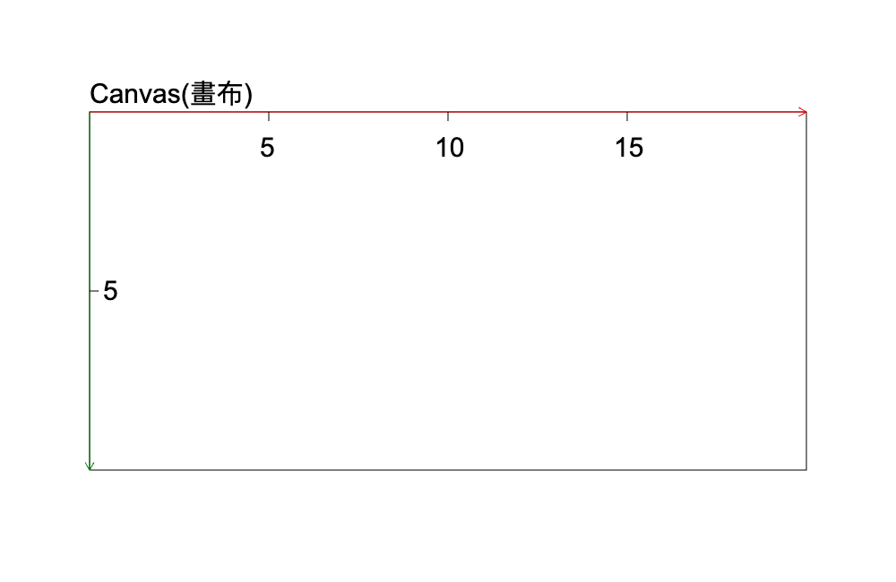
_紅色的線是 x 軸，而綠色的線是 y 軸，箭頭指向的方向是軸的正方向_

反著的 y 軸在後面講到旋轉的時候會有另外一個影響，我們留到後面。

#### `tranlsate` 是移動 `context`，並不是移動 `canvas`
回到我剛剛的比喻，`context` 就好像是一個機器畫筆，而 `translate` 就像是你把這個機器畫筆搬起來，然後跑跑跑，然後再放下。

這聽起來好像很簡單對吧 xD？

所以現在我要提出一個狀況劇是會比較需要動一點腦筋的。

這種機器畫筆通常會有一個它認為的原點，這樣它才有一個基準點也才知道東西要 _畫在相對於原點的哪裡_（原點通常是在機器畫筆的某個角落）。

假設我們今天得到了一個機器畫筆，然後它的原點是設定在左上角。

我們把它放在一張畫紙上面，把機器畫筆的原點（左上角）對齊畫紙的左上角。

接著我們對它輸入指令，要在 x = 5, y = 5 的地方畫上一個圓圈。

它就會開始嘰嘰嘰地移動它的畫筆，接著到它的 (5, 5) 然後畫下一個圓圈。

等它畫完之後，我們把它搬起來移動到畫紙的別的地方。

然後對它輸入跟剛剛一樣的指令，它也會開始在“它”的 (5, 5) 的地方畫下一個圓圈。

很明顯，在畫紙上的兩個不同地方會各有一個圓圈。

但是對機器畫筆來說它會覺得它是在同一個地方畫下圓圈的。

#### 這個狀況劇有 2 個重點

- 機器畫筆有他自認為的原點 `context` 也是，它有一個它認為的原點以及座標系，所有作畫都是相對於這個原點去實現的。
- 底下的畫布跟機器畫筆對位置的認知是不同的，換句話說就是它們有各自的座標系（機器畫筆認為它畫圓圈是同一的位置，但是實際在畫布上卻是不同的位置）。

這兩個觀念對於等等的 `scale` 以及 `rotate` 也是適用的。

`rotate` 會比較好理解，但是 `scale` 就比較沒有那麼直覺了。

可以把 `scale` 想成：機器畫筆原本認為的 1 的位置現在它覺得是 0.5（所以如果現在它要到它認為的 1 ，我們看起來會是 2） ，這樣要畫在 (5, 5) 這個位置在我們眼裡看到就會是 (10, 10) 了。（等同於放大）

或者是原本的 1 變成了 2 ，這樣要畫在 (5, 5) 這個位置在我們眼裡看到就會是 (2.5, 2.5) 了。（等同於縮小）

### Scale

讓我們來看看 `scale` 吧。 
```javascript
scale(x, y)
```
怎麼跟 `translate` 長得很像 xD。

`x` 是水平方向的縮放

`y` 是垂直方向的縮放

`scale(1, 1)` 會讓成果跟原本的圖形一模一樣，數字往上加的時候圖形會越來越大，往下的時候越來越小。

當 `scale` 被傳入 0 的時候那個方向就會被變不見，啪，沒了。

你說那負呢？ 很好的一個問題，它畫出來會是反了。x 會左右相反，y 會上下相反。

因為我們現在是在做無限畫布只需要移動畫布的效果不會自帶變形效果，所以我們的 `x` 跟 `y` 會是一樣的數值，然後一定會是大於 0 。

如果 `x` 跟 `y` 是不一樣的那畫出來的圖形就會變形。如果小於等於零那畫出來的圖形就會反過來或不見。

### Rotate

馬上就到最後一個了，很快吧！

```javascript
rotate(angle)
```

`angle` 是旋轉的角度，單位是 raidans（弧度），順時針是正值。

radian 跟 degree 的換算關係是 radian = degree * Math.PI / 180。

半個圓會是 `Math.PI`，一個圓會是 `2 * Math.PI`。

旋轉這邊有一個需要注意的地方，就是旋轉的中心點是 _`context` 的原點_。

好的，這樣子三件套都集齊了，我們可以開始做一點點的小開發，把一些比較容易搞混的地雷都先踩一踩。

別怕，我都踩過了！

## 跟我一起這樣做！

在這個階段還不需要架設開發環境，可以只用 MDN 的 playground 跟著我一起做就好。

這樣可以保證你得到的結果會跟我的相近，而且也可以減少不必要的環境設置。

[Playground 連結在這裏](https://developer.mozilla.org/en-US/play) 

非常建議開著兩個視窗，邊看邊做。 

進去 playground 之後在 html 以及 javascript 的欄位先填上以下的內容。

html
```html
<canvas></canvas>

```

javascript
```js
const canvas = document.querySelector("canvas");
const ctx = canvas.getContext("2d");

```

### 手指揮一揮，畫出一個圓

這裡需要先跟大家再介紹幾個新的函數。

```javascript
arc(x, y, radius, startAngle, endAngle, anticlockwise)
```

這是一個用來畫圓的函數！[MDN 文件連結](https://developer.mozilla.org/en-US/docs/Web/API/CanvasRenderingContext2D/arc)

`arc` 這個函數也是屬於 `context` 的，所以要呼叫它也是需要用 `context`，像是這樣`ctx.arc(x, y, radius, startAngle, endAngle, anticlockwise)`。

`x` 圓心的 x 座標

`y` 圓心的 y 座標，這個一樣也是螢幕往下是正，往上是負

x 跟 y 都是在 `context` 的座標系，長度也是在 `context` 的座標系

`radius` 半徑

`startAngle` 初始角度 (單位是 radian)

`endAngle` 收尾角度 (單位是 radian)

`anticlockwise` 逆時針畫，還是順時針畫這個圓

要在原點畫出一個半徑 50 的圓形
```javascript
const canvas = document.querySelector("canvas");
const ctx = canvas.getContext("2d");

ctx.beginPath(); // 這算是跟 context 說 我要開始畫了喔
ctx.arc(0, 0, 50, 0, 2 * Math.PI); // 因為是畫一整個圓，所以順逆時針結果是一樣的可以省略最後一個參數
ctx.stroke(); // 跟 context 說我畫完了，幫我上個色，讓我可以在螢幕上看到
```

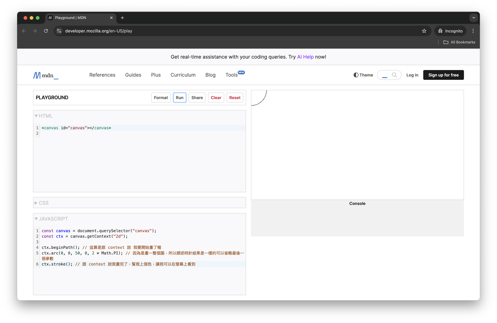
_畫出來大概是這個樣子_

因為 `context` 的原點最一開始會是切齊 `canvas` 的左上角所以剛剛畫出來的圓形應該只會有右下角的 1 / 4 個圓。

### `translate` 的實戰題

如果我們在畫圓之前把 `context` 先 `translate` 會變成什麼樣子呢？
```javascript
const canvas = document.querySelector("canvas");
const ctx = canvas.getContext("2d");

// 多加這行
ctx.translate(50, 50);

// 以下是剛剛上面打的
ctx.beginPath(); 
ctx.arc(0, 0, 50, 0, 2 * Math.PI);
ctx.stroke();
```

現在你看到的應該就是一個完整的圓。

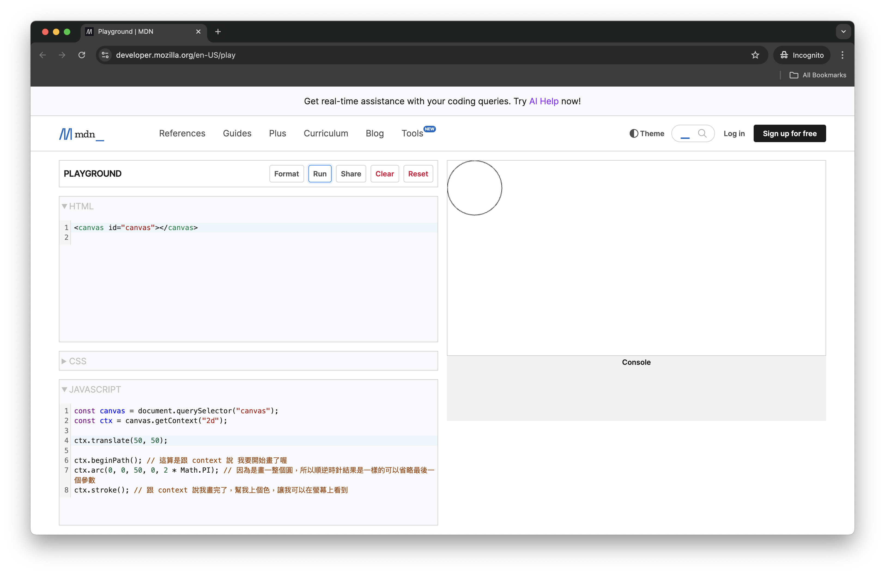
_一個完整的圓圈_

為什麼 `arc` 吃進去的 `x`，`y`座標是一樣的，它的位置會移動呢？

哈哈，驚不驚喜？

因為你把機器畫筆移動位置了！`arc` 的座標是 _相對於`context`的原點_ 所以當 `context` 的位置移動之後，它所有畫的東西都是移動後的位置。

### `rotate` 的實戰題

如果只畫整個圓形的話會看不出來 `rotate` 的功用。

所以我們來畫矩形吧！（被打

```javascript
rect(x, y, width, height)
```

`x` 矩形起點的 x 座標 _不一定是左上角喔！_

`y` 矩形起點的 y 座標 _不一定是左上角喔！_

`width` 矩形的寬度，應該說是 x 軸方向的長度 _（可以是負的！）_

`height` 矩形的高度，或者應該說 y 軸方向的長度 _（可以是負的！）_

矩形有一個比較需要注意的地方是，它長的方向永遠都是 x 或 y 軸的正方向（負值就會往反方向長），所以起點的 x 跟 y 是沒有一定是矩形的哪個角落！（因為可以寬高都給負值，這樣起點反而看起來是右下角）[MDN 文件連結](https://developer.mozilla.org/en-US/docs/Web/API/CanvasRenderingContext2D/rect)

我們把剛剛 `translate` 實戰題的圓形改成矩形，然後把 `translate` 也拿掉變成以下這樣。

```javascript
const canvas = document.querySelector("canvas");
const ctx = canvas.getContext("2d");

ctx.beginPath(); 
ctx.rect(0, 0, 50, 100);
ctx.stroke();
```

沒意外的話你應該會看到一個直的長方形。

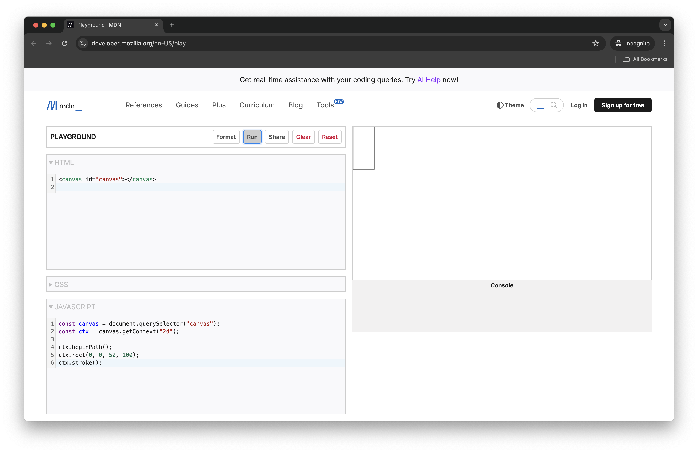

接下來我們加上 `rotate`

我們讓它逆時針轉個 45 度

`ctx.rotate(-45 * Math.PI / 180);`


```javascript
const canvas = document.querySelector("canvas");
const ctx = canvas.getContext("2d");

// 新增這行
ctx.rotate(-45 * Math.PI / 180);

ctx.beginPath(); 
ctx.rect(0, 0, 50, 100);
ctx.stroke();
```

是不是很神奇！ 我們的矩形翹起來了！

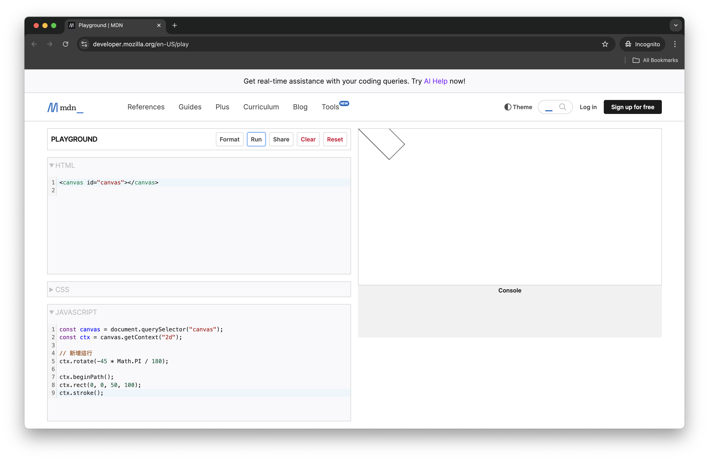

為什麼！明明 `ctx.rect` 都是一樣的參數。

因為在作畫的時候，`context` 就已經旋轉過了！

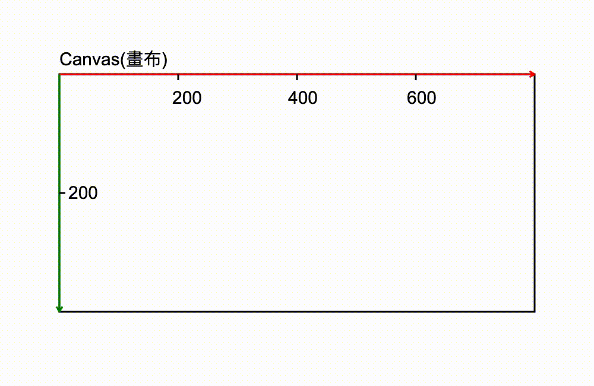
_`context` 作畫的步驟，先旋轉，然後再把矩形畫出來（相對於 context 的原點，因為 x、y 軸已經不是水平垂直方向了，所以矩形看起來會是旋轉過的）_

### `tranlate` 跟 `rotate` 的組合拳
很多人（好啦，可能只有我）是被這個 combo 打得暈頭轉向的

別怕，被打過的前輩帶你走。

#### 先來一個 `translate` 再來一個 `rotate`

把我們剛剛的矩形

```javascript
const canvas = document.querySelector("canvas");
const ctx = canvas.getContext("2d");

ctx.rotate(-45 * Math.PI / 180);

ctx.beginPath(); 
ctx.rect(0, 0, 50, 100);
ctx.stroke();
```

加上一個 `tranlsate` ，要加在 `rotate` 前面喔

來個 `translate(50, 50)`

```javascript
const canvas = document.querySelector("canvas");
const ctx = canvas.getContext("2d");

ctx.translate(50, 50);
ctx.rotate(-45 * Math.PI / 180);

ctx.beginPath();
ctx.rect(0, 0, 50, 100);
ctx.stroke();
```

現在應該有一個被移動到右下方的翹起來的矩形。
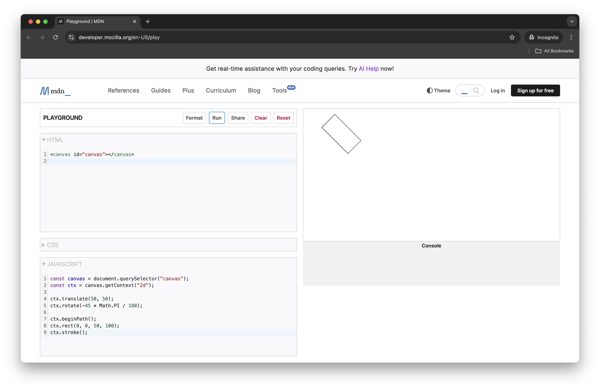


_`context` 作畫的步驟_

#### 換個順序，先 `rotate` 再 `translate`

接下來很簡單，我們把 `translate` 跟 `rotate` 的順序調換

變成以下這樣

```javascript
const canvas = document.querySelector("canvas");
const ctx = canvas.getContext("2d");

// 這裡有換過順序
ctx.rotate(-45 * Math.PI / 180);
ctx.translate(50, 50);

ctx.beginPath();
ctx.rect(0, 0, 50, 100);
ctx.stroke();
```

在跑之前你可以先自己思考會看到什麼樣的成像。

會是像剛才一樣嗎？`translate` 跟 `rotate` 的順序會有影響嗎？

答案是會的。請聽我娓娓道來。

還記得 `context` 是有自己的原點跟座標的嗎？

`translate` 以及 `rotate` 都是根據 `context` 自己的原點以及座標去做移動的。

因此當 `context` 已經先 `rotate` 過後，`context` 的 x 跟 y 軸已經不是水平或是垂直的方向了。

所以畫出來會長這樣

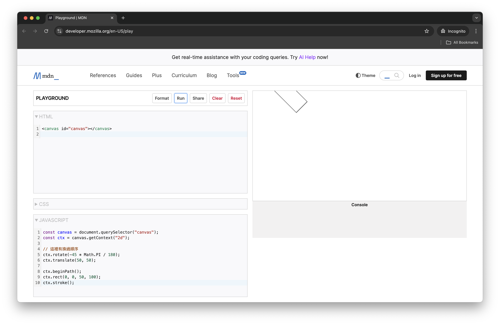

x 軸以及 y 軸的`translate` 變成是旋轉過後的方向。

沿著 x 軸平移 50 已經不是只有水平方向的移動而是變成斜著移了。

而移動 (50, 50) 就變成水平移動了（因為 `context` 已經有旋轉 -45 度了）

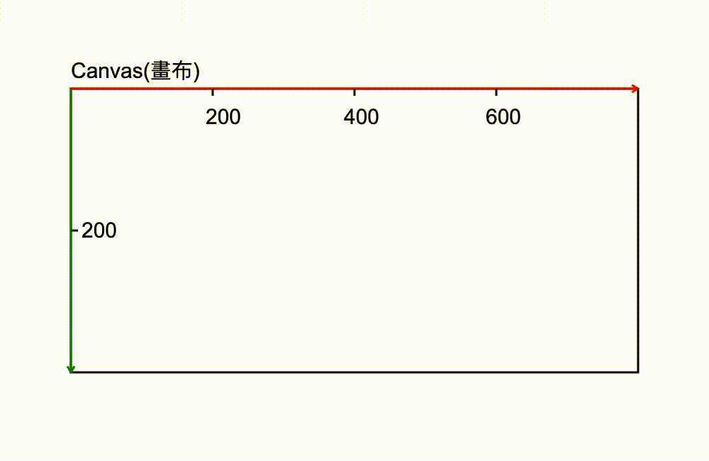
_`context` 作畫的步驟_

另外有一個需要注意的點是 `translate` 、 `rotate` 、 `scale` 是疊加的狀態。

不是只有剛剛示範的 `translate` 以及 `rotate` 這種兩種不同的變形方法會疊加。

`translate` 以及 `translate` 也是會疊加的。

如果有連續兩個 `translate` 例如

```javascript
ctx.translate(10, 10);
ctx.translate(20, 20);
```

這樣子的結果會是 x、y 軸皆移動 30 而不是只移動到 20。

好的，今天就差不多是這樣了！辛苦各位。明天我們會探討要怎麼讓 `canvas` 變成一個會動的 `canvas`。

我們明天見！
