今天起這個系列要開始實作了！啪唧啪唧啪唧

今天要講的是向量，以及怎麼做向量相關的計算。這算是進入正篇之前的前菜！

# 前置作業

以下有三個方法大家可以一起跟著做：

1. 大家可以從我的 GitHub 上面的 template 去創造一個新的 repository 然後從那裡開始。
[starter template 在這裏](https://github.com/niuee/typescript-starter)
    - 從 template 開始會是接近完全的白紙，但我有設置好開發工具了！適合想要跟著系列一起實作的人！點進去 template 連結後可以點 use this template 按鈕去建立一個新的 repo 。 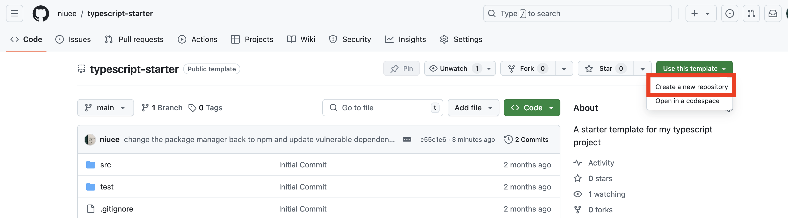

2. 如果你真的沒有很想要在本機開發，那也可以從這個 [code sandbox](https://codesandbox.io/p/sandbox/board-tutorial-hqsxhv) fork 去做，不過這個要有 code sandbox 的帳號(可以免費辦)才能夠 fork 去編輯。這裡也是白紙

3. 如果你有比較習慣的作法，你也可以以自己習慣的方式去建立一個 TypeScript/JavaScript 專案然後跟著一起實作，都沒有問題！上面的選項主要是給不太熟悉從頭建立 JavaScript/TypeScript 專案的讀者！

如果你選 2 或 3 的話，可以直接跳過以下內容直接到今天的重點“向量”。

※ 我有準備另外一個 repository 來給想要看每日進度的人，我會用不同的 tag 去把每天的進度 commit 標起來，然後放連結在當天的文章底下，你可以在當天結束之後去看當天的原始碼進度。這個適合給看完理論之後想要直接用或直接拿來改的人用；不過在實作時有一些問題想要看一下範例的也可以參考這裡。[repository 的網址在這](https://github.com/niuee/infinite-canvas-tutorial)

---
選 1 的同學可以看一下前情提要：

我先介紹一些基本簡單的 `script` 指令。

clone 完這個 repository 之後我們先用

`npm install` 把依賴套件安裝進來。（除了 dev dependency 以外我沒有另外引入其他第三方套件，我們是要造輪子的人！）

`npm run dev` 會開啟一個 dev server 在 `port 5173`，如果想要換 port 可以去 `vite.config.js` 調整。

`npm run build` 會建立一個 bundled JavaScript 在 `build` 這個資料夾。

`npm run test` 則會跑單元測試的部分。

我是使用 vite 當作打包跟跑 dev server 的工具。

如果有需要寫測試的部分則是仰賴 vitest。 

這兩個工具其實我只有粗淺的摸過，因為我自己開發的時候是使用別的工具。這次想說來試試看用新的工具來開發，所以沒有用很花俏的功能。

如果設定檔或是專案有任何可以最佳化的地方再請各位前輩多多指教。

接下來我會先解釋每一種不同的向量操作是什麼，然後再示範實作的細節。

# 向量

雖然前面說過希望讀者具備一些向量相關的前置知識，不過我這邊也介紹一下向量是什麼。

簡單來說，在我們的應用裡面向量描述如何從一個點到另外一個點的過程。

而向量本身具有兩個比較重要的資訊

1. 方向
2. 長度

長度的部分比較好理解，基本上就是兩個點之間的直線距離。
而方向比較白話一點表達是指站在一個點望向另外一個點時你的頭朝向哪裡。

長度是一個純量，換句話來說就是一個數字。
而方向是有方向性的（廢話。

意思是指 “_從 A 點到 B 點_” 跟 “_從 B 點到 A 點_” 這兩個方向是 __不相同__ 的。

長度通常需要表示的話就是用一個數字去表示，就是這兩點之間長度是 10 個單位(公尺、或公里等等)。

而方向就比較複雜一點，通常會跟長度一起表達。我先放著等等再解釋。

#### 向量表示方法

這個系列只關注 2D 方面的應用，因此我這邊大部分只會提到關於 2D 的向量表示

通常 2D 向量會這樣表示：

a 上面的箭頭代表它是一個向量而不是一個純量。而 i 跟 j 上面的“帽子”代表它們是單位向量。
有時候是用粗體表示它是一個向量而不是用箭頭，所以有些地方沒看到箭頭也不代表它並不是向量喔！

單位向量在後面會有更詳細的解釋，這邊可以先看作 i 是代表 x 軸方向，而 j 是代表 y 軸方向。

而 x 跟 y 的值就是 a 在 x y 軸上的值。
所以假設 a 在 x 軸上是 3，在 y 軸上是 4，就會這樣表示：

而畫出來的話就會長這樣
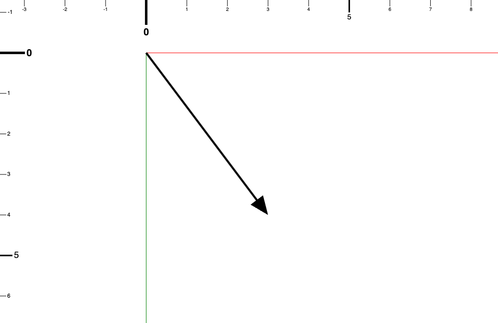

而如果要表示 a 向量的長度則會用類似絕對值的直線，像是這樣：

後面會接續介紹需要用到的計算的細節跟實作。
無限畫布的很多概念都會運用到向量，因此我認為有必要在前面的章節做比較繁瑣的解釋。

接下來我會解釋各種向量的操作！

我在這裡列出來
1. 長度
2. 單位向量
3. 向量相加
4. 向量相減
5. 向量乘上純量
6. 向量內積
7. 向量之間的角度

##### 實作時間

首先在 `src` 裡面先建立一個新的檔案 `vector.ts`。

在這個檔案裡面先建立一個 `type` ， `Point`

`vector.ts`
```typescript
export type Point = {
    x: number;
    y: number;
}
```

#### 長度 (magnitude)

2D 向量的長度計算會是大家都很熟悉的畢氏定理 (Pythagorean Theorem)


斜邊平方是鄰邊平方加上對邊平方。

因為向量可以寫成 x 跟 y 方向的分量，所以可以想成這個向量是斜邊，然後對邊是 y 方向的值，鄰邊是 x 方向的值。
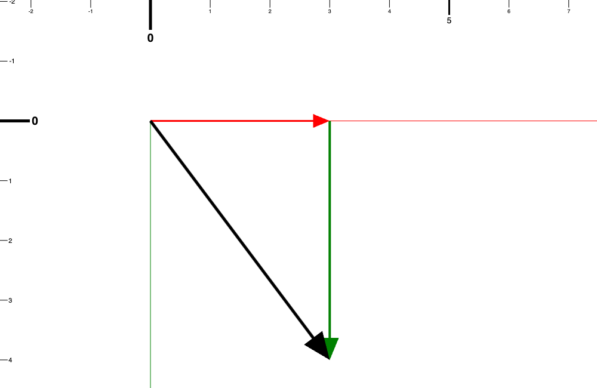

所以如果你知道向量長度跟它跟x軸的角度，也可以利用三角函數去求這個向量在 x y 軸方向的分量。

##### 長度實作時間

在剛剛的 `vector.ts` 檔案裡面加上新的 `function`：`magnitude`。

```typescript
export function magnitude(vector: Point): number {
    return Math.sqrt(vector.x * vector.x + vector.y * vector.y);
}
```

#### 單位向量 (unit vector)

單位向量的意思就是長度為 1 的一個向量，不管他是哪個方向。

剛剛說的方向通常會跟長度一起表達就是在說單位向量，只是因為單位向量的長度是 1，所以單位向量比較重要的部分是它的方向。

而這邊要注意的是 (1, 1) 並不是一個單位向量喔！ 
因為 (1, 1) 這個向量的長度是：

所以 (1, 1) 的單位向量應該是會比 (1, 1) 再短一點。

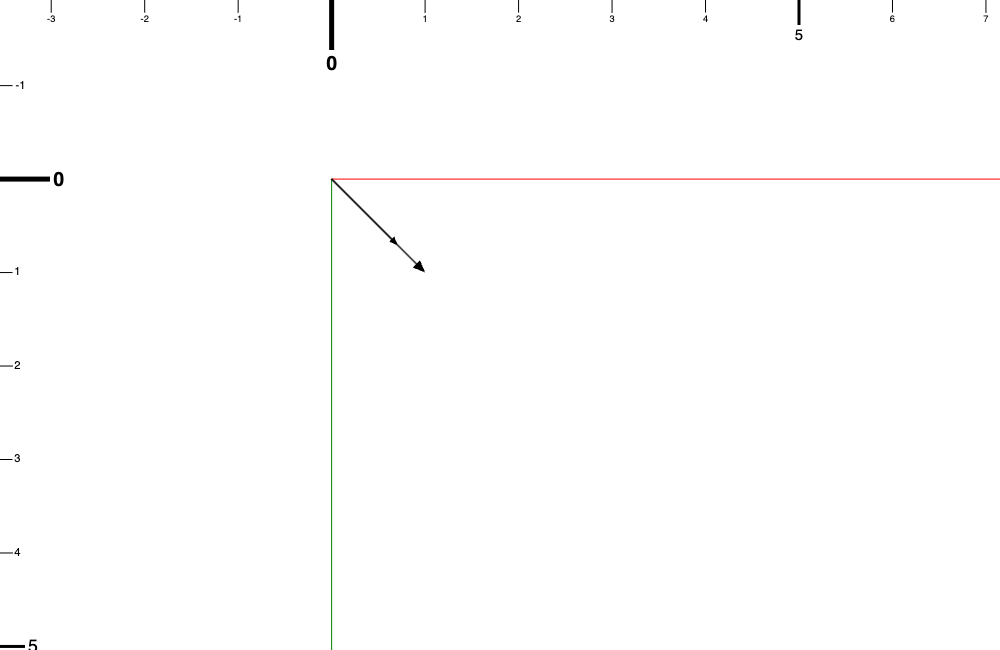
_那個比較不明顯比較小的箭頭就是 (1, 1) 的單位向量_

要計算一個向量的單位向量也非常簡單，只需要先計算出這個向量的長度，然後再把向量的 x、y 部分個別除上長度。


例如說，我們有一個向量：(4, 7)，我們想要找到它的單位向量需要先算出它的長度： 


差不多是 `8.06`。

接下來 x 跟 y 兩個方向的分量都要除上長度 


(4 / 8.06, 7 / 8.06) = (0.496, 0.868)。 

所以 (4, 7) 這個向量的單位向量是 (0.496, 0.868)。

你可能會想單位向量有什麼用？

假設我們有一個向量像剛剛那樣 (4, 7)， 那我想知道跟這個向量同方向但是長度是 7 的向量會是什麼？這個時候我們就可以先計算出單位向量然後再把單位向量乘上純量就可以得出我們想要的東西了！另外，當你只需要知道一個向量的方向而不是長度時，單位向量就是你的好朋友。

像上面有提到過幾次的 i 跟 j，它們到底是什麼？它們就是 x 跟 y 方向的單位向量，所以其實如果要表示的話 i 就是 (1, 0) 這個向量，而 j 就是 (0, 1) 這個向量。

而 (4, 7) 如果是表示成：

其實就是：

好像偷跑向量相加ㄌ，所以我單位向量停在這裡就好，我們來實作。

##### 單位向量實作時間

```typescript
export function unitVector(vector: Point): Point{
    const mag = magnitude(vector);
    return {x: vector.x / mag, y: vector.y / mag};
}
```

#### 向量相加

向量是有(x, y)兩個方向的分量的，所以當向量相加時也是要兩個方向的分量分開相加，x 加 x，y 加 y。

舉個例子來說的話，(1, 8)、(3, 5) 這兩個向量相加會是 (1 + 3, 8 + 5) = (4, 13)。

向量相加的用意就是把兩個向量的作用合在一起，好像廢話 xD

這邊我舉個例子：
假設今天我們螢幕上有一個箱子，而我們按鍵盤上的“^”這個方向鍵，螢幕上我們可以看到一個箱子會往上移動，而當我們按下“>”這個方向鍵，箱子則會往右邊移動，那如果我們同時按下 “^” 跟 “>” 這兩個方向鍵，通常來說我們會預期箱子會往右上方移動對吧？通常啦！

而我們可以用這個例子去解釋向量相加，我們是 “上” 加上 “右” 這個組合。上就是我們往上的向量，而右就是我們往右的向量，當我們一起按的時候就是把這兩個向量的作用合在一起，所以我們把它們加起來。

上跟右兩個向量加起來就會是一個指向右上的向量！所以箱子往右上移動也是為數不多腦袋直覺符合科學的預期！
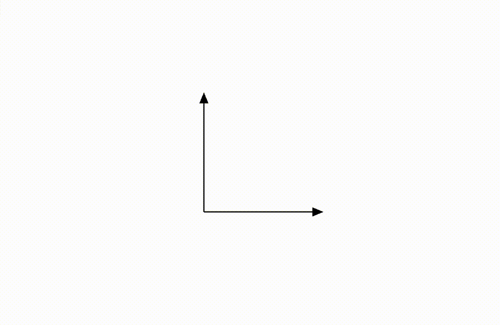

如果要視覺化向量相加，在教科書或是其他地方很常可以看到畫一個三角形代表向量相加的示意圖。
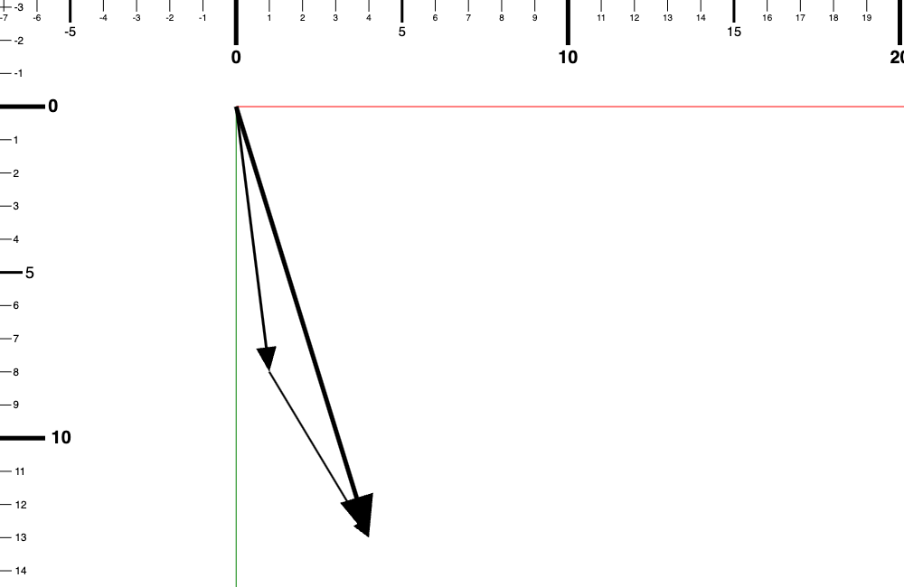

其實就是尾對頭，然後尾連頭：把兩個要相加的向量其中一個的尾巴接上另外一個向量的頭，接在一起後，再從沒連接的尾巴連到沒連接的頭，這個連接就會是兩個向量相加的結果。有時候可能會需要移動一下向量，像是剛剛我舉的那個移動箱子的例子，我往上的箭頭就有移動去讓尾巴可以接頭，移動一下會比較好想像！

說了這麼多，其實實作很簡單的！

##### 向量相加實作時間

```typescript
export function vectorAddition(vectorA: Point, vectorB: Point): Point {
    return {x: vectorA.x + vectorB.x, y: vectorA.y + vectorB.y};
}
```

#### 向量相減

向量相減跟相加是差不多的概念，也是要 x、y 分開相減。

舉相同的例子來說的話 (1, 8) - (3, 5) = (-2, 3)

要視覺化的話，向量相減其實就是向量相加的反過來。（我好像很常講廢話

其實就是 a - b 可以寫成 a + (-b) 的應用，所以其實我們只需要加上另外一個反過來的向量就好。

我們就是把減掉的向量變成負的。
 

用畫的其實就是頭尾對調

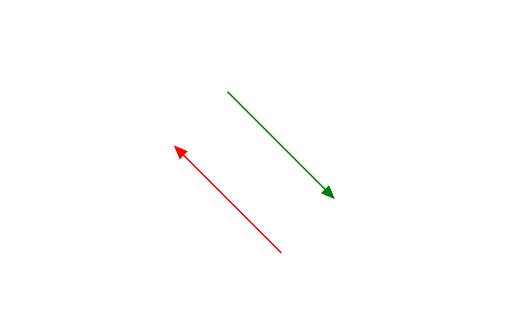
_紅色向量跟綠色向量為各自的反方向的向量_

接下來就是跟向量相加是一樣的。

##### 向量相減實作時間

```typescript
export function vectorSubtraction(vectorA: Point, vectorB: Point): Point {
    return {x: vectorA.x - vectorB.x, y: vectorA.y - vectorB.y};
}
```

#### 向量乘上純量

如果需要把一個向量沿著自身的方向延伸長度則是需要把向量的兩個分量都乘上一個數字。


舉個例子來說，如果要將 (1, 8) 現有長度延伸 3 倍的話，就需要 (1 x 3, 8 x 3) = (3, 24)

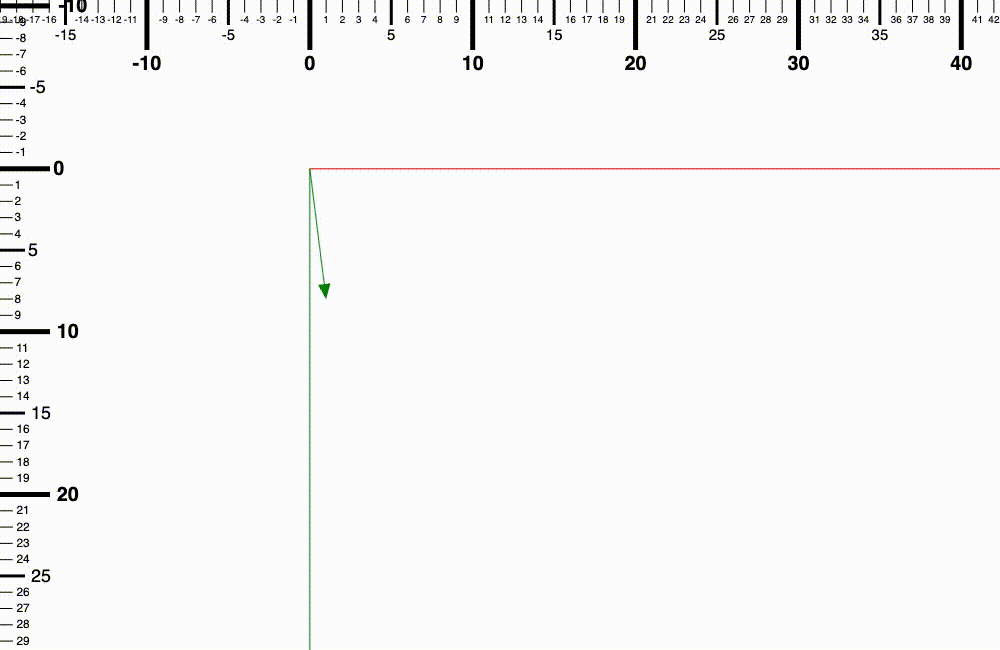

從 (1, 8) 到 (3, 24) 延伸的過程方向都是保持一致的，(1, 8) 變成 (3, 24) 並沒有改變向量的方向，只有改變向量的長度而已。

而如果你計算一下兩個向量的長度的話就會發現 (3, 24) 的長度是 (1, 8) 的長度的三倍。

##### 向量乘上純量實作時間
```typescript
export function multiplyByScalar(vector: Point, scalar: number): Point {
    return {x: vector.x * scalar, y: vector.y * scalar};
}
```

#### 向量內積

向量的內積可以用在很多地方，不過我們這邊主要是要用在投射一個向量到另外一個向量上面的應用。投射的意思是一個向量它在另外一個向量上的那個方向的分量長度是多少。

要表示兩個向量的內積會用點來表示，而向量內積的計算方式是：


向量內積可以表示成：


可以從公式看到向量內積的計算結果會是一個純量，這個純量的就是其中一個向量投射在量外一個向量上的長度再乘上另外一個向量的長度。

這邊就是剛剛說的內積可以用在投射一個向量到另外一個向量。

因為內積是會受到兩個向量的長度影響，所以有時候會是對單位向量的內積會對我們比較有用，因為單位向量的長度是 1 所以對內積後的數字沒有影響。

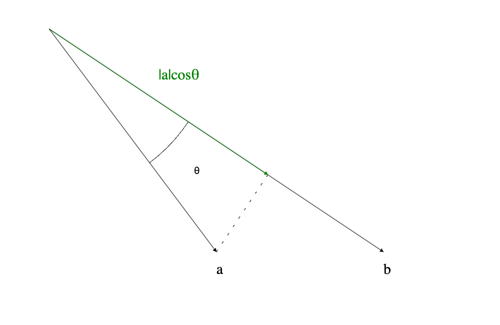
_如果 A 跟 B 的 __“單位向量”__ 做內積的話就會是綠色向量的長度_

這個概念可能我們之後有更多案例實作的時候會比較容易理解，現在只需要知道怎麼實作細節就好。

##### 向量內積實作時間

```typescript
export function dotProduct(vectorA: Point, vectorB: Point): number {
    return vectorA.x * vectorB.x + vectorA.y * vectorB.y;
}
```

#### 旋轉向量

假設我們現在有一個向量起點是 (0, 0)原點，終點是 (3, 0)。

如果我們把它畫出來的話，會像是時鐘上面時針指在三點鐘的方向對吧，然後那根針的長度會是 3 。 

如果我們想知道 5 點鐘的話，同樣長度的向量應該怎麼表示呢？（在 y 軸是往螢幕下方為正的座標系中）

如果是 9、6、12 點鐘都很好表示對吧，但如果要隨便的一個時間的向量就很難直接地表示出來了吧。（應該吧，如果你是天才可以直接算那就另當別論ㄌ）

那如果你是一般人的話該怎麼辦呢？這時候你就需要旋轉向量這個好用的酷東西了。

旋轉向量的用法就是給它一個向量跟一個角度，它可以跟你說這個向量旋轉過後的樣子。

有個東西需要先釐清，就是角度的表示。

在向量計算的時候使用的角度單位都是弧度(radian)不是度(degree)。

在前面的章節也有提到過 

弧度(radian) 跟 度(degree) 的換算關係是：


另外，在 y 軸是螢幕往下為正方向的座標系中，旋轉的正方向是順時針。

旋轉向量的公式看起來像是這樣


所以要回答剛剛的問題的話，五點鐘的長度為 3 的向量。

時鐘上每個小時中間的角度是 30 度 (degree)（360 / 12 = 30），所以 3 點到 5 點中間是 60 度 (degree)

60 度 (degree) 換算成弧度 (radian) 是 `60 * Math.PI / 180 = Math.PI / 3;`

用這個弧度帶入公式的話會得到： 


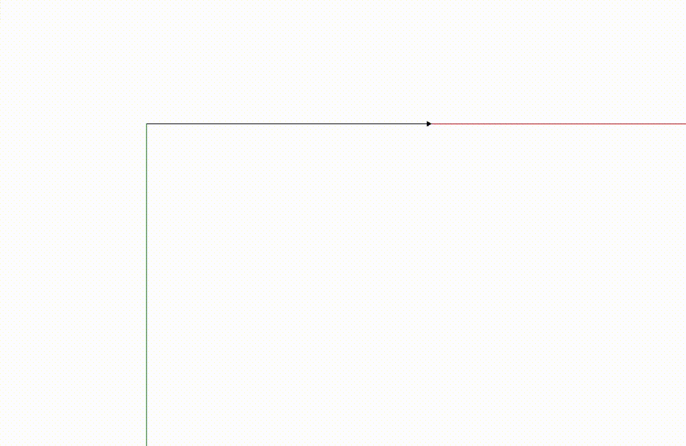
_從三點旋轉到五點_

如果你把這個向量畫出來的話，可以看到真的是指到 5 點鐘方向。

如果你再去計算這個向量的長度，的確也是預期的 3！

至於有興趣看這個旋轉矩陣的公式的同學可以留下來繼續看，如果沒有興趣的話可以直接跳到旋轉的實作！

----
這邊的推導好像有很多方法，我選一個我比較熟悉的，如果有誤也請大家更正我。

我這個是以前在學動力學的時候有一個前導章節是在講旋轉座標系之間的轉換，我從那邊延伸過來的。

假設現在我們有一個座標系它的 x、y 方向可以用 I 單位向量以及 J 單位向量表示。如圖所示
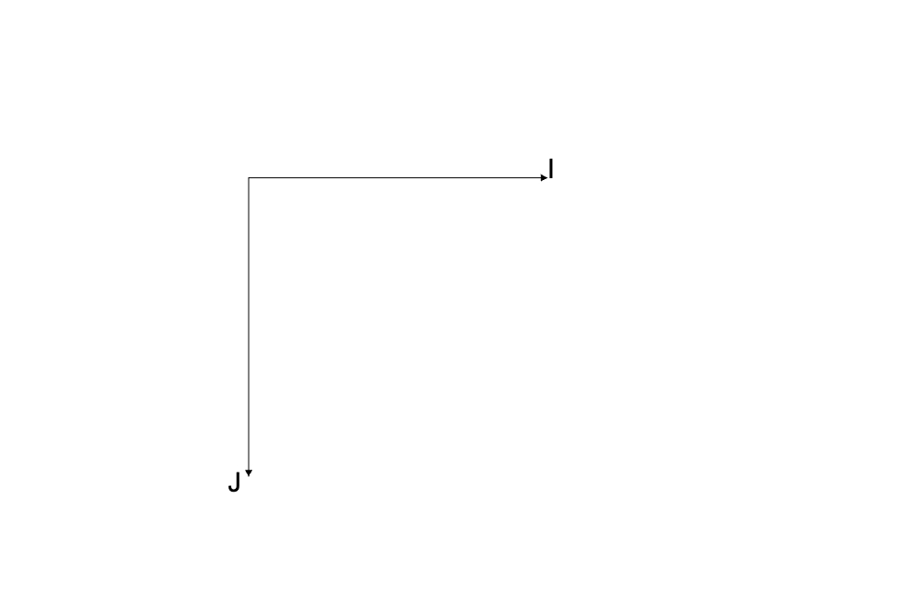

現在有一個旋轉過 theta 角度的座標系，它的 x、y 方向可以用 i 單位向量以及 j 單位向量表示。
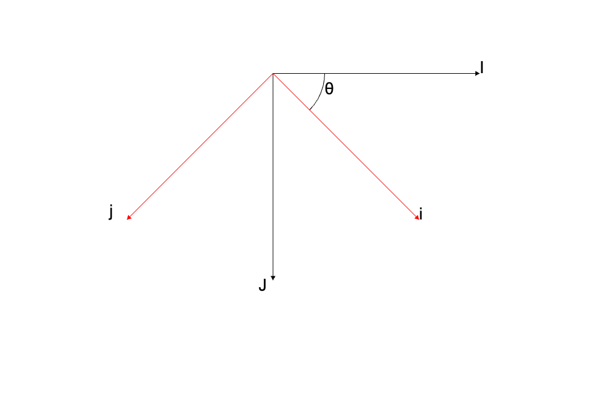

如果我們現在有一個向量是 (XI, YJ)，我們要怎麼用 i 跟 i 去表示這個向量呢？（等於是旋轉座標系）

我們從用 i 單位向量跟 j 單位向量去表示 I 這個單位向量開始，這樣之後我們就可以直接把結果帶進去 I 這個向量。

我們可以看到如果 I 在 i 跟 j 這個座標系裡面，i 方向的分量是原本長度的 cos(theta)；而 j 方向的分量是 -sin(theta)。

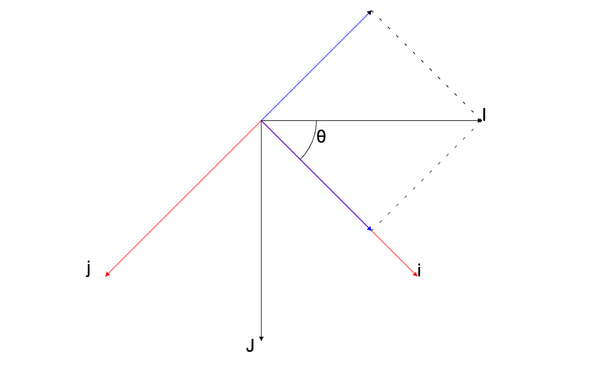
_圖中的藍紫色箭頭就是 I 這個單位向量投射在 i 跟 j 方向的分量，而它們的長度分別是 i: cos(theta)、j: -sin(theta)。_

再來我們看如果 J 在 i 跟 j 這個座標系裡面， i 方向的分量是原本長度的 sin(theta) 的；而 j 方向的分量是 cos(theta)。

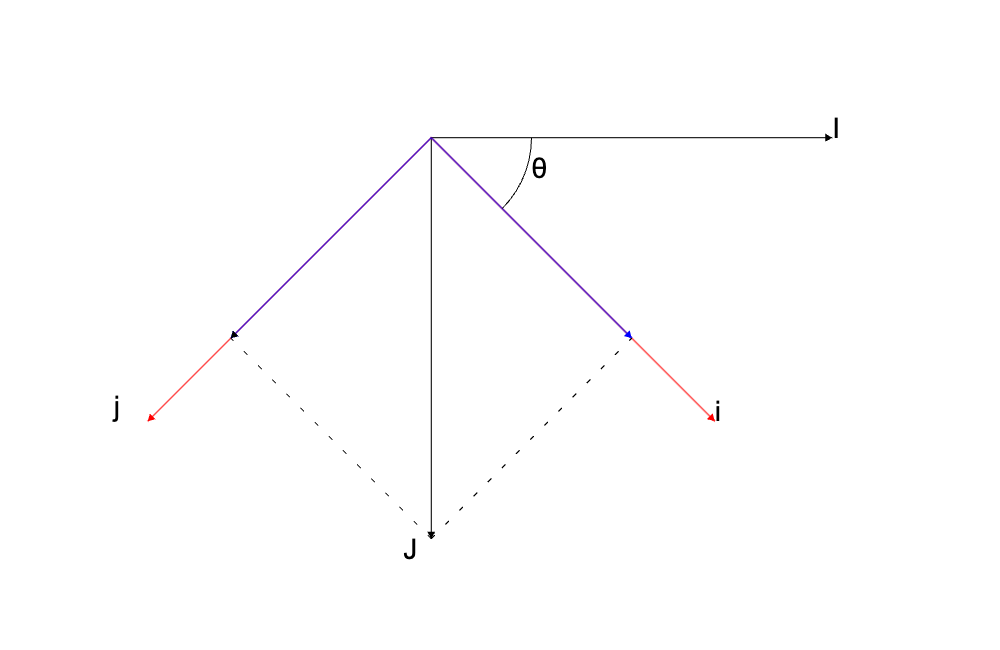
_圖中的藍紫色箭頭就是 J 這個單位向量投射在 i 跟 j 方向的分量，而它們的長度分別是 i: sin(theta)、j: cos(theta)。_

所以我們可以這麼表示。


之後我們可以把它用成矩陣的方式。


中間的矩陣是不是就跟旋轉矩陣一模一樣了！

這是為什麼呢？

其實如果你仔細觀察，從 IJ 轉換成 ij 的時候因為這兩個座標系之間的關係是有一個旋轉角度，轉換座標系的時候實際上結果跟旋轉向量是一樣的。
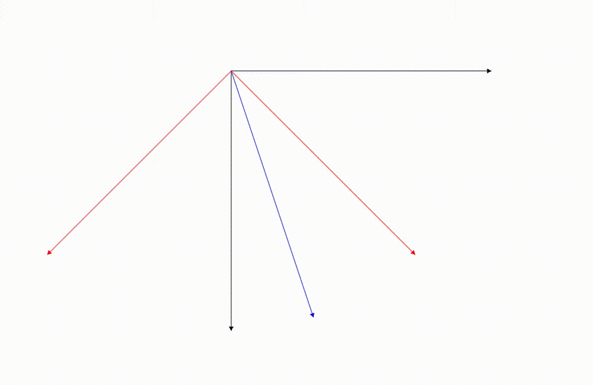
_藍色的向量是我們關注的向量，它的座標是根據紅色座標軸去描述的(相對於紅色座標軸的座標)，這張圖是我們把它從紅色座標軸的座標系轉換成黑色的。（轉換座標系）_

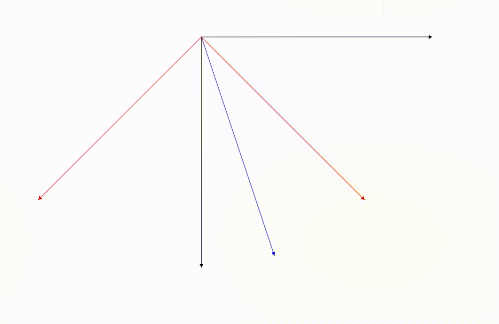
_藍色的向量是我們關注的向量，它的座標是根據紅色座標軸去描述的，這張圖是我們把向量旋轉_

這兩張圖藍色向量相對於紅色的座標軸最後的結果都是一樣的！

大概是這樣子。好像不是很嚴謹的推導，不過我真的是這樣從大學記到現在的，就不用特別去記旋轉矩陣長怎樣，可以自己推導出來。

----

##### 旋轉向量實作時間

```typescript
export function rotateVector(vector: Point, angle: number): Point {
    return {x: vector.x * Math.cos(angle) - vector.y * Math.sin(angle), y: vector.x * Math.sin(angle) + vector.y * Math.cos(angle)};
}
```

#### 向量之間的角度

有時候我們會需要知道向量之間的角度，而兩個向量之間的角度是有方向的。
例如說從 A 向量到 B 向量跟從 B 向量到 A 向量的角度數值雖然是一樣的但是他們的方向是完全相反的。

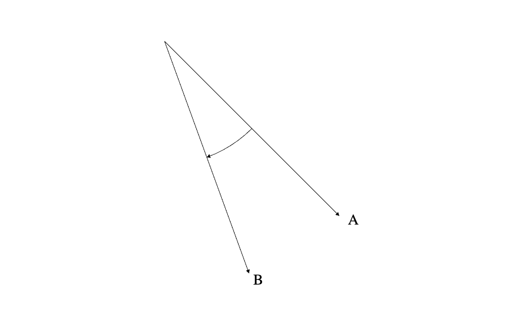 B" class="image-shadow image-rounded" style="max-width: 100%; height: auto;" />
_從A到B的角度_

 A" class="image-shadow image-rounded" style="max-width: 100%; height: auto;" />
_從B到A的角度_

下面是這個算法的不嚴謹推導有興趣的人再看就好，可以直接跳到實作時間。

----
我們知道向量的內積也可以表示成 |a|*|b|cos(a跟b之間的角度)

而向量的外積在 2D 裡面就只是一個純量（代表在垂直第三軸的量），而且也可以表示成 |a|*|b|sin(a跟b之間的角度) 

外積的向量順序調換會讓這個結果變成正負相反，而 sin(theta) 的正負會是可以這樣轉換的 -sin(theta) = sin(-theta) 的，所以外積順序會影響角的正負方向。

如果我們把 外積 / 內積 ，那我們會得到 cos(theta) / sin(theta)

為什麼要這樣疊在一起呢？

我們可以只計算內積取得 cos(theta) 的值然後再用 `Math.acos` 取得角度的值。

我們也可以只計算外積取得 sin(theta) 的值然後再用 `Math.asin` 取得角度的值。

但是 `Math.acos` 的返回值範圍是在 [0, pi]，而 `Math.asin` 的返回值範圍是在 [-pi/2, pi/2] 。

我們需要用 `acos` 取得大於 90 度的角，而需要用 `asin` 去取得角的方向。

而疊在一起會變成 cos(theta) / sin(theta) = tan(theta)，而 tan(theta) 取角度有一個很方便的 `Math.atan2`。

為什麼是 `Math.atan2`？ 而不是 `Math.atan` 呢？ 因為 `Math.atan` 的返回值範圍也會被限制在 [-pi/2, pi/2]。

`Math.atan` 只吃一個參數，就是 `cos(theta)` / `sin(theta)` 最後的結果，而 `Math.atan2` 是要分開傳進去的，這樣才可以判斷角度的象限。

所以我們在這邊找 `arctan` 的時候就用 `Math.atan2(sin(theta), cos(theta))`。

而剛剛前面有提到的內外積就可以在這時候用了把 `cos(theta)` 跟 `sin(theta)` 代換一下變成 `A X B` 跟 `A · B` 就變成 `Math.atans(AXB, A·B)` （因為 `|A|*|B|` 會被抵銷掉。） 而 AXB 再代換成 `A.x * B.y - A.y * B.x` ，然後 `A·B` 變成 `A.x * B.x + A.y * B.y`。

以上就是我的不嚴謹推導，計算有方向的兩個向量夾角。

----

##### 向量之間的角度實作時間

```typescript
export function angleFromA2B(vectorA: Point, vectorB: Point): number {
    return Math.atan2(vectorA.x * vectorB.y - vectorA.y * vectorB.x, vectorA.x * vectorB.x + vectorA.y * vectorB.y);
}
```

#### 向量外積

因為無限畫布這邊主要是在 2D 平面，我們幾乎不會使用外積。但是我這邊是先列出來就好，如果之後有需要我再補上實作細節。

向量計算的章節就到這裡！

如果你對中間的一些東西還是有點不懂也沒有關係，可以留言問我或是其他讀者！

有些東西看到實際運用時可能才會有那個 “啊哈！” 的時候，所以後面跟著應用這些函式可能會讓你更好吸收！

今天的進度在[這裡](https://github.com/niuee/infinite-canvas-tutorial/tree/Day05)，如果你有實作上的任何不確定也都可以參考一下。

※ 目前的設置是沒有辦法打包成 library 給其他外面的 package 用的，如果你想要把目前的東西打包成一個 Javascript 你可以在 `src/index.ts` 裡面把 `placeholder` 拿掉，然後加上 `export * from "./vector"` （後續如果有新增其他檔案也是比照辦理）因為目前 `vite.config.js` 入口是 `src/index.ts`。（或是也可以去改 `vite.config.js`）

如果有任何問題也可以在留言問我，如果覺得問題不方便公開也可以站內信！（但我可能會徵求你的同意把你的問題轉述 po 在下面補充，畢竟你的問題很有可能也有不同人遇到）

那我們明天見！


