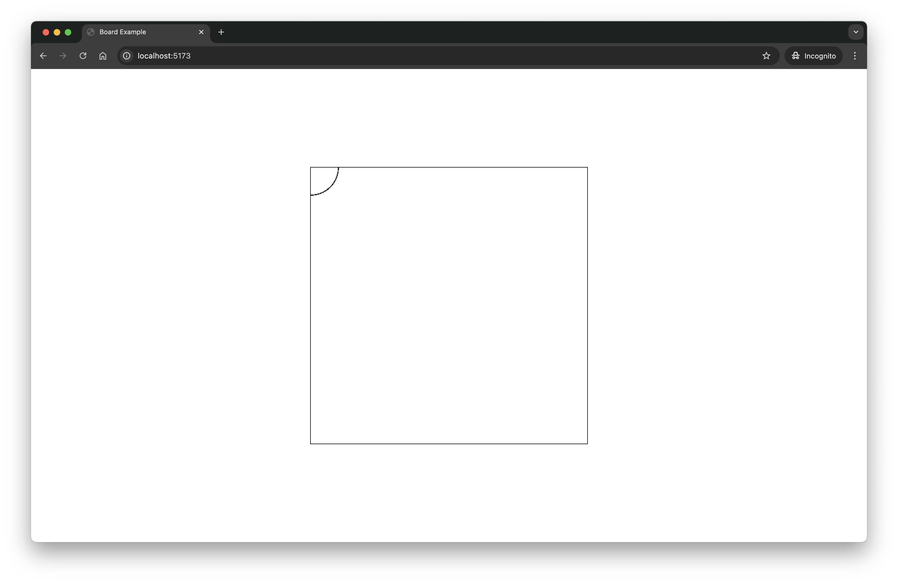
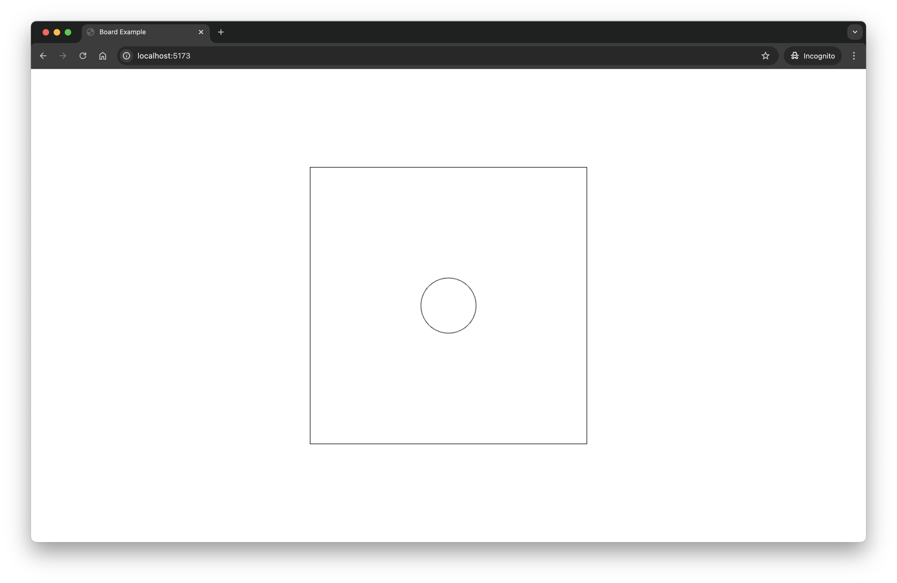
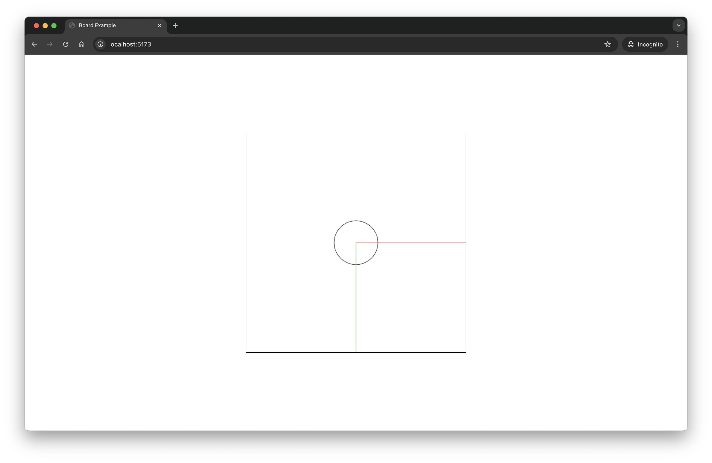

## 前言：還沒有實作之前提到的功能，就要先畫東西嗎？
前面在 Day 02 的時候有提到這個系列主要會實作移動無限畫布的功能。

不過在那個之前，需要先做的是無限畫布的 debug 元素！

Debug 元素？請聽我娓娓道來。

### 無限畫布的特性與測試挑戰
無限畫布很著重在數字的計算，例如說現在應該要呈現什麼在畫布上是取決於 canvas 的狀態。

這些東西都是可以用數學算出來有一個正確的解答去對照的，因此測試的時候完全可以不仰賴視覺化的任何元素。

不過不過，很多時候因為我很懶，很多場合我可能只會算出幾個簡單的測資，就不想算了，可能是我的腦袋也不堪負荷了。

在沒有絕對測資的時候無限畫布應該怎麼 debug 呢？

眼睛！還有手！好險無限畫布這種東西是很直覺的，有點像是你不太需要學習，你操作之後，你自己就已經可以預期它應該如何反應。

### 視覺化 Debug 的重要性
例如說，你滾滑鼠滾輪，你第一個直覺的反應可能會是放大或是縮小。

有時候我會仰賴這些部分去幫我測試無限畫布的操作。

但是如果是白白的一片大畫布，我就很難知道它有沒有移動？有沒有放大？有沒有旋轉？

這時候我們就需要一些畫在畫布上的“真理”！

這些東西可以說是我們的定錨點。

小可以到只是一顆原點，大到可以是你復刻出蒙娜麗莎的微笑這樣。

你可能會覺得這實在太蠢了！很不科學，不過我覺得無限畫布利用這種 debug 的方法同時也是在調整無限畫布的使用者體驗。

例如說，縮放的敏感程度、平移的敏感程度等等的；這些都是要實際看到畫面之後才會有調整的基準，不然只有在螢幕上的數字很難直接對比到使用者體驗。

當然有一些計算的東西我們還是付諸科學用單元測試的方式去完成驗證，所以別擔心，我們還沒有完全失去理智！

雖然我剛剛說你可以畫出蒙娜麗莎的微笑，但我覺得比較實際的東西可能就是座標軸跟一個你知道座標的點。

所以我會先示範這兩個東西，不過大家可以發揮自己的創意！

## 實際操作：準備開發環境
我們會接著使用 “Day 05 | 點到點，向量的計算” 建立起來的專案去做今天的開發；在專案的根目錄裡面我有另外加入 `index.html` 跟 `main.ts` 這兩個檔案。

這兩個檔案是讓我們用來測試這個 library 的 dev server 用的。（使用 code sandbox 來開發的人也可以用 dev server，dev server 的用意跟 code sandbox 裡面的 preview 會是一樣的）

這兩個檔案我都先用好最基本的架構了，包含一個 500 x 500 的 canvas 置中在 html 裡面，而 canvas 有 1px 的黑色邊框，好讓大家知道 canvas 的範圍在哪裡。

接下來我要示範一下可以怎麼在 canvas 上面畫一些酷東西。

我會順便把 “Day 04 | Canvas 你怎麼都沒反應？” 介紹過的 `requestAnimationFrame` 也加進去，不過因為我們還沒有開始實作無限畫布所以它暫時還看不出來用處。

### 修正先前的錯誤：開始之前，有個小小的事情要請各位一起做
在今天實作開始之前，我要先跟各位坦承，我 Day 05 上傳的進度的 index.html 是我忘記更新的版本，所以在今天的實作開始之前，想請各位先把根目錄的 index.html 換成是以下這樣：

`index.html`
```html
<!DOCTYPE html>
<html lang="en">
<head>
    <meta charset="UTF-8">
    <meta name="viewport" content="width=device-width, initial-scale=1.0">
    <title>Board Example</title>
    <link rel="stylesheet" href="https://fonts.googleapis.com/css2?family=Noto+Sans:wght@400;700&display=swap">
</head>
<body style="margin: 0; overflow: hidden;">
    <div style="display: flex; justify-content: center; flex-direction: column; align-items: center; height: 100vh;">
        <canvas id="graph" width="500" height="500" style="border: 1px solid black; background-color: white;"></canvas>
    </div>
    <script type="module" src="./main.ts"></script>
</body>
</html>
```

### 開始實作：設置 Canvas
好的，我們可以回到正題了！

在 `main.ts` 裡面把現有的東西都先刪掉。

接著加上一個取得 html 上面 canvas 的 `querySelector`，然後取得 canvas 的 2D `context`。

`main.ts`
```typescript
const canvas = document.querySelector("canvas") as HTMLCanvasElement;
const context = canvas.getContext("2d");
```

### 動畫循環
接下來我們要加上 `requestAnimationFrame` 的 callback function `step`，以及呼叫他的 `requestAnimationFrame`。

這邊有一個 early return 是 context 如果沒有辦法取得到的話，我們就沒辦法做接下來的事情。也不需要一直去無謂地呼叫 `requestAnimationFrame`，然後你也可以選擇在這時候輸出一些東西讓使用者知道發生什麼事情了。

`main.ts`
```typescript

// timestamp 是 requestAnimationFrame 會帶進來的參數
function step(timestamp: number){
    if(!context){
        return;
    }
    context.beginPath(); // 要記得 beginPath 不然會都沒有東西！
    context.arc(0, 0, 50, 0, 2 * Math.PI);
    context.stroke();
    window.requestAnimationFrame(step); // 要記得遞回呼叫 requestAnimationFrame 不然動畫就只會有第一幀。
}

window.requestAnimationFrame(step); // or step(0);
```

你可以在終端機打 `npm run dev` 然後點開連結去瀏覽器，應該可以看到你的 canvas 的左上角有一個 1/4 的圓，而且圓是只有右下角的那部分。



這是因為 context 的原點現在是在 canvas 的左上角，所以才會是這個畫面。（前面在 “Day 03 | Canvas 的基礎”也有稍微提到。）

### 調整 Canvas 原點
如果我們想要看到完整的一個圓，我們需要把 `context` 移動到 canvas 的中間！

要把 context 移動到畫面中 canvas 的中心點很簡單！我們只需要在 y 軸移動半個 canvas 的高度，然後也在 x 軸的方向移動半個 canvas 的寬度即可。

所以在 `context.beginPath()` 之前我們先來 `context.translate(x, y)` 一下。

`main.ts`
```typescript

// timestamp 是 requestAnimationFrame 會帶進來的參數
function step(timestamp: number){
    if(!context){
        return;
    }
    context.reset(); // 這裏！
    context.translate(canvas.width / 2, canvas.height / 2); // 這裏！
    context.beginPath(); // 要記得 beginPath 不然會都沒有東西！
    context.arc(0, 0, 50, 0, 2 * Math.PI);
    context.stroke();
    window.requestAnimationFrame(step); // 要記得 call requestAnimationFrame 不然動畫就只會有第一幀。
}

window.requestAnimationFrame(step);
```



前面有多一個 `context.reset()` 是因為 `step` 會是每一幀都呼叫一次，而 `translate` 這個東西是會疊加的；如果我們沒有進行 reset 的話，它每一幀都會平移一段距離，而且是在上一幀平移之後的狀態再繼續平移，最後就會移出畫面之外了。(昨天的文章有稍微提到關於 `context.reset()` 的一些需要注意的地方，目前因為我們還沒有要清空畫布，所以目前還沒有把 `clearRect` 用出來。)

### 繪製座標軸
接下來，我們可以畫一下座標軸了！

在 `context.stroke()` 後面加上新的東西。

`main.ts`
```typescript

// 上略

function step(timestamp: number){
    if(!context){
        return;
    }
    context.reset(); // 這裏！
    context.translate(canvas.width / 2, canvas.height / 2); // 這裏！
    context.beginPath(); // 要記得 beginPath 不然會都沒有東西！
    context.arc(0, 0, 50, 0, 2 * Math.PI);
    context.stroke();

    // 畫出 x 軸
    context.beginPath();
    context.moveTo(0, 0); // 移動畫筆到原點
    context.lineTo(250, 0); // 從 moveTo 的點開始畫直線到 lineTo 的點 (250 是因為 canvas 的寬度是 500 目前我們畫到 250 就可以涵蓋可是範圍內的 x 軸)
    context.strokeStyle = `rgba(220, 59, 59, 0.8)`; // 畫出的線是一點淡淡的紅色
    context.stroke();

    // 畫出 y 軸
    context.beginPath();
    context.moveTo(0, 0); // 移動畫筆到原點
    context.lineTo(0, 250); // 從 moveTo 的點開始畫直線到 lineTo 的點
    context.strokeStyle = `rgba(87, 173, 72, 0.8)`; // 畫出的線是一點淡淡的綠色
    context.stroke();
    window.requestAnimationFrame(step); // 要記得 call requestAnimationFrame 不然動畫就只會有第一幀。
}

// 下略

```



## 結尾
如此一來我們就有一個原點，跟兩根座標軸了！

之後這些東西會是我們 debug 的好幫手！

之後會根據需要調整其中的一些東西，我會在需要調整的時候詳細解釋所以不用擔心！

好的，那我們今天就先這樣！各位明天見！

今天的進度連結在[這裡](https://github.com/niuee/infinite-canvas-tutorial/tree/Day07)

