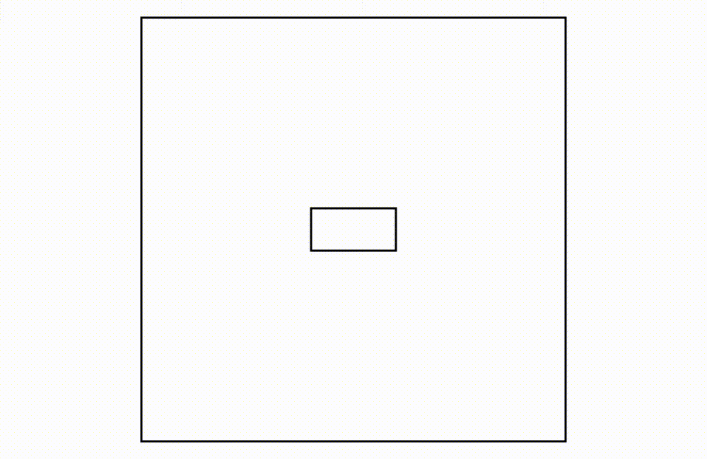
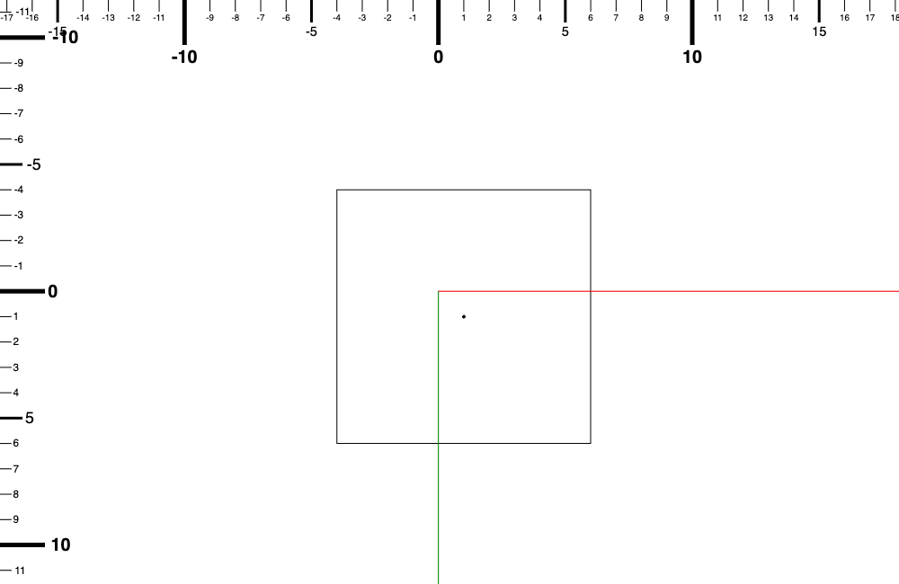
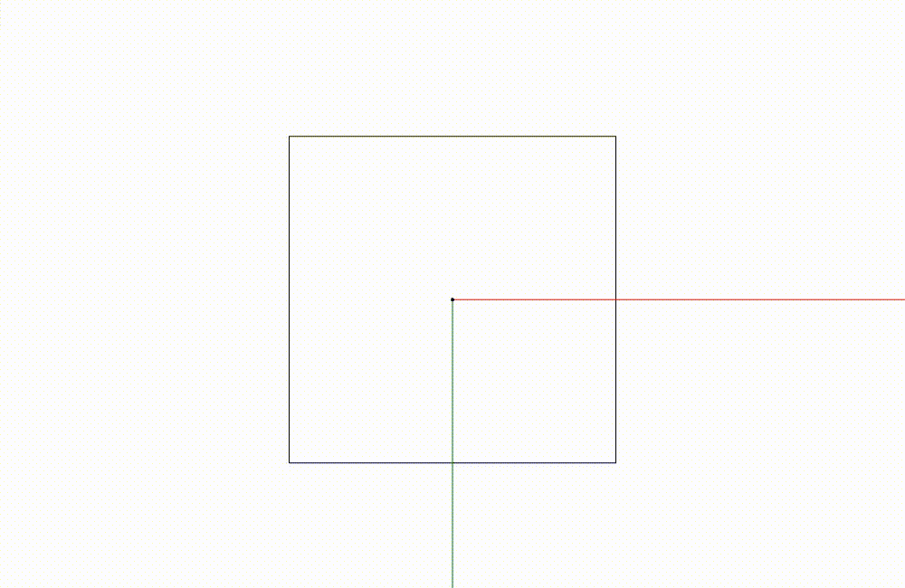
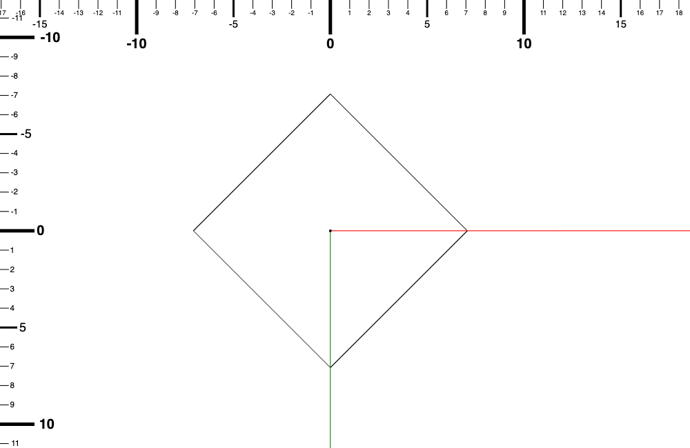
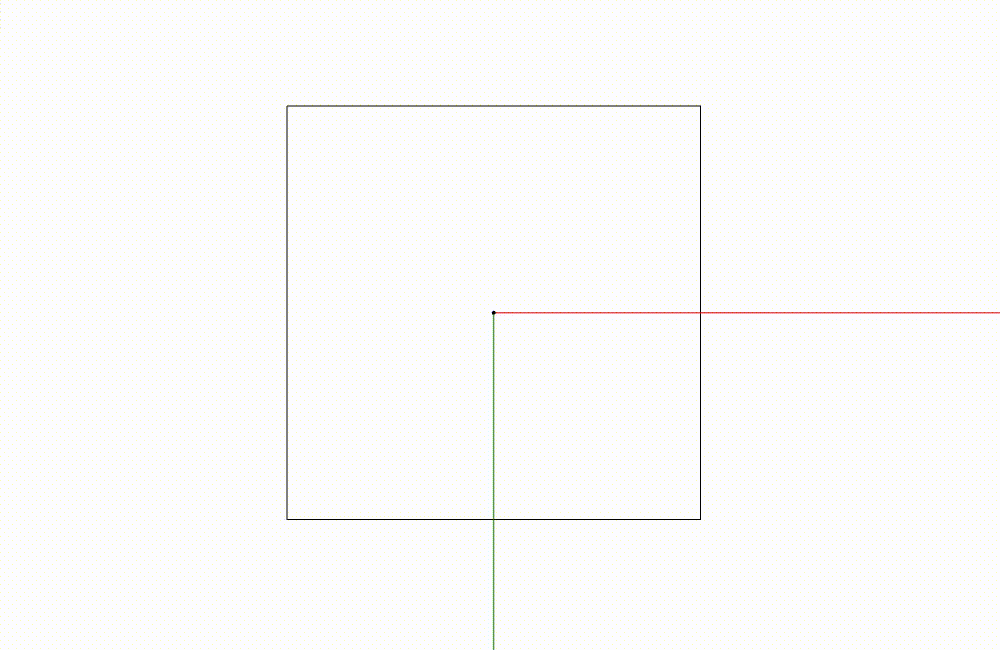
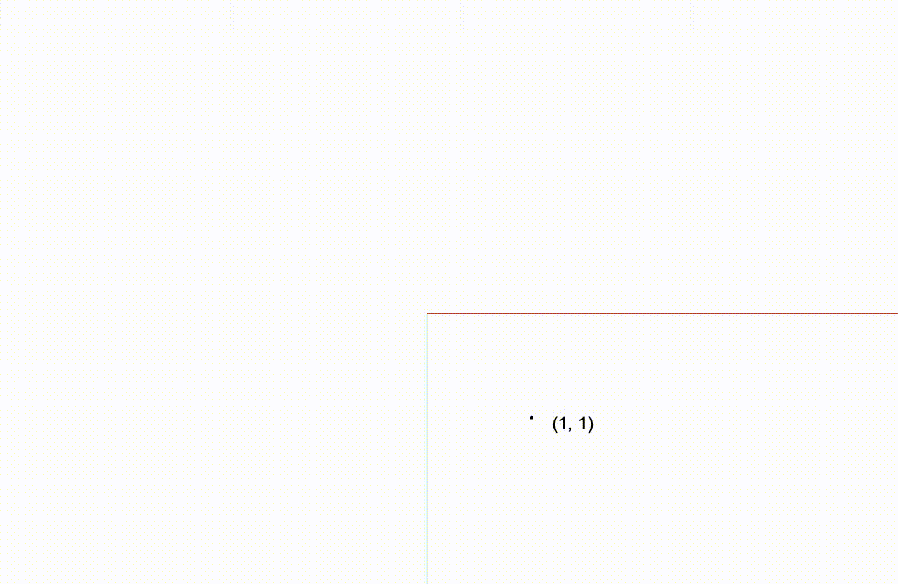

今天我想要先概略講解一下我們會怎麼去拆解無限畫布這個看似範圍很大的問題，把它變成一些可以模組化的東西。

# 我們需要一個相機

## 相機是一個比較具體的比喻
要怎麼把無限畫布這個概念轉換成一個讓我們實作時可以引用的比喻？

沒錯，就是跟標題透露的 “相機” 有關係！

我們可以想像無限畫布本身就是一張大白紙，然後有一個相機是在上面拍。

我們移動的東西不是底下的畫布，而是懸浮在上方的相機。

而相機視窗捕捉到的就是呈現在螢幕上的畫面。


_大的框框是畫布，小的框框是相機的視窗範圍，我們在螢幕上看到的就是小的框框內的東西_

因為我們是使用 `<canvas>` 這個標籤去實作這個功能，而`<canvas>`可能是放在頁面上的任何一個角落，`<canvas>` 的大小也不一定是佔滿整個螢幕的。

所以相機的視窗大小應該是要跟著 `<canvas>` 的大小變動，而 canvas 的位置會影響後面的座標系轉換。

## 座標系的轉換

無限畫布很重要的一部分是座標系的轉換。

當使用者在螢幕中用滑鼠點擊，瀏覽器回報的游標位置會是在螢幕中的，而我們需要把這個位置的座標轉換成在大畫布上面的座標，這樣才有辦法跟畫布上的物件去做互動，反之也有可能需要知道畫布上的其中某一點是否在相機的視窗範圍內，如果在視窗範圍內的話會是在畫面上的哪裡？

諸如此類的問題都會需要用到座標系轉換。

我們可以把相機的視窗跟畫布分開成兩個獨立的個體，各自有獨立的座標系，這樣在互相轉換時才比較不會讓自己混亂。

在這個系列的後續我都會把相機視窗稱為視窗，而畫布則是世界（有點像是全域的感覺）。

因為畫布本身是不會動的，所以雖然我們也可以讓畫布有自己獨立的座標系，但是我們讓它直接跟世界座標系是一致的就可以省一些麻煩。

以相機的概念為基底也能夠讓運鏡的實作比較直覺容易解釋。

我整理一下為什麼需要使用這樣子的比喻當作前提來實作無限畫布。

1. 方便座標系轉換
2. 與現實世界的物體有連結，方便函式以及類別命名

這個系列文會以這個類比貫穿整個專案，如果你有更好的想法也歡迎大家一起交流～

好的，那我們就開始今天的實作吧！

# 實作時間

## 基礎的相機 `Camera` 類別
我們可以在 `src` 這個資料夾裡面加上一個新的檔案 `camera.ts`。

我們根據剛剛的類比在 `camera.ts` 裡面先創造一個 Camera 的類別。

`camera.ts`
```typescript
class Camera {

}
```

在我們的應用範圍內相機會有幾個比較重要的屬性：位置、縮放程度、以及旋轉角度。

目前這三個屬性就足夠我們實現無限畫布中的平移、縮放、以及旋轉的基本功能。

`_position`：相機的“絕對位置”，換句話說就是相機視窗中心在世界裡的座標。這個座標是在“世界”座標系裡的。

`_zoomLevel`：相機的縮放倍率；數字越大代表相機有放大的效果，原本的物體在相機視窗中看起來會比較“大”。反之，數字越小代表相機有縮小的效果，原本的物體在相機視窗中看起來會比較小。

`_rotation`：相機的旋轉角度。這個應該比較直覺，但也幾乎沒有無限畫布有應用到。

我們把它們都加上去。

`camera.ts`
```typescript
class Camera {
    private _position: Point;
    private _zoomLevel: number;
    private _rotation: number;
}
```

`_position` 的 type 是 `Point` 就是跟計算向量的時候用的 `Point` 是一樣的。 

所以我們需要在 `camera.ts` 裡面從 `./vector` import `Point` 這個 type。

`camera.ts`
```typescript
import { Point } from "./vector";
```

接下來我們需要一些 accessor 來從外部設定存取這些屬性，以及在建構子中初始化它們。
     
`camera.ts`
```typescript
class Camera {
    private _position: Point;
    private _zoomLevel: number;
    private _rotation: number;
    
    constructor(){
        this._position = {x: 0, y: 0};
        this._zoomLevel = 1; // 縮放程度不能夠小於或是等於 0。
        this._rotation = 0;
    }

    get position(): Point {
        return this._position;
    }

    get zoomLevel(): number {
        return this._zoomLevel;
    }

    get rotation(): number {
        return this._rotation;
    }

    setPosition(destination: Point){
        this._position = destination;
    }
    
    setZoomLevel(targetZoom: number){
        this._zoomLevel = targetZoom;
    }
    
    setRotation(rotation: number){
        this._rotation = rotation;
    }
}
```

然後我們在 `camera.ts` 的最後面輸出 `Camera` 類別讓其他 module 也可以使用。

`camera.ts`
```typescript
export { Camera };
```

都是很簡單直覺的 accessor ，我們後面會針對輸入做驗證，所以先不要急著就直接把 `position`、`zoomLevel`、`rotation` 改成 public！

## 把相機轉換給 `context` 用

接下來我們要把這個相機轉化成為我們可以使用在 `context` 上面的形式。

轉換成可以使用在 `context` 上的形式？這是什麼意思呢？

雖然我們上面是說我們是操作相機在畫布上面移動來移動去的，但是實際上我們能控制的東西是底下幫我們畫圖的機器畫筆 `context`。我們需要操縱 `context` 來幫我們畫出根據相機的狀態，視窗上面應該看到的東西！

`context` 只是我們用來輔助我們達成有在對畫布操作的假象。

這邊會需要一些視覺的輔助，我比較好解釋 xD，所以請接著看下去！

首先我們先處理相機位置的部分。

### 平移
試想，我們現在有一個相機它現在的 `position` 是在 (1, 1)。縮放維持在 1，旋轉角度則是 0。

然後它的視窗大小是 10 x 10 的話，它的視窗範圍畫在世界裡會長怎樣？


_方框是相機的視窗，方框中的小黑點是相機的中心點也就是位置_

因為我們實際能夠移動的東西是 `context` 所以我們從這張圖片去回推會比較好理解。

當相機 `position` 在 (0, 0) 的時候，座標系與原點會是在畫面的中心點。

那當相機 `position` 移動到 (1, 1) 時，座標系原點理應會在畫面中心點往左上角一點的位置對吧？（我們遵循 y 軸正方向是往下這個座標系）。當我們只看相機時，它是朝右下角移動，反過來說，如果相機不動的話，座標軸是朝左上角移動了。

_相機移動跟底下的座標軸移動都可以達成相機視窗中是一樣的畫面（有相機移動的感覺）_

所以如果需要呈現原點以及座標系是在左上角的狀態，我們應該要怎麼移動 `context` 去讓畫出來的東西呈現在視窗中是我們想要的？

沒錯！就是讓他往左上的方向移動，然後再在畫布上重繪！

`context.translate(-相機所在位置的 x, -相機所在位置的 y)` 這個樣子。

我們來在昨天 `main.ts` 的 `step` function 裡面的 `context.translate(canvas.width / 2, canvas.height / 2)` 後面加上相機的位移。

我們先加上一個 camera 在 `main.ts` 裡面。

記得要先 import `Camera`。

`main.ts`
```typescript
import { Camera } from "./src/camera";
```

再來建立一個 `camera` 的實例。

`main.ts`
```typescript
const camera = new Camera();
```

之後再在 `step` function 裡面加上 `context.translate` 的部分。

`main.ts`
```typescript

// 上略

function step(timestamp: number){
    if(!context){
        return;
    }
    context.reset();
    context.translate(canvas.width / 2, canvas.height / 2);

    // 加在這裡
    context.translate(-camera.position.x, -camera.position.y);

    // .
    // . 
    // .

    //下略
    
    window.requestAnimationFrame(step);
}

// 下略

```

之後在 `step` function 之外可以把 `camera` 的 `position` 調整到不同位置，去看看它的變化跟影響。

像是這樣

`main.ts`
```typescript
camera.setPosition({x: 10, y: 10});
```

然後看一下變化。

註：因為我們目前畫座標軸的機制會讓座標軸的長度是固定的，所以移動過後座標軸不會畫到 canvas 在畫面上的邊匡。

### 旋轉
我們再回到原點。

這邊我們也隨著 canvas 本身原本的座標系。

正方向的旋轉是順時針的。

那如果我們把相機旋轉 45 度的話，相機在世界的樣子會是怎麼樣呢？

這邊我也畫出視窗範圍給大家看～


這樣子的話，在相機視窗裡面，x 軸是朝右上方，y 軸朝右下方。（如果你的頭也跟著相機視窗旋轉去看的話）

這樣子的話 `context` 要怎麼旋轉才會長成這樣呢？

`context` 是要 "逆時針" 旋轉 45 度，對吧？也就是負方向的旋轉 45 度。


如果很難懂的話可以再往上滑一點看一下視窗範圍的那張圖片！

我們現在來把相機的旋轉角度也加進去 `step` function 裡面。

`main.ts`
```typescript

// 上略

function step(timestamp: number){
    if(!context){
        return;
    }
    context.reset();
    context.translate(canvas.width / 2, canvas.height / 2);

    // 加在這裡，要比剛剛 translate 還上面
    context.rotate(-camera.rotation);
    context.translate(-camera.position.x, -camera.position.y);

    // .
    // . 
    // .

    //下略
    window.requestAnimationFrame(step);
}

// 下略

```

接下來你可以用 `setRotation` 來對相機角度做更動。（記得也要加在 `step` 外面喔）

像是 `camera.setRotation(45 * Math.PI / 180)` （這個是旋轉 45 度的意思，因為角度要換成弧度）

這個系列會提到很多不同的座標系，可能會讓人很混亂。

基本上座標系的概念就是像之前 Day 03 canvas 的基礎裡面講到的，canvas 跟 context 有不同的座標系，context 都是根據自己的座標系移動的。

而不同的座標系之間的座標是可以換算的，要嘛是彼此之間轉換，或是都用世界座標系表達。

不論如何，重要的是要一致。就是你不能拿兩個用不同座標系去表示的點去找差距或做計算。

舉例來說你有一個點是定義在 y 軸 往下為正的座標系，它的座標是 (1, 1)，而你有另外一個點是定義在 y 軸往上為正的座標系，它的座標也是 (1, 1)。


_兩個點都是 (1, 1) 但是因為用來描述的座標系不同，所以其實兩個點是不一樣的_

然後你拿兩個點去做向量的差距，得出來的結果是(0, 0)。

差距是 (0, 0) 所以它們是同一個點？好像哪裡怪怪的對吧？ 如果要做計算的話應該要是同一個座標系。

所以我們應該選一個點然後把它換成另外一個點的座標系再去做相減才對。

假設我們把在 y 軸往下為正的點的座標轉換成 y 軸往上為正的座標系中的座標。它的座標應該會是 (1, -1)，再去計算它們之間的差距就會是 (0, 2) (或是 (0, -2) 看你用誰減誰)。

然後這個差距沒有轉換的話也只能用在這個座標系統的其他向量，如果你需要在 y 軸往下為正的座標系統中使用的話就應該要再轉換。

大概是這樣子的概念，這個是蠻重要的部分，很多人包括我很容易在這其中迷失。

不過無限畫布的好處就是你可以直接畫出來 debug；不用一直埋頭算數學。

這邊要再提一個蠻重要的觀念： `translate`、`scale`、以及 `rotate` 的順序很重要。

在 “Day 03 Canvas 的基礎” 裡面我們探討過一次轉換對順序是敏感的。調換之後得出來的結果會是不同的。

轉換的順序會是 scale -> rotate -> translate 這樣。

因為 scale 跟 rotate 的轉換都是相對於 `context` 的原點。如果我們用 translate 去到了別的地方，然後再 scale 或是 rotate 就會有影響。

scale 會被變成相對於 translate 過後的點。

旋轉也是，如果 translate 在 rotate 之前的話，會變成 rotate 不是相對於原點而是 translate 過後的那個點。

所以我們要把 `scale` 跟 `rotate` 加在 `translate` 的前面。

還有一點是我們紀錄相機的位置是在世界座標系的，你可能會想：那如果我們 `translate` 是擺在 `scale` 跟 `rotate` 之後的，那它不是就吃到變形了嗎？

怎麼還會是世界座標系的？

還記得我們 `context` 做完相機的轉換之後我們並沒有再對 `context` 的轉換做更改或重置，就直接畫上座標軸跟原點嗎？

所以之後畫圖的指令也都全部會吃到 `context` 的轉換。

`context` 作畫的位置會根據轉換後的狀態去做，所以其實如果相機轉換有改變，同一個東西的位置跟尺寸在"context"上面都會是跟之前不同的。

_我們並不是先畫上所有東西之後再去移動跟縮放旋轉相機，而是移動跟縮放所有畫的東西讓相機的轉換看起來是有效果。_

_相機本身是我們建立的一個概念，對 `context` 來說它根本不在乎相機，它管的是畫出來的東西。_

_換句話說，我們對 context 的操作是作用在畫出來的東西，不是相機！_

所以我們的相機位置的確是紀錄世界座標系的座標，所有東西相對於相機也都會跟著縮放倍率變化，讓相機的位置 `translate` 雖然有吃到縮放倍率以及旋轉，它還是世界系的座標，因為其他存在世界的物體也會經過這些變化。

## 縮放

接下來縮放就比較簡單了。

縮放的概念就是我們原本大小是 1 x 1 的正方形，如果相機放大兩倍（zoom in 的概念，視窗中的東西都會變大，它們之間的間隔也會變大）那這個方形在視窗中看起來要是 4 倍大變成 2 x 2 對吧。(距離是兩倍，但面積是四倍)

所以我們只需要讓 `context` 在作畫的時候畫出來的東西長度都是乘上相機的縮放倍率就好。
我們來把它加進去！

記得剛剛講的 `scale` 需要在 `translate` 之前。

`main.ts`
```typescript

// 上略

function step(timestamp: number){
    if(context){
        context.reset();
        context.translate(canvas.width / 2, canvas.height / 2);

        // 加在這裡
        context.scale(camera.zoomLevel, camera.zoomLevel);
        context.rotate(-camera.rotation);
        context.translate(-camera.position.x, -camera.position.y);

        // .
        // . 
        // .

        //下略
    }
    window.requestAnimationFrame(step);
}

// 下略

```

接下來你可以用 `setZoomLevel` 來調整相機的縮放倍率，去看看它怎麼影響無限畫布的。

今天內容也有點多，大家可以消化一下，然後玩玩看 `setPosition`、`setZoomLevel`、`setRotation` 來看看相機的屬性對畫出來的東西有什麼影響。

今天的進度在[這裡](https://github.com/niuee/infinite-canvas-tutorial/tree/Day08)

好的，那我們今天就到這裡，明天見！


