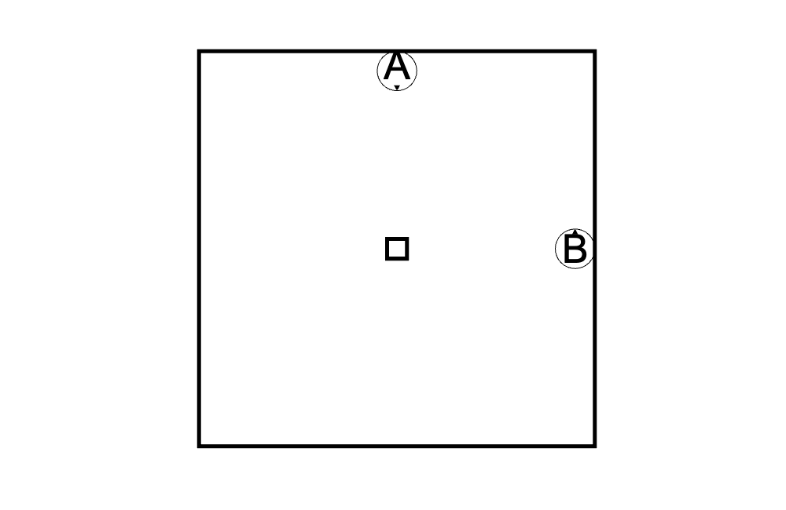
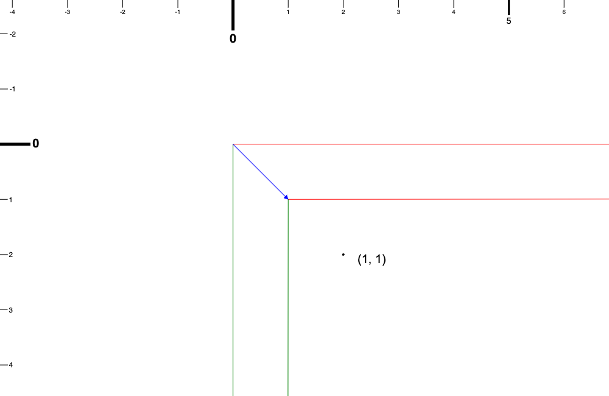
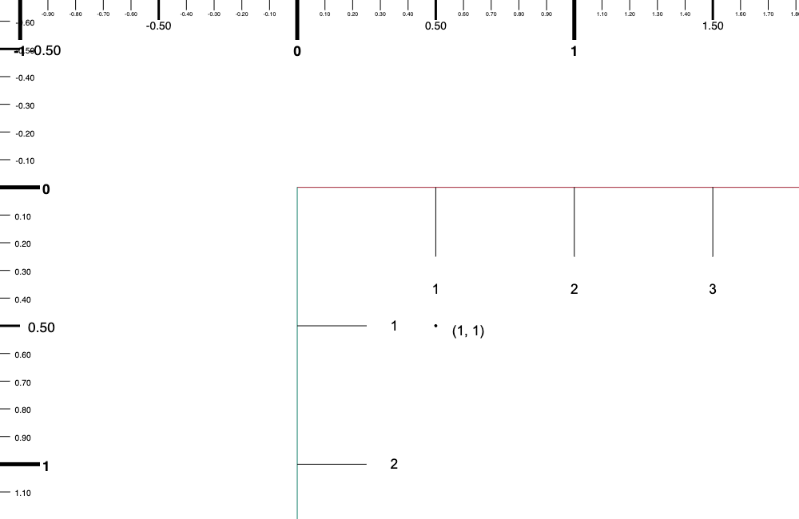
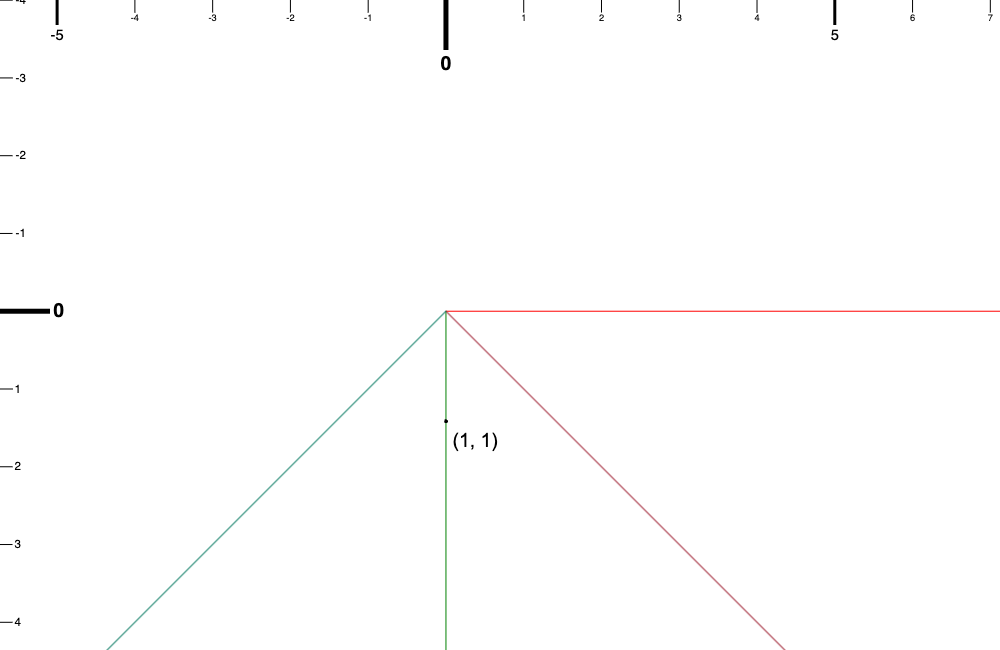

今天要講解的東西是座標系的轉換(昨天有稍微提到過了)。

# 為什麼我們需要座標系轉換？

簡短來說就是當使用者在螢幕上點擊時，我們要知道他點擊了哪裡？

或者是說當使用者想要知道世界中的某一點，在螢幕視窗中是否能夠看見，如果可以看見，它又會是位在視窗中的哪裡？

換句話來說就是今天有一個點，然後我們現在有兩個座標系：一個我們視為絕對的世界座標系，一個是相機視窗的座標系。

我們現在必須要用兩個座標系去描述這一個點，這兩個描述要可以互相轉換，但是不論怎麼樣它們講的都是同一個點。

如果要比喻的話可能像是這樣:

有兩個人他們站在房間裡的不同地方，然後你問他們：欸欸椅子在哪裡啊？


_A 跟 B 各自站在房間裡，小箭頭是他們面朝的地方，中間的方框是椅子_

他們各自會回答不一樣的答案 A：在我前面、B：在我左邊。他們都對，他們描述的位置是同一個只是描述的方式跟基準不同而已。

座標系轉換的有點像是如果當今天 A 說：我左邊有一個花瓶，我們可以根據 A 跟 B 的關係去推斷 B 會如何描述花瓶在哪。（可能的答案，B：花瓶在我前面）

# 視窗座標系變成世界座標系

那我們先從頭開始，當相機的座標、縮放倍率、旋轉角度都為初始值。(位置為 {x: 0, y: 0}，縮放倍率為 1， 旋轉角度為 0)

當一切都是沒有改變的情況下，我們可以觀察到在視窗中的座標跟在世界中的座標是相同的。

如果我們在視窗中點擊一個點它的座標是 (1, 1)，它在世界座標系的座標還是 (1, 1)。

## 相機位置改變
如果我們讓相機平移到了 (1, 1) 的話，我們還是點擊了視窗中的 (1, 1)。

這時候我們點擊的這個點在世界中的座標是多少？

答案是 (2, 2)。

我們需要考慮到相機的平移，看起來就像是要把點擊的座標加上相機目前的位移。


_上面跟左邊的尺規是世界座標系的，可以看到相機的座標軸原點是位在世界的 (1, 1)，圖中 (1, 1) 寫出來的這個座標是黑點的視窗座標，可以對照在世界座標系這個黑點的座標會是 (2, 2)_

## 相機倍率改變
接下來我們先讓相機回到原點，然後把相機的縮放倍率調成 2。換句話說視窗座標系中的 2 個單位會是世界座標系的 1 個單位，而不是原本的 1 視窗單位 為 1 世界單位。(世界的東西到視窗中長度方面是放大到 2 倍的意思，反過來在視窗中的東西放到世界中它其實是要縮小 0.5 倍)

那麼當我們在視窗中點擊的座標是 (1, 1) 時，在世界中的座標是什麼？

會變成 (0.5, 0.5)！（因為在視窗中所有世界長度會被拉長兩倍，所以在視窗中的 1 在世界會是 0.5 ）


_上面跟左邊的尺規是世界座標系的，(1, 1) 這個座標是黑點的視窗座標系，可以對照在世界座標系這個黑點的座標會是 (0.5, 0.5)；另外可以看到相機視窗縮放的刻度是在座標軸上的，1 視窗單位對照是 0.5 世界單位，2 視窗單位是 1 世界單位_

看起來如果有縮放的話，需要除上相機縮放的倍率。

## 相機旋轉角度改變
讓我們再一次回到初始值。

然後相機旋轉 45 度。

那如果我們還是在視窗中點擊 (1, 1)時，這個點用世界座標系要怎麼描述？

我們就把這個點旋轉相機旋轉的角度就可以得到這個點在世界座標系的描述了。

答案會是(0, 1.414(sqrt(2)))


_其中比較淡色的座標軸是旋轉過後的視窗座標系，黑點上面標註的座標 (1, 1)是視窗座標系的，你可以對照在世界座標系它的座標就是 (1, 1) 旋轉 45 度的（變成 (0, 1.414)）_

前面的解釋完之後我們要來組合起來了。

我先把流程先寫出來～

### 從視窗座標系轉換到世界座標系 實作
1. 取得有興趣的點在視窗中的座標是多少（盡量以相機視窗的中心點為視窗座標系的原點，比較好計算）（像是 `pointerdown` 這種 event 通常都會回傳整個網頁的座標，但是 canvas 不一定是滿版所以可能需要轉換一下）
2. 把這個座標去根據相機的縮放倍率放回世界座標系的大小（ x 1 世界單位 / s 視窗單位）
3. 旋轉第 2 步的結果，旋轉的角度即為相機的旋轉角度（方向一樣）
4. 最後再把相機位置(偏移量)加回來。

我們來把這些步驟實作起來，在 `camera.ts` 的 `Camera` 類別加上新的 method `transformViewPort2WorldSpace`。

因為第一步會需要 canvas 在頁面上的位置，這個部分我傾向不做在 `Camera` 裡面，你可以自己斟酌更改。

所以 `transformViewPort2WorldSpace` 的參數會是已經經過第一步的轉換。（在視窗中的座標）

記得先把 `multiplyByScalar`、`rotateVector`、`vectorAddition` 先 import 進來。

`camera.ts`
```typescript
import { multiplyByScalar, rotateVector, vectorAddition } from "./vector";
```

`camera.ts`
```typescript
class Camera {

    // 上略

    transformViewPort2WorldSpace(point: Point): Point {
        const scaledBack = multiplyByScalar(point, 1 / this._zoomLevel);
        const rotatedBack = rotateVector(scaledBack, this._rotation);
        const withOffset = vectorAddition(rotatedBack, this._position);
        return withOffset;
    }

    // 下略
}

```

就是這麼的簡單三行就可以解決了。

接下來我們來做反過來的。從世界座標系轉換成視窗的座標系。

這件事情如果用轉換矩陣的話就是視窗座標系轉換成世界座標系的轉換矩陣的反矩陣就好。（我這邊不會去提到轉換矩陣，因為要解釋的東西就會更多了 xD，如果有需要再補充）

我也是把步驟列出來，基本上就是上面的步驟反過來這樣。

### 世界座標系轉換成視窗座標系 實作
1. 找出從相機位置到點的向量
2. 將這個差距向量縮放 (純量乘上 x s 視窗單位 / 1 世界單位)
3. 將 2 的結果旋轉”負“的相機旋轉角度

我們加上一個新的 method `transformWorldSpace2ViewPort`

也要記得先 import `vectorSubtraction`

`camera.ts`
```typescript
import {multiplyByScalar, rotateVector, vectorAddition, vectorSubtraction} from "./vector"
```

`camera.ts`
```typescript
class Camera {

    // 上略

    transformWorldSpace2ViewPort(point: Point): Point {
        const withOffset = vectorSubtraction(point, this._position);
        const scaled = multiplyByScalar(withOffset, this._zoomLevel);
        const rotated = rotateVector(scaled, -this._rotation);
        return rotated;
    }

    // 下略
}

```

接下來我們需要驗證一下我們的邏輯是不是正確的。

我會提供一些測資，可以直接加一個新的單元測試檔案 `camera.test.ts` 到 `tests` 這個資料夾，然後複製貼上就好，大家也可以根據自己的需要去補上各種不同的測資。

`camera.test.ts`
```typescript
import { Camera } from '../src/camera';
import { Point } from '../src/vector';
import { expect, describe, test, beforeEach } from 'vitest';

describe('Camera', () => {
  let camera: Camera;

  beforeEach(() => {
    camera = new Camera();
  });

  describe('transformWorldSpace2ViewPort', () => {
    test('identity transformation', () => {
      const worldPoint: Point = { x: 10, y: 20 };
      const viewportPoint = camera.transformWorldSpace2ViewPort(worldPoint);
      expect(viewportPoint).toEqual({ x: 10, y: 20 });
    });

    test('with camera position offset', () => {
      camera.setPosition({ x: 5, y: 5 });
      const worldPoint: Point = { x: 10, y: 20 };
      const viewportPoint = camera.transformWorldSpace2ViewPort(worldPoint);
      expect(viewportPoint).toEqual({ x: 5, y: 15 });
    });

    test('with zoom', () => {
      camera.setZoomLevel(2);
      const worldPoint: Point = { x: 10, y: 20 };
      const viewportPoint = camera.transformWorldSpace2ViewPort(worldPoint);
      expect(viewportPoint).toEqual({ x: 20, y: 40 });
    });

    test('with rotation', () => {
      camera.setRotation(Math.PI / 2); // 90 degrees
      const worldPoint: Point = { x: 10, y: 0 };
      const viewportPoint = camera.transformWorldSpace2ViewPort(worldPoint);
      expect(viewportPoint.x).toBeCloseTo(0);
      expect(viewportPoint.y).toBeCloseTo(-10);
    });

    test('with position, zoom, and rotation', () => {
      camera.setPosition({ x: 5, y: 5 });
      camera.setZoomLevel(2);
      camera.setRotation(Math.PI / 4); // 45 degrees

      const worldPoint: Point = { x: 10, y: 20 };
      const viewportPoint = camera.transformWorldSpace2ViewPort(worldPoint);

      // Calculate expected result
      // 1. Translation
      const tx = 10 - 5;
      const ty = 20 - 5;
      // 2. Scale (zoom)
      const sx = tx * 2;
      const sy = ty * 2;
      // 3. Rotation
      const cos45 = Math.cos(-Math.PI / 4);
      const sin45 = Math.sin(-Math.PI / 4);
      const expectedX = sx * cos45 - sy * sin45;
      const expectedY = sx * sin45 + sy * cos45;

      expect(viewportPoint.x).toBeCloseTo(expectedX);
      expect(viewportPoint.y).toBeCloseTo(expectedY);
    });
  });

  describe('transformViewPort2WorldSpace', () => {
    test('identity transformation', () => {
      const viewportPoint: Point = { x: 10, y: 20 };
      const worldPoint = camera.transformViewPort2WorldSpace(viewportPoint);
      expect(worldPoint).toEqual({ x: 10, y: 20 });
    });

    test('with camera position offset', () => {
      camera.setPosition({ x: 5, y: 5 });
      const viewportPoint: Point = { x: 5, y: 15 };
      const worldPoint = camera.transformViewPort2WorldSpace(viewportPoint);
      expect(worldPoint).toEqual({ x: 10, y: 20 });
    });

    test('with zoom', () => {
      camera.setZoomLevel(2);
      const viewportPoint: Point = { x: 20, y: 40 };
      const worldPoint = camera.transformViewPort2WorldSpace(viewportPoint);
      expect(worldPoint).toEqual({ x: 10, y: 20 });
    });

    test('with rotation', () => {
      camera.setRotation(Math.PI / 2); // 90 degrees
      const viewportPoint: Point = { x: 0, y: -10 };
      const worldPoint = camera.transformViewPort2WorldSpace(viewportPoint);
      expect(worldPoint.x).toBeCloseTo(10);
      expect(worldPoint.y).toBeCloseTo(0);
    });

    test('with position, zoom, and rotation', () => {
      camera.setPosition({ x: 5, y: 5 });
      camera.setZoomLevel(2);
      camera.setRotation(Math.PI / 4); // 45 degrees

      // Use a known viewport point
      const viewportPoint: Point = { x: 7.071067811865475, y: 24.74873734152916 };
      const worldPoint = camera.transformViewPort2WorldSpace(viewportPoint);

      // Calculate expected result
      // 1. Rotation (inverse)
      const cos45 = Math.cos(Math.PI / 4);
      const sin45 = Math.sin(Math.PI / 4);
      const rx = viewportPoint.x * cos45 - viewportPoint.y * sin45;
      const ry = viewportPoint.x * sin45 + viewportPoint.y * cos45;
      // 2. Scale (unzoom)
      const sx = rx / 2;
      const sy = ry / 2;
      // 3. Translation
      const expectedX = sx + 5;
      const expectedY = sy + 5;

      expect(worldPoint.x).toBeCloseTo(expectedX);
      expect(worldPoint.y).toBeCloseTo(expectedY);
    });
  });
});
```

有了測資之後就可以用 `npm run test` 來跑一下單元測試。

不過我們不免俗的用自己的工人智慧來測一下。

其實我是想要帶到 canvas 可能不是滿版的情況需要怎麼處理。

我們可以先在 `main.ts` 裡面加上一個 `pointerdown` 的 event handler，在 `step` function 外面。

`main.ts`
```typescript
canvas.addEventListener("pointerdown", (event)=>{
    const clicked = {x: event.clientX, y: event.clientY};
});
```

接下來我們要找出點擊的點是在視窗中的哪一個點。

我們可以利用 `getBoundingClientRect` 這個 API。[`getBoundingClientRect`](https://developer.mozilla.org/en-US/docs/Web/API/Element/getBoundingClientRect);

return 的 `DOMRect` 可以用 `DOMRect.left` 跟 `DOMRect.top` 取得 canvas 的左上角。

`main.ts`
```typescript
canvas.addEventListener("pointerdown", (event)=>{
    const clicked = {x: event.clientX, y: event.clientY};
    const boundingBox = canvas.getBoundingClientRect();
    const topLeftCorner = {x: boundingBox.left, y: boundingBox.top};
});
```

接下來我們要轉換到 canvas 的中間，需要在 x 加上 width / 2 以及在 y 加上 height / 2 。

`main.ts`
```typescript
canvas.addEventListener("pointerdown", (event)=>{
    const clicked = {x: event.clientX, y: event.clientY};
    const boundingBox = canvas.getBoundingClientRect();
    const topLeftCorner = {x: boundingBox.left, y: boundingBox.top};
    const viewPortCenter = {x: topLeftCorner.x + canvas.width / 2, y: topLeftCorner.y + canvas.height / 2};
});
```

再來，我們要把點擊的點相對於視窗的中心點的向量算出來。

`main.ts`
```typescript
canvas.addEventListener("pointerdown", (event)=>{
    const clicked = {x: event.clientX, y: event.clientY};
    const boundingBox = canvas.getBoundingClientRect();
    const topLeftCorner = {x: boundingBox.left, y: boundingBox.top};
    const viewPortCenter = {x: topLeftCorner.x + canvas.width / 2, y: topLeftCorner.y + canvas.height / 2};
    const clickedPointInViewPortSpace = {x: clicked.x - viewPortCenter.x, y: clicked.y - viewPortCenter.y};
});
```

這樣我們就可以把這個點丟進去給 `camera` 處理轉換的計算了。

`main.ts`
```typescript
canvas.addEventListener("pointerdown", (event)=>{
    const clicked = {x: event.clientX, y: event.clientY};
    const boundingBox = canvas.getBoundingClientRect();
    const topLeftCorner = {x: boundingBox.left, y: boundingBox.top};
    const viewPortCenter = {x: topLeftCorner.x + canvas.width / 2, y: topLeftCorner.y + canvas.height / 2};
    const clickedPointInViewPortSpace = {x: clicked.x - viewPortCenter.x, y: clicked.y - viewPortCenter.y};
    const clickedPointInWorldSpace = camera.transformViewPort2WorldSpace(clickedPointInViewPortSpace);

    console.log("clicked in view port", clickedPointInViewPortSpace);
    console.log("clicked in world", clickedPointInWorldSpace);
});
```

這樣我們可以在視窗裡點擊一些點，然後靠著座標軸以及原點稍微判斷我們的轉換是否是合理的。（不過因為現在相機的位置、旋轉角度、縮放倍率都是初始的值，所以可能看不太出來有什麼用；需要使用 `setPosition`、`setRotation`、`setZoomLevel` 來調整一下相機目前的屬性，再去目視檢查座標系的轉換）

今天的進度在[這裡](https://github.com/niuee/infinite-canvas-tutorial/tree/Day09)。

那今天就先這樣！明天開始我們就會開始平移(pan)的實作了！明天見～

