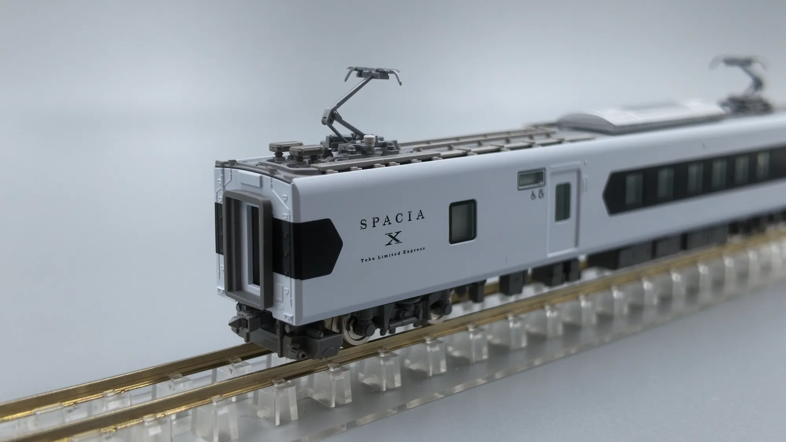

# Tobu N100 SPACIA X: Nikko's White, Folded into a Limited Express

Some trains look wrong at first glance and more right the longer you look at them. Tobu Railway's N100 series, the "SPACIA X", is one of those for me.

It follows the 100 series "SPACIA" of 1990 — the gold-liveried, round-nosed train that defined the Nikko run for three decades. The N100 doesn't do a retro homage, and it doesn't chase the smooth high-speed-rail look either. It treats the whole train as a piece of craftwork: a white body, irregular side windows, and a giant "X" that emerges from the bodyside itself.

## The spec sheet, briefly

| Item | Detail |
| --- | --- |
| Class | Tobu Railway N100 series (nicknamed SPACIA X) |
| Entered service | 15 July 2023 |
| Formation | 6 cars, 212 seats per set |
| Fleet | 4 sets / 24 cars (2 sets in 2023, 2 more in 2024) |
| Max speed | 130 km/h |
| Body | Aluminium alloy, double-skin construction |
| Built by | Tobu Railway × Hitachi (A-train) |
| Traction | VVVF inverter control using hybrid SiC devices |
| Main route | Asakusa – Tobu-Nikko / Kinugawa-Onsen |

It also took a 2023 Good Design Award. After the design section below, that stops being surprising.

## Gofun white, and the "X" of Kanuma kumiko

The easiest thing to misread about the N100 is its white.

It isn't "clean Shinkansen white". It deliberately references **gofun** — the traditional white pigment ground from seashells, used on the Yomeimon and Karamon gates of Nikko Tosho-gu. The colour doesn't start from an idea of modernity; it starts from the World Heritage site at the far end of the line. The train is wearing Nikko's colour before it ever gets there.

Then there are the windows.

Instead of the usual evenly spaced row of long side windows, the N100 has clusters of polygonal openings in varying sizes, all sharp angles. The motif comes from crafts along the line: **kumiko** joinery from Kanuma in Tochigi, and Edo bamboo weaving. Kumiko builds geometric patterns purely from interlocking wooden strips, with no nails — it is, by nature, a pattern cut out of straight lines. Blown up to carbody scale, the gaps between window frames resolve into a run of "X" shapes.

The X in the name isn't a letter the marketing department bolted on. It's a shape the body grows.

## Six seat types in one train

The genuinely unorthodox part is inside. Six cars carry **six** different seat products — roughly one per car:

- **Car 1 (Asakusa end):** Cockpit Lounge plus a Café Counter. Open sofa-style lounge seating with a counter you can actually order from.
- **Car 2:** Premium Seat.
- **Cars 3 and 4:** Standard Seat.
- **Car 5:** Box Seat plus Standard Seat, including wheelchair spaces.
- **Car 6 (Tobu-Nikko end):** private rooms only — four 4-person Compartments plus one 7-person **Cockpit Suite**.

The Cockpit Suite is the flagship, conceived around a private jet: movable sofas, small tables, sitting right behind the cab. One end of an entire six-car set serves seven people.

Packing six products into one train is rare for a Japanese private-railway limited express, where the usual instinct is to standardise seating for efficiency. The N100 bets the other way — that the trip to Nikko is itself worth selling as an experience.

## Shrunk to 1:150

Beyond the real thing, this train is a popular modelling subject, and it would be a waste if it weren't.

*The cab car bodyshell on its own — the design language reads more clearly than on a fully assembled model*

Lifting the shell off the chassis is, oddly, the best way to read the design. At 1:150 the side openings are still physically cut through, with smoked glazing fitted behind them, so the "X" is formed by real frames rather than printed on. The "SPACIA X" marking and the tiny `TOBU LIMITED EXPRESS` line beneath it hold their strokes at roughly fingernail size, which is respectable printing.

The nose is worth a look too: the windscreen is a single large curved clear part, tapering down into a nose cone that looks carved rather than moulded, with a dark obstacle-deflector shape and a mesh grille set below it. The roof-to-body parting line hides at the edge of the grey skirt, so the whole thing feels more solid than you'd expect.

*Two cab cars side by side — the easiest way to compare the nose curvature under identical light*

With two cab cars side by side on the track, what stands out is how *asymmetrically blunt* the nose is. The SPACIA X front end isn't a mirror-symmetric streamlined shape; the diagonal cut along the lower edge of the windscreen and the slanted black panel of the cab side window give it a subtle skew. That angle is hard to see on the real train. A model at desk height hands it to you.

## Car by car

Here's what makes this train interesting: **the bodyside design isn't uniform across the set**. Photograph each car separately and line them up, and you find the designers prepared two different vocabularies.

### Car 1 — where the X lives

*Car 1 in profile — the kumiko pattern runs almost the full length*

Car 1 is kumiko pattern nearly end to end. White frames and black diamond openings alternate along the flank, with a handful of genuinely glazed hexagonal windows mixed in — on the model these are pale green clear parts, so under light they separate visibly from the solid black decorative openings.

This is the car with the Cockpit Lounge and the Café Counter. An open lounge space doesn't need the usual one-window-per-seat rhythm, which frees the designers to treat the whole side as a single drawing rather than a row of windows. There are only two doors on the entire car; everything else is pattern.

It's also the only bodyside in the set with **no black window band** at all.

### Car 2 — the band returns

*Car 2 in profile — an entirely different vocabulary*

By car 2 the language has switched completely. A black window band runs along the waist of the white body, holding twelve orderly square windows. The band doesn't just stop at each end — it tapers into a pointed hexagon, which is, of course, half an X. The motif hasn't been abandoned, just turned down.

Through the windows you can see the seats are brown-toned: these are the Premium Seats. The roof carries a single silver air conditioner and no pantograph — a plain trailer car.

### Car 3, and what's on the roof

*Car 3. This angle shows the gangway bellows and the raised pantograph*

Car 3 has the same black band and square windows, but the seats visible through them are now pale — Standard Seats. Same bodyside, different interior colour: a neat way for a model to encode the class difference.

The grey gangway bellows at the car end, the coupler and the electrical jumper below it are all separate parts, and the raised pantograph is the most immediate difference from car 2.

*Looking down at the roof — the only busy surface on an otherwise plain train*

Shoot from above and you realise the most complex surface on this train is the roof. Around the pantograph base sit lightning arrestors and switchgear boxes, with high-voltage cable runs and their insulators tracking the length of the roof — all separate grey parts, and their density is in sharp contrast with the blank white body below.

### The car that carries the badge

*That big blank panel ahead of the door exists to hold the badge*

One intermediate car leaves a large white panel ahead of its door, printed with "SPACIA X" and, below it, `Tobu Limited Express`. It's the easiest car in the set to pick out — where the other cars put a car number, this one puts the nameplate.

Below the destination indicator sit two very small accessibility pictograms, which most likely makes this car 5, the car with the wheelchair spaces in the real formation. Printing at that size without smearing is a point in the model's favour.

## The trouble with white

Step back and look at the set as a whole: almost no waistline, no colour stripe, no broad corporate livery colour. The entire visual weight is carried by the shapes of the openings and that one black band.

That's a brutal test for a model — on an all-white body, every parting line and every unevenness in the paint gets amplified. Judging by these photos the white is laid down very evenly, and the boundary between body white and roof grey is crisp.

## To be continued

This post will keep growing. Photos of the real train are still to come, along with the ekiben from along the line — riding a Nikko limited express without a boxed lunch always feels like something's missing.
