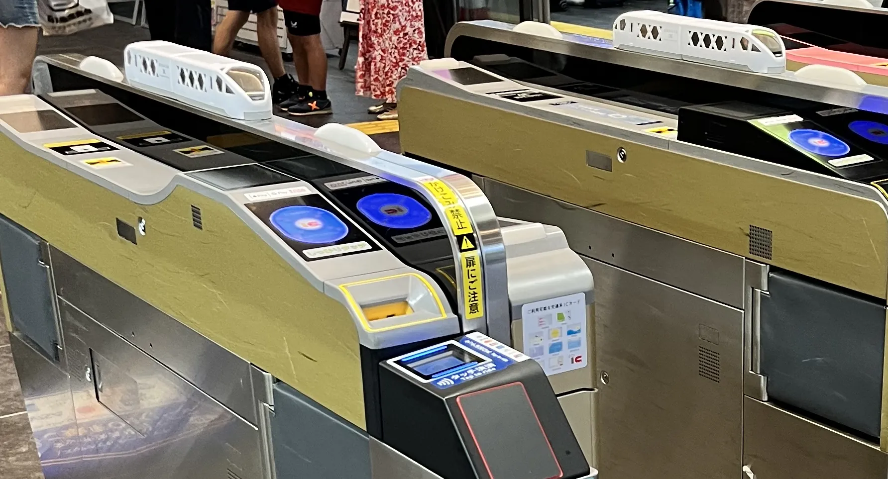

> 上面這個標題也太 AI xD ，這篇本來想說要用 AI 來生成試試看，但結果真的是有點慘不忍睹，所以我現在來自己下來重寫了，希望有一天 AI 可以調校成用像我的語氣來寫文章，或是只需要少數的修改就好。

我爸會自己寫很長的文章貼進家裡的 LINE 群組裡，有一次是寫關於東武的 N100 系，裡面有一部分就是關於列車的塗裝，使用胡粉白。那是我第一次認真接觸到 N100 這型列車。雖然當時沒有很放在心上，但是有一天想要坐坐看的這個想法，已經在這時候萌芽了。 

後來有去過幾次日本，但是因為當時 Spacia X 都還是算很新鮮很熱門的狀態，

## 這台車的規格速寫 （這趴就真的是 AI 抓出來的

| 項目 | 內容 |
| --- | --- |
| 形式 | 東武鐵道 N100 系（暱稱 SPACIA X） |
| 營運開始 | 2023 年 7 月 15 日 |
| 編成 | 6 輛編成，全編成 212 席 |
| 配置數 | 4 編成 24 輛（2023 年 2 編成、2024 年再 2 編成） |
| 最高速度 | 130 km/h |
| 車體 | 鋁合金 double skin 構造 |
| 製造 | 東武鐵道 × 日立製作所（A-train） |
| 控制方式 | 採用 hybrid SiC 元件的 VVVF 逆變器控制 |
| 主要運行區間 | 淺草 ～ 東武日光／鬼怒川溫泉 |

日立的 A-train ，有股很強的熟悉感？其實台鐵的 EMU 3000型（新自強） 、 TEMU 1000型 (太魯閣號) 也是日立的 A-train ，A-train 詳細的

## 胡粉白，與鹿沼組子的「X」

先從最明顯的白色開始。

這個白不是單純選一個「看起來很新、很乾淨」的白，它參考的是日光東照宮陽明門、唐門所使用的**胡粉**。胡粉是一種以貝殼研磨製成的傳統白色顏料，所以這台車的顏色其實是從終點站的世界遺產倒推回來的。還沒到日光，車子自己就先變成日光的一部分了（聽起來很像設計簡報，但是他們真的就是這樣設計的 xD）。

然後是側窗。

N100 的側面不是一般特急那種一整排等距的長方形窗，而是塞滿大大小小、帶著尖角的多邊形。這些圖案取自沿線的傳統工藝，包含栃木鹿沼的**組子**細工，以及江戶的竹編細工。組子不用釘子，靠木片彼此咬合排出幾何紋樣；把那套做法放大到一整節車的尺寸，窗框中間就會跑出一個一個的「X」。

所以車名裡的 X 不是先取完名字再硬貼到車上的，車側本來就有一堆 X 藏在裡面。這點我覺得很讚。

## 六種座位，一列車

外面已經長得很不普通了，裡面也沒有打算放過大家。短短 6 輛編成裡塞了 **6 種**座位，差不多就是一輛車玩一種：

- **1 號車（淺草側）**：Cockpit Lounge ＋ Café Counter。沙發式的開放休息空間，配上真的可以點東西的咖啡吧檯。
- **2 號車**：Premium Seat。
- **3、4 號車**：Standard Seat。
- **5 號車**：Box Seat ＋ Standard Seat（含輪椅席）。
- **6 號車（東武日光側）**：全部都是包廂——4 人用的 Compartment 四間，加上 1 間 7 人用的 **Cockpit Suite**。

其中 Cockpit Suite 是這台車的頂規，概念取自私人飛機，裡面有可以移動的沙發與小桌，位置就在司機室後方。簡單來說，整個編成最前面那一大塊空間只服務七個人（票也理所當然的沒有很好搶）。

在偏通勤導向的日本私鐵特急裡，一列車放六種座位其實滿少見的。一般來說座位越統一越容易營運，N100 則是反過來，把「搭車去日光」本身也當成旅程的一部分。你可以只買一般座位抵達目的地，也可以從上車開始就進入觀光模式，看你的錢包跟訂票手速願不願意配合。

## 實車：從裡面看

上面講了很多設計概念，不過列車終究是拿來坐的，我們還是回到車上。

### 一扇窗，一間房

*包廂裡的六角窗。窗框的形狀從車外一路延續到車內*

這是包廂裡的六角形車窗。從外面看，它只是組子圖案裡的其中一格；真的坐進去之後，那一格就變成包廂裡最搶眼的東西，窗外幾乎是一整面景。

我本來以為外面做得那麼花，裡面大概就會收斂一點，結果沒有。窗簾有很細的褶，收邊、拉繩和旁邊的立燈也都在延續那種傳統工藝的感覺；燈罩上甚至還有鏤空的捲草紋。車內用的是米色、木色和偏黃的燈光，和車外那片冷冷的白色完全相反，但是放在一起又不會打架。

當然牆上還是很務實地放了 `AC 100V 60Hz 2A` 的插座。傳統工藝歸傳統工藝，手機還是要充電啦。

### Cockpit 不是修辭

*駕駛台。那組銳角的窗框從車外看是造型，從駕駛座看是視野*

「Cockpit Suite」、「Cockpit Lounge」這兩個名字第一次看很像行銷部門想出來的，坐上車之後才發現他們是認真的。

隔著玻璃看過去，駕駛台幾乎整個攤在眼前：左邊是一大排開關與計器盤，中央有顯示器，右邊是主控制器，後面才是那張黑色司機座椅。我原本最在意的還是窗框，因為從車外看真的有夠尖；換到駕駛座的視角才發現，它把正前方留成一大片，再用兩側的斜窗補視野。至少它不是只顧著好看，害司機每天坐在裡面受苦。

### 終點

*到站。尾燈亮起，旅客沿著月台散開*

到站之後我又回頭看了一下。車尾的紅色尾燈亮成一排，那個一路上看起來很銳利的車頭，在月台的燈光下面突然變得有點鈍、有點安靜。旁邊是石砌擋土牆和爬滿藤蔓的山壁，和大城市裡的終點站完全不一樣。這裡是**東武日光**，日光線真的就到這裡結束了。

*剪票機上一台排一列——那不是裝飾品*

接著出站的時候，我看到一個比列車本身更讓我困惑的畫面：**每一台剪票機上面都放了一台 SPACIA X**。

我本來以為是模型或車站擺飾，結果那是便當盒。白色車體、車側的三角形與六角形開口全部都有做，長度又比一般便當盒多一截，就這樣整整齊齊排在閘門上面。每個人刷卡出站都一定會從它旁邊經過，想忽略它都有點困難。

總之先記得它，後面還會再出現。

## 縮成 1:150

看完實車，再來看我可以搬回家慢慢研究的版本。這個造型如果沒有被做成模型，真的有點說不過去。

*兩節先頭車並排，車鼻的曲面在同一個光線下最容易比較*

把兩節先頭車並排放到軌道上，最明顯的就是車鼻那種「不對稱的鈍」。SPACIA X 不是常見的左右鏡射流線型，擋風玻璃下緣有斜切，駕駛室側窗又多了一塊斜向的黑色面，兩邊看起來就是有一點點不一樣。實車停在月台時很難蹲到這個角度慢慢看（也不建議為了看車頭妨礙其他旅客），模型放在桌上就方便多了。

## 一節一節看下去

接下來就把它一節一節拆開來看。這台車有個我一開始沒有注意到的地方：**車側設計並不是全編成都一樣**。把六節車分開拍、排在一起之後，差異突然變得超級明顯。它至少用了兩套外觀，而且還會跟著每節車裡面的用途微調。

### 1 號車——X 的主場

*1 號車側面，整節車幾乎都被組子紋佔滿*

1 號車幾乎整面都是組子紋，白色框架和黑色菱形交錯在一起，中間才藏著幾扇真的可以透光的六角形車窗。模型用淺綠色透明件做窗戶，所以只要有光照過去，就看得出哪些是窗、哪些只是黑色圖案。

這節就是 Cockpit Lounge 與咖啡吧檯所在的位置。因為裡面不是一排一排的座位，不需要硬做成「一張椅子配一扇窗」，設計師終於可以很開心地把整面車側當成一張圖來畫。除了兩處車門之外，剩下的空間幾乎全部拿去做圖案了。

順帶一提，這也是全編成上唯一一種**沒有黑色窗帶**的車側。

*湊近看才分得出來：黑色的是裝飾開口，透出內裝的才是真正的窗*

湊近一點看，這面車側其實有兩種東西：一種是黑色的三角形、菱形裝飾，另一種才是裝了透明件、能夠看到內裝的六角形車窗。遠遠看全部混成同一片圖案，靠近才發現不是每個洞都真的可以看出去。

### 2 號車——黑帶回來了

*2 號車側面，設計語彙整個換了一套*

到了 2 號車，畫風直接換掉。車身中間拉出一條黑色窗帶，裡面放了十二扇很規矩的方窗，看起來終於比較像一般人熟悉的特急列車。不過窗帶兩端沒有直接切平，而是收成帶尖角的六邊形；仔細看，那其實還是半個 X。設計沒有消失，只是沒有像 1 號車那麼用力。

透過窗戶可以看到裡面是褐色系的 Premium Seat。屋頂則很單純，只有一具銀色冷氣，沒有集電弓，是一節拖車。

### 3、4 號車——雙胞胎，差別全在屋頂

*3 號車側面。兩具集電弓一前一後*

*4 號車側面。同一套車側，屋頂上什麼都沒有*

3、4 號車都是 Standard Seat，根本就是雙胞胎：黑色窗帶、十五扇方窗，車端一樣收成尖六邊形，兩節車的側面**幾乎可以直接疊在一起**。窗內的座椅是淺色，所以還是能和 2 號車褐色的 Premium Seat 分開。

真正的差別全部跑到屋頂上了。3 號車前後各有一具集電弓，是編成裡的動力車；4 號車只剩中央一具冷氣，屋頂乾淨到有點空。這台車全身幾乎都是白的，結果認車還要看屋頂有沒有東西，也算是一種很奇妙的樂趣。

*3 號車斜角。車端的幌、連結器與電氣連結器都是分件*

### 5 號車——掛廠標的那一節

*5 號車側面。窗戶只剩七扇，前半段整片留白*

5 號車大概是中間四節裡最好認的。車門前方留了一大片白牆，上面直接印著「SPACIA X」和 `Tobu Limited Express`。別節車在這附近乖乖放車號，只有它在掛招牌，想認錯好像也不容易。

它的窗戶也少很多，黑窗帶裡只剩七扇方窗，其他長度都讓給那片白牆。行先表示器下面有輪椅圖示和一個「5」，直接講明這節車的身分。Box Seat、Standard Seat 和輪椅席都在這裡，車內設備與無障礙空間自然也會占掉原本可能放座位窗的位置。

屋頂上則和 3 號車一樣有兩具集電弓，所以整列車的動力集中在 3、5 號車。這也是為什麼前面要特地看屋頂啦。

*換個角度，那片留白其實是有厚度的白——車體側面的折面在這裡看得最清楚*

### 6 號車——四間包廂，一間 Suite

*6 號車側面。窗戶的疏密直接畫出了裡面的隔間*

來到編成另一端的 6 號車，滿版組子紋又回來了。所以那個很囂張的「X」其實只放在兩端先頭車，中間四節全部都是比較安分的黑色窗帶。

不過同樣是組子紋，1、6 號車的窗戶排法完全不同。從駕駛室這端開始數，先是**三扇連在一起的淺色六角窗**，接著才是**四扇彼此拉開的深褐色六角窗**，最後是車門和車號「6」。

對照實車配置就知道為什麼了。6 號車整節都是包廂，一間 7 人用 Cockpit Suite，再加上四間 4 人用 Compartment。前面連在一起的三扇窗屬於 Suite，後面四扇分開的窗則剛好一間包廂一扇。

換句話說，**站在月台上就可以從外面數出裡面有幾間房**。這個真的有點厲害。模型甚至用內裝件的顏色把差異做出來，Suite 是淺色，四間 Compartment 是深褐色，隔著透明車窗一眼就看得懂。

*6 號車斜角。和 1 號車是同一個模具的前頭，卻是完全不同性格的一節車*

看到這裡再回頭看整個編成，就會發現車側其實一直很老實地把內部配置畫出來。1 號車是開放式 Lounge，窗戶就連續排在一起；6 號車是一間一間的包廂，窗戶跟著分開；中間四節是一般座位，就用整齊的黑色窗帶。如果忘記每節車裡面是什麼，看外面大概也猜得出來。

### 車頂上的東西

*車頂俯瞰。全白車體上唯一「熱鬧」的地方*

從上往下看才會發現，全車最忙的地方其實不是側面，而是平常最容易被忽略的屋頂。集電弓旁邊塞了避雷器、開關箱，還有沿著車頂拉過去的高壓配線與礙子，全部都是灰色分件。和下面那片幾乎什麼都沒有的白色車身放在一起，反差非常大。

### 點燈之後

*通電之後，組子紋後面那幾扇六角形車窗才真正活過來*

拍完一輪之後，當然還是要通電看看。

沒有開燈時，1 號車的六角形窗只是一片淺綠色；室內燈一亮，同樣幾扇窗就變成暖橙色，在白色組子紋裡排成一列亮點。其他黑色裝飾還是黑的，這時候不用湊近看也知道哪些是真的窗了。

前面的頭燈也會一起亮，駕駛室側窗同樣透出暖光。看到這裡才發現，模型沒有自己亂加氣氛，這個偏暖的照明就是從實車一路縮小下來的。

## 白色的難處

*正面。沒有色帶、沒有標誌，只剩下形狀*

回頭看整組模型，它幾乎沒有腰帶線、色帶或大面積的企業識別色，真的就是一大坨白。整台車只靠開口形狀和黑色窗帶撐住外觀，膽子其實滿大的。

這種設計做成模型其實很危險。全白車身只要有一點分模線或塗裝不均，眼睛馬上就會被吸過去。還好這組模型的白色壓得很均勻，車身白與屋頂灰的交界也夠乾淨，不然「胡粉白」可能會直接變成「塑膠白」，氣勢差很多。

## 最後：便當也是一台 SPACIA X

*便當盒。車窗變成透明蓋，裡面的菜色就是內裝*

最後終於可以回來看剛剛排在剪票機上面的東西了。

它是一個做成 SPACIA X 先頭車造型的鐵路便當，車側的組子開口都有照做，然後設計的人想到一件很聰明的事：**直接把六角形車窗變成透明上蓋**。所以從車外看進去，「車窗裡面」不是座椅，是今天的菜色。前面的大擋風玻璃也做成透明的，整個駕駛室就這樣變成便當觀景窗。

車身側面的「SPACIA X」、下面的 `TOBU LIMITED EXPRESS`、車頂到裙板的灰白分色，連車頭下方網狀的排障器都有想辦法塞進這個塑膠盒上。最妙的是，它從實車縮成 N 規模型，再變成一個便當盒，居然都還認得出來是同一台車。這個造型大概真的有點東西。

至於吃完之後怎麼辦？盒子當然是留下來了，不然咧 xD。

## 結語

N100 系的最高速度是 130 km/h，和很多同級特急相比沒有特別誇張。它厲害的地方本來就不是跑多快，而是東武把「去日光」這件事情從頭到尾都包在同一套設計裡：車身用了東照宮的胡粉白，車窗參考鹿沼組子，裡面又從一般座位一路做到可以關門的包廂，最後連便當都不肯放過。

我覺得最有趣的是，不管站在月台看實車、坐在包廂裡看窗外，還是把 1:150 的模型放在桌上慢慢數窗戶，那個 X 都會一直跑出來。甚至吃完便當之後，它還會以一個空盒子的形式跟著你回家。

所以我一開始覺得「這也太怪了吧」的那個車頭，現在還擺在我的桌上。看來是越看越合理沒錯。
