# 東武 N100 系 SPACIA X：把日光的白，摺進一列特急裡

有些列車你第一眼看到會覺得「這也太怪了」，然後越看越覺得有道理。東武鐵道的 N100 系「SPACIA X」對我來說就是這種車。

它接續的是 1990 年登場、跑了三十幾年的 100 系「SPACIA」——那台有著金色塗裝、圓潤前頭的日光特急代表作。N100 沒有走復刻路線，也沒有走「高鐵化」的流線路線，而是把整台車當成一件工藝品在做：白色車身、不對稱的側窗、以及那個從車體外側浮出來的巨大「X」。

## 這台車的規格速寫

| 項目 | 內容 |
| --- | --- |
| 形式 | 東武鐵道 N100 系（暱稱 SPACIA X） |
| 營運開始 | 2023 年 7 月 15 日 |
| 編成 | 6 輛編成，全編成 212 席 |
| 配置數 | 4 編成 24 輛（2023 年 2 編成、2024 年再 2 編成） |
| 最高速度 | 130 km/h |
| 車體 | 鋁合金 double skin 構造 |
| 製造 | 東武鐵道 × 日立製作所（A-train） |
| 控制方式 | 採用 hybrid SiC 元件的 VVVF 逆變器控制 |
| 主要運行區間 | 淺草 ～ 東武日光／鬼怒川溫泉 |

它也拿下了 2023 年度的 Good Design Award。看完下面的設計解析，大概會覺得這個獎不算意外。

## 胡粉白，與鹿沼組子的「X」

N100 最容易被誤讀的地方，是它的白。

那不是「新幹線那種乾淨的白」，而是刻意去對照日光東照宮陽明門、唐門所使用的**胡粉**——一種以貝殼研磨製成的傳統白色顏料。也就是說，這台車的顏色不是從「現代感」出發的，是從終點站那座世界遺產出發的。列車還沒到日光，車體已經先是日光的顏色了。

然後是側窗。

N100 的側面沒有一般特急那種整排等距的長窗，而是一組一組大小不一、帶著銳角的多邊形開口。這個造型取自沿線的傳統工藝——栃木鹿沼的**組子**細工，以及江戶的竹編細工。組子是不用釘子、純靠木片互相咬合排出幾何紋樣的技法，本來就是一種「用直線切出來的圖案」。把它放大成車體尺度，從車外看過去，窗框與窗框之間就會浮出一個一個的「X」。

車名裡的那個 X，不是行銷部門補上去的字母，是車體本身長出來的形狀。

## 六種座位，一列車

N100 真正離經叛道的地方在車內。6 輛編成裡塞了 **6 種**不同的座位，等於平均一輛車一種：

- **1 號車（淺草側）**：Cockpit Lounge ＋ Café Counter。沙發式的開放休息空間，配上真的可以點東西的咖啡吧檯。
- **2 號車**：Premium Seat。
- **3、4 號車**：Standard Seat。
- **5 號車**：Box Seat ＋ Standard Seat（含輪椅席）。
- **6 號車（東武日光側）**：全部都是包廂——4 人用的 Compartment 四間，加上 1 間 7 人用的 **Cockpit Suite**。

Cockpit Suite 是這台車的頂規，概念取自私人飛機：可移動的沙發、小桌，位置就在司機室後方，等於一整個編成端部只服務七個人。

這種「一列車裡放六種產品」的做法，在通勤導向的日本私鐵特急裡其實滿罕見的。多數特急是把座位標準化以求效率，N100 反過來，賭的是「去日光這件事本身值得被當成一段體驗賣」。

## 實車：從裡面看

規格與設計講完，還是得回到車上。

### 一扇窗，一間房

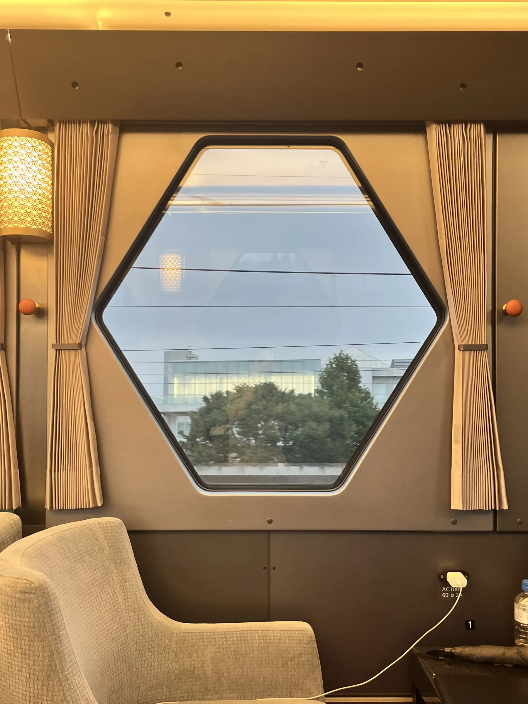

*包廂裡的六角窗。窗框的形狀從車外一路延續到車內*

這是包廂裡的那扇六角形車窗——從外面看是組子紋裡的一格，從裡面看就是一整面景。

值得注意的是，車內並沒有把外面那套幾何語彙丟掉。窗兩側是打了細褶的布簾，收邊的壓條與拉繩頭是木質色系與一顆橘色的圓球；左邊那盞立燈的燈罩上是鏤空的捲草紋，光透出來的時候會在牆上留下同一種「用線條切出圖案」的味道。整節車的色調偏暖，是米色、木色與黃光，和車外那片冷冽的胡粉白正好相反。

牆上還有 `AC 100V 60Hz 2A` 的插座——這種東西不浪漫，但它提醒你這仍然是一台 2020 年代的通勤／觀光兩用特急，不是復古列車。

### Cockpit 不是修辭

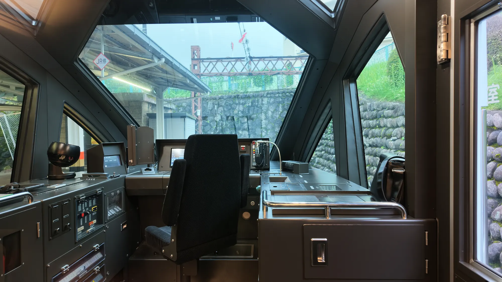

*駕駛台。那組銳角的窗框從車外看是造型，從駕駛座看是視野*

「Cockpit Suite」、「Cockpit Lounge」這兩個名字，坐上車之後才會發現不完全是行銷詞。

從車內隔著玻璃看過去，駕駛台幾乎是整個攤開的：左手邊一整排的開關與計器盤、中央的顯示器、右側的主控制器，還有那張黑色的司機座椅。真正有趣的是窗——那些從車外看起來很有設計感的銳角窗框，從駕駛座的角度看過去，其實是把視野切成一片大的正前方、加上兩側斜向的補角。造型與功能在這裡是同一件事。

### 終點

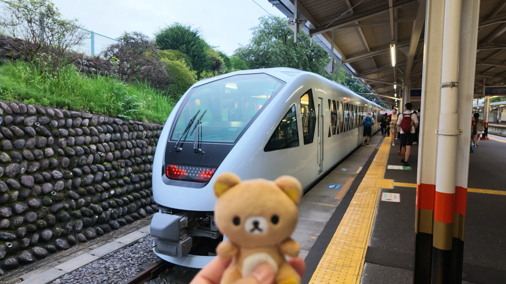

*到站。尾燈亮起，旅客沿著月台散開*

到站之後回頭看，車尾的紅色尾燈亮成一排，那個原本很銳利的前頭在月台燈光下反而顯得很鈍、很安靜。左邊是石砌的擋土牆與爬滿藤蔓的山壁——這種背景大概也只有終端站才有。

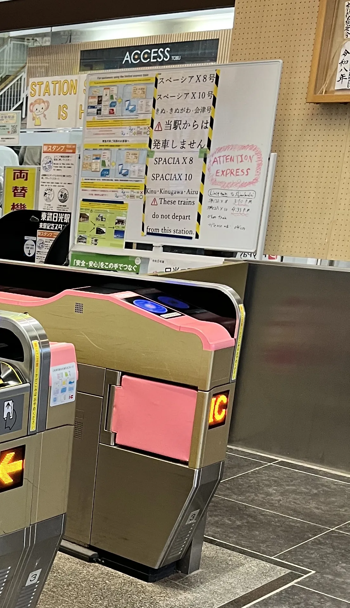

*剪票口。牆上那張手寫告示才是這條路線真正的說明書*

出站的剪票口旁邊貼著一張很有生活感的手寫告示：

> スペーシアX8号／スペーシアX10号／きぬ・きぬがわ・会津号　⚠ 当駅からは発車しません

意思是「這幾班車不從本站發車」。SPACIA X 並不是每一班都跑同一條路——日光線與鬼怒川線在下今市分家之後，有些班次的起點在鬼怒川溫泉那一側。一張白板加簽字筆，把時刻表上讀起來很抽象的分歧，講得比任何路線圖都清楚。

## 縮成 1:150

實車之外，這台車也是模型圈很受歡迎的題材——那個造型不做成模型實在太可惜了。

*兩節先頭車並排，車鼻的曲面在同一個光線下最容易比較*

兩節先頭車並排放在軌道上時，最明顯的是車鼻那個「不對稱的鈍」——SPACIA X 的前頭並不是左右完全鏡射的流線型，而是靠著擋風玻璃下緣的斜切、以及駕駛室側窗那塊斜向的黑色面，做出一種微妙的偏斜感。實車上這個角度不容易看到，模型放在桌面高度反而看得清楚。

## 一節一節看下去

這台車有趣的地方是：**它的車側設計不是整編成統一的**。把每一節單獨拍下來排在一起，會看到設計師其實準備了兩套語彙，而且第二套還會隨著車輛的用途微調。

### 1 號車——X 的主場

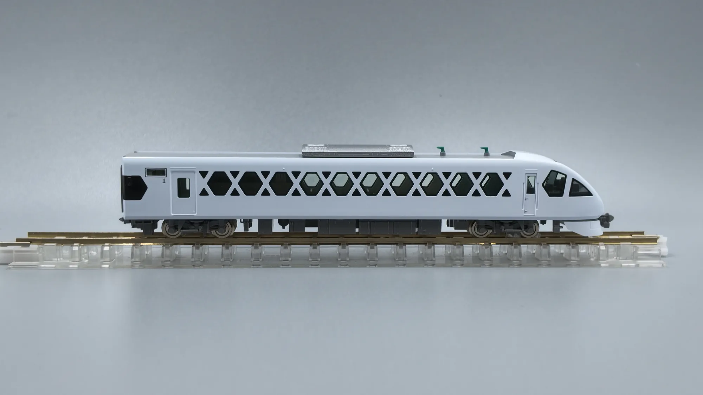

*1 號車側面，整節車幾乎都被組子紋佔滿*

1 號車幾乎整節車側都是組子紋。白色的框與黑色的菱形開口交錯排列，中間夾著幾扇真正透光的六角形車窗——在模型上是淺綠色的透明件，所以在光線下會和純黑的裝飾開口分出層次。

這節車正好就是 Cockpit Lounge 與咖啡吧檯所在。開放式的休息空間本來就不需要「一個座位配一扇窗」的規律，設計師因此可以把整面車側當成一張圖來畫，而不是一排窗戶。整節車只有兩處車門，其餘全部交給圖案。

順帶一提，這也是全編成上唯一一種**沒有黑色窗帶**的車側。

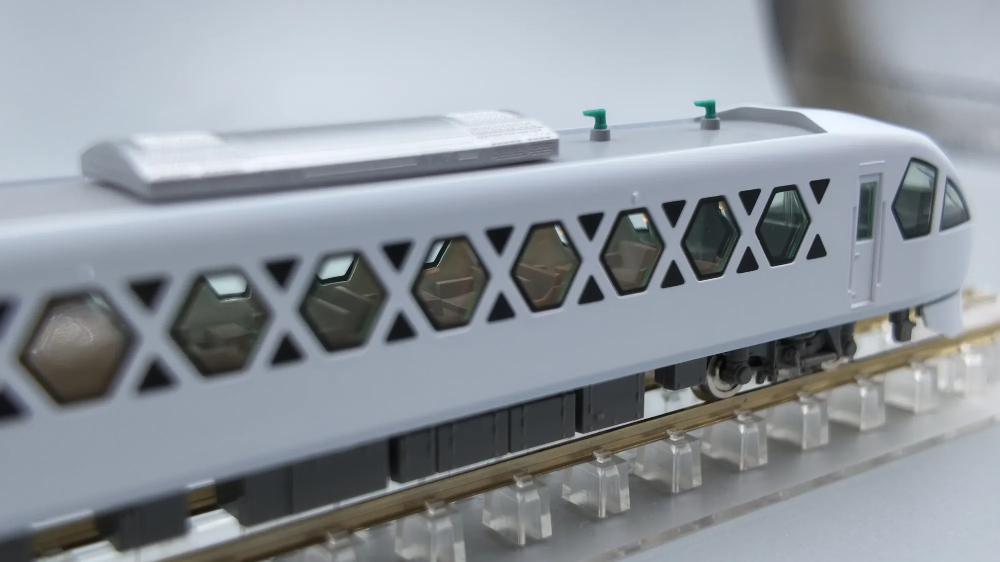

*湊近看才分得出來：黑色的是裝飾開口，透出內裝的才是真正的窗*

湊近看，這面車側其實分成兩種開口：純粹挖穿、內側沒有東西的黑色三角與菱形，以及裝了透明件、看得到內裝的六角形車窗。兩者在遠處是同一片圖案，靠近了才會分家。

### 2 號車——黑帶回來了

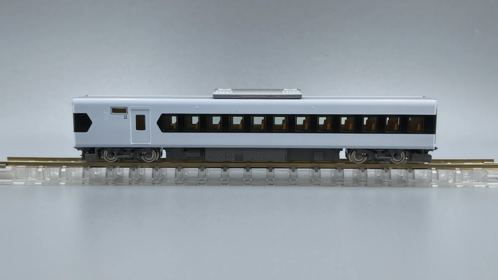

*2 號車側面，設計語彙整個換了一套*

到了 2 號車，畫風完全變了。白色車身腰部拉出一條黑色窗帶，裡面是十二扇規規矩矩的方形窗；窗帶的兩端沒有直接切斷，而是收成一個帶尖角的六邊形——那其實就是 X 的一半。語彙沒有斷掉，只是收斂了。

透過窗戶看得到裡面的座椅是褐色系的，對應的是 Premium Seat。屋頂上只有一具銀色的冷氣，沒有集電弓，是一節單純的拖車。

### 3、4 號車——雙胞胎，差別全在屋頂

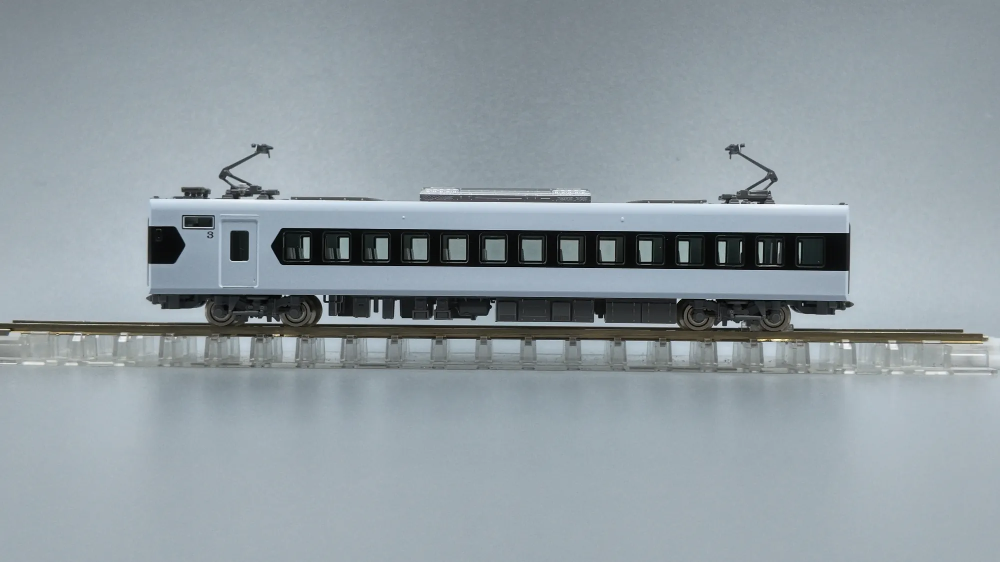

*3 號車側面。兩具集電弓一前一後*

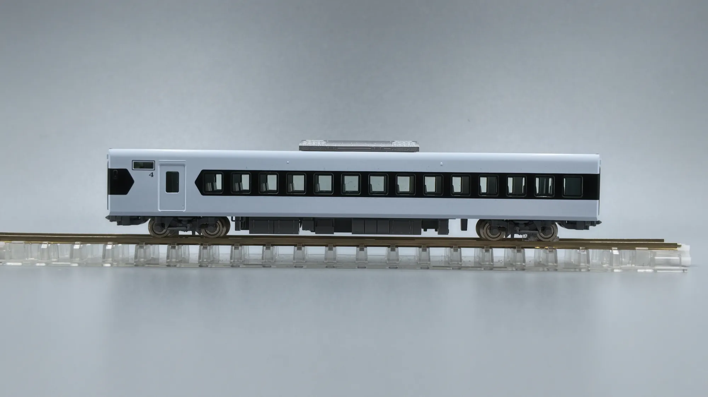

*4 號車側面。同一套車側，屋頂上什麼都沒有*

3 號車與 4 號車是 Standard Seat 的雙胞胎：黑窗帶、十五扇方窗、車端同樣收成尖六邊形，兩節車的側面**幾乎可以疊在一起**。窗內透出來的座椅是淺色的，和 2 號車那組褐色的 Premium Seat 一眼就分得出來。

差別全部在屋頂上。3 號車前後各架了一具集電弓，是編成裡的動力車；4 號車屋頂上只剩中央那一具冷氣，乾淨到有點空。在一台幾乎沒有塗裝變化的白色列車上，這種「靠屋頂認車」的辨識方式其實滿有趣的。

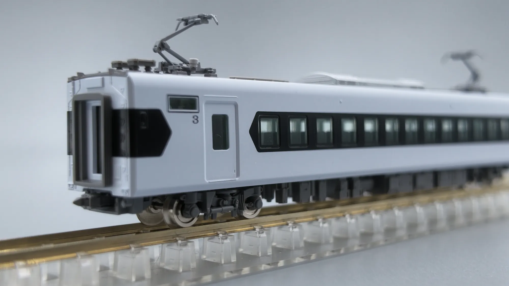

*3 號車斜角。車端的幌、連結器與電氣連結器都是分件*

### 5 號車——掛廠標的那一節

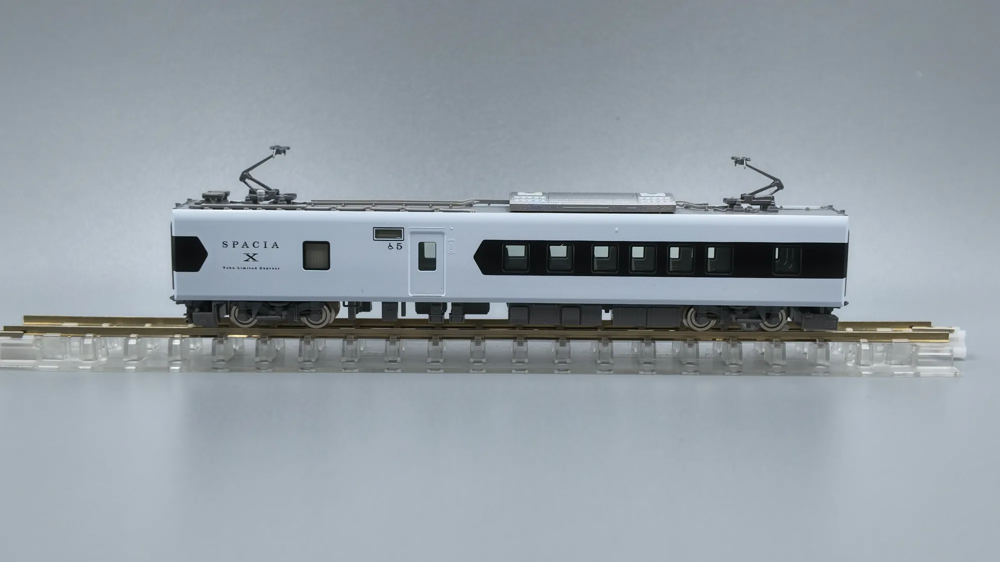

*5 號車側面。窗戶只剩七扇，前半段整片留白*

5 號車是全編成最好認的一節。車門前方留了一大片白牆，上面印著「SPACIA X」與下方的 `Tobu Limited Express`——別的車在這個位置放的是車號，這節放的是招牌。

窗戶也明顯變少了，黑窗帶裡只有七扇方窗，其餘的長度全部讓給那片留白。行先表示器下方的標記則直接寫明了身分：一個輪椅圖示，加上一個「5」。這節就是實車編成裡設有輪椅席的車輛，Box Seat 與 Standard Seat 在這裡共處，機器與無障礙空間也吃掉了原本該是座位窗的位置。

屋頂上和 3 號車一樣架了兩具集電弓，所以動力集中在 3、5 兩節。

*換個角度，那片留白其實是有厚度的白——車體側面的折面在這裡看得最清楚*

### 6 號車——四間包廂，一間 Suite

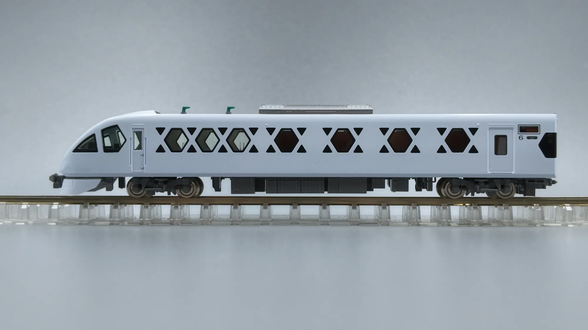

*6 號車側面。窗戶的疏密直接畫出了裡面的隔間*

編成另一端的 6 號車，和 1 號車一樣是滿滿的組子紋——所以「X」其實只長在兩端的先頭車上，中間四節都是黑窗帶。

但同樣是組子紋，兩節車的窗完全不是同一種排法。從駕駛室這端數過去：先是**三扇連在一起的淺色六角窗**，接著是**四扇間距明顯拉開的深褐色六角窗**，最後才是車門與那個「6」。

對照實車的配置，這件事就變得很有趣了——6 號車整節都是包廂：一間 7 人用的 Cockpit Suite，加上四間 4 人用的 Compartment。連著的三扇是 Suite，後面分得開開的四扇，正好一間包廂一扇窗。

也就是說，**你可以站在月台上，從車外數出裡面有幾間房**。模型還進一步用內裝件的顏色把它講清楚：Suite 那側是淺色，四間 Compartment 是深褐色，隔著透明件看過去一目瞭然。

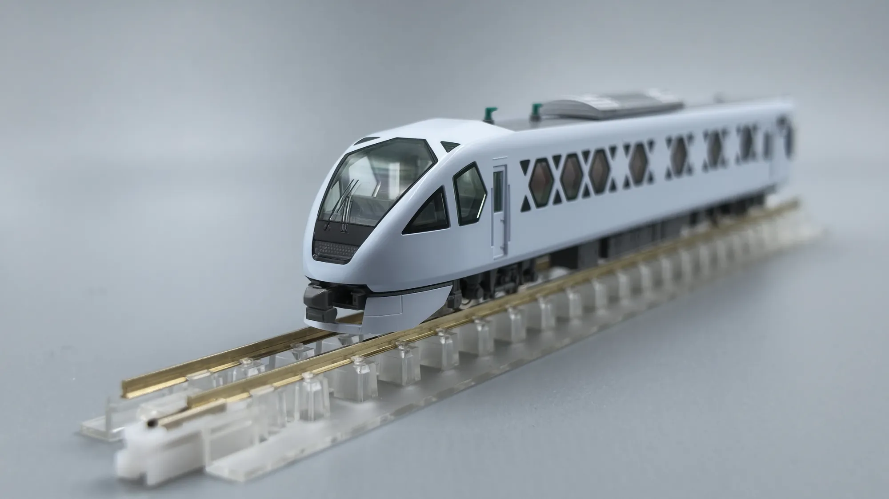

*6 號車斜角。和 1 號車是同一個模具的前頭，卻是完全不同性格的一節車*

回頭看整個編成會發現，車側圖案的疏密其實一路都在誠實地反映裡面在做什麼：1 號車是開放的 Lounge，窗就連續密集；6 號車是隔間，窗就一格一格分開；中間四節是排排坐的座位車，就換成規律的黑窗帶。這台車的外觀不只是好看，它同時是一張平面圖。

### 車頂上的東西

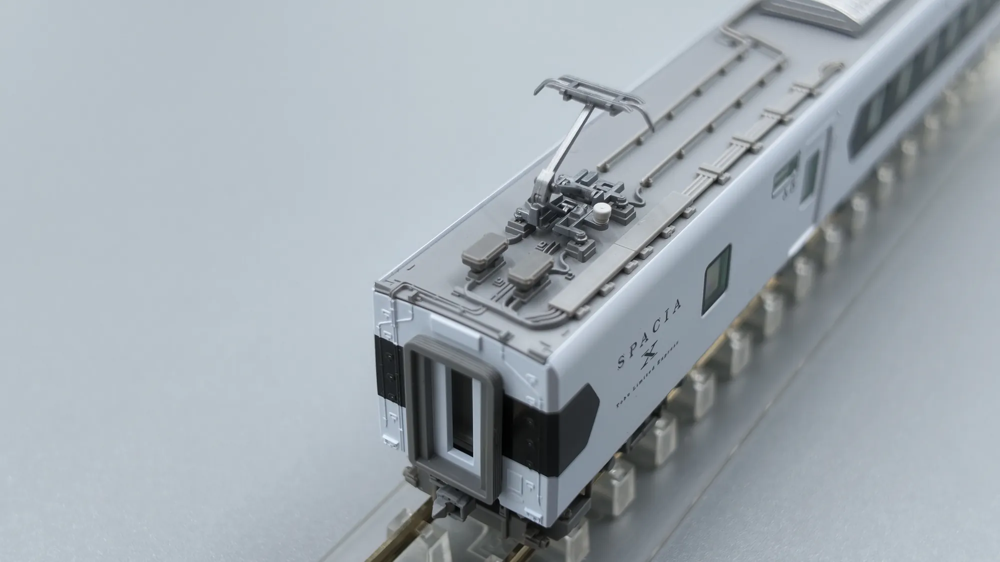

*車頂俯瞰。全白車體上唯一「熱鬧」的地方*

從上往下拍才會發現，這台車最複雜的表面其實在屋頂。集電弓底座周圍散著避雷器、開關類的箱體，還有沿著車頂縱向拉過去的高壓配線與固定礙子——全部是灰色系的分件，密度和下面那片素白的車身形成強烈對比。

### 點燈之後

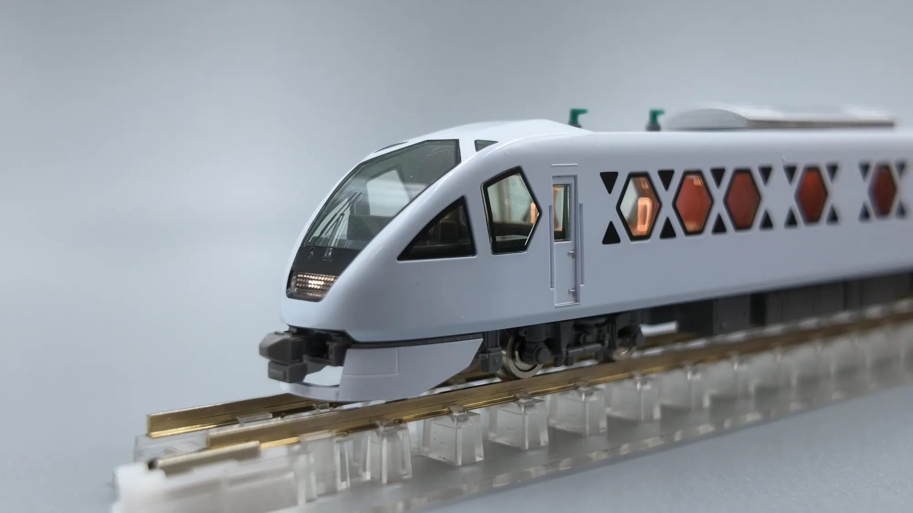

*通電之後，組子紋後面那幾扇六角形車窗才真正活過來*

不過這台車真正的高潮是通電之後。

白天看，1 號車的六角形車窗是一片安靜的淺綠；點上室內燈，同樣幾扇窗透出來的變成暖橙色，在整面白色的組子紋上排成一列亮點。那些純黑的裝飾開口依然是黑的，於是「哪些是真的窗、哪些只是圖案」的答案，被燈光一次講清楚了。

前頭的頭燈也同時亮起，配上駕駛室側窗透出的暖光——這個時候才會意識到，Cockpit Lounge 那種偏暖的照明色，是實車就決定好的東西，模型只是把它縮小了而已。

## 白色的難處

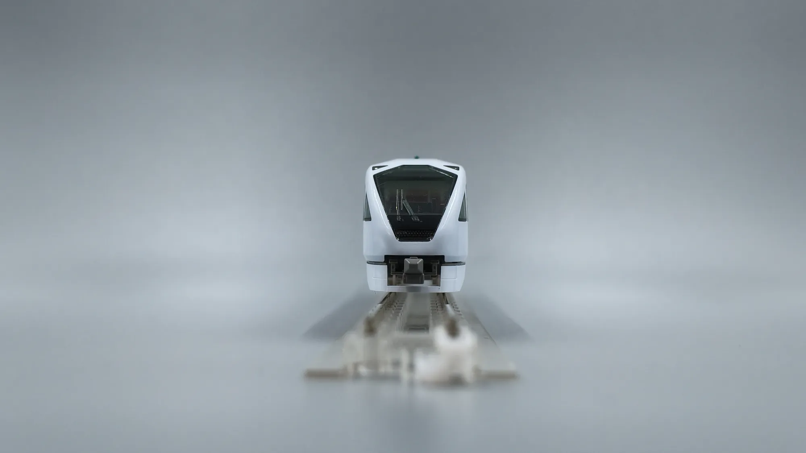

*正面。沒有色帶、沒有標誌，只剩下形狀*

回頭看整組車：幾乎沒有腰帶線、沒有色帶、沒有大面積企業識別色。所有的視覺重量都由開口的形狀、以及那條黑窗帶承擔。

這在模型上是很嚴苛的考驗——一台全白的車，任何一點分模線、任何一點塗裝不均都會被放大。從上面這幾張照片看，車體的白算是壓得很均勻，白色與屋頂灰的交界也很利落。

## 最後：便當也是一台 SPACIA X

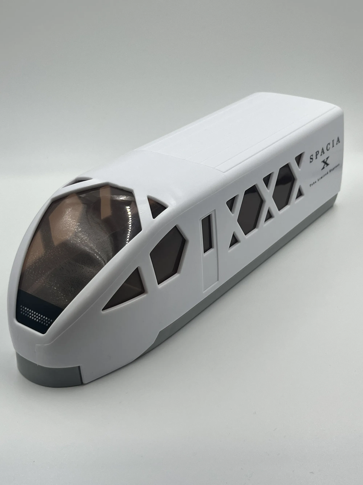

*便當盒。車窗變成透明蓋，裡面的菜色就是內裝*

然後是這個。

這是做成 SPACIA X 先頭車造型的鐵路便當——連車側的組子開口都照做，而且做了一件很聰明的事：**把六角形的車窗換成透明蓋**。於是從外面看，「窗戶裡面」透出來的不是座椅，是菜色。前頭那片大擋風玻璃同樣是透明的，等於整個駕駛室變成一個觀景窗。

車身側面「SPACIA X」與下方 `TOBU LIMITED EXPRESS` 的燙印、車頂到裙板的灰白分色、甚至前頭下方那塊網狀的排障器造型，全都被壓在一個塑膠成型件上。設計語彙從實車到 N 規模型再到便當盒，居然一路都成立——這大概就是一個造型夠強的證明。

吃完之後盒子當然是留下來了。

## 結語

一台車能不能被記住，通常不是看它跑多快。

N100 系的最高速度和很多同級的特急沒什麼差別，它被記住的原因，是它把「去日光」這件事整個當成一個作品在做：車體是東照宮的胡粉白，車窗是鹿沼的組子，車內是一間一間可以關上門的房，連便當盒都是同一個形狀。

從月台看它、從包廂裡看窗外、把 1:150 的它擺在桌上一節一節看，最後在便當盒上又看到同一個「X」——這台車在每一個尺度上都是同一件東西。
