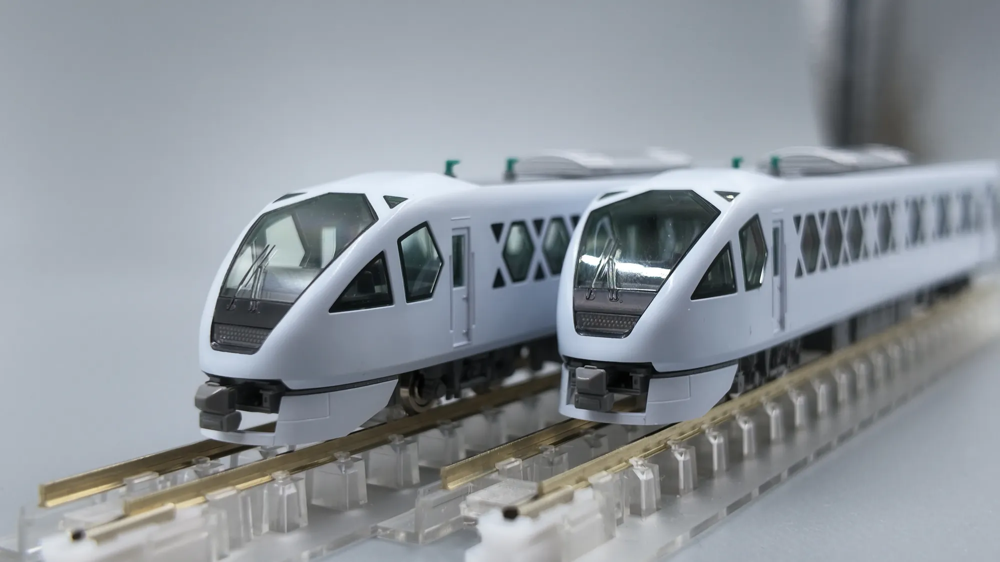

# 東武 N100 系 SPACIA X：把日光的白，摺進一列特急裡

有些列車你第一眼看到會覺得「這也太怪了」，然後越看越覺得有道理。東武鐵道的 N100 系「SPACIA X」對我來說就是這種車。

它接續的是 1990 年登場、跑了三十幾年的 100 系「SPACIA」——那台有著金色塗裝、圓潤前頭的日光特急代表作。N100 沒有走復刻路線，也沒有走「高鐵化」的流線路線，而是把整台車當成一件工藝品在做：白色車身、不對稱的側窗、以及那個從車體外側浮出來的巨大「X」。

## 這台車的規格速寫

| 項目 | 內容 |
| --- | --- |
| 形式 | 東武鐵道 N100 系（暱稱 SPACIA X） |
| 營運開始 | 2023 年 7 月 15 日 |
| 編成 | 6 輛編成，全編成 212 席 |
| 配置數 | 4 編成 24 輛（2023 年 2 編成、2024 年再 2 編成） |
| 最高速度 | 130 km/h |
| 車體 | 鋁合金 double skin 構造 |
| 製造 | 東武鐵道 × 日立製作所（A-train） |
| 控制方式 | 採用 hybrid SiC 元件的 VVVF 逆變器控制 |
| 主要運行區間 | 淺草 ～ 東武日光／鬼怒川溫泉 |

它也拿下了 2023 年度的 Good Design Award。看完下面的設計解析，大概會覺得這個獎不算意外。

## 胡粉白，與鹿沼組子的「X」

N100 最容易被誤讀的地方，是它的白。

那不是「新幹線那種乾淨的白」，而是刻意去對照日光東照宮陽明門、唐門所使用的**胡粉**——一種以貝殼研磨製成的傳統白色顏料。也就是說，這台車的顏色不是從「現代感」出發的，是從終點站那座世界遺產出發的。列車還沒到日光，車體已經先是日光的顏色了。

然後是側窗。

N100 的側面沒有一般特急那種整排等距的長窗，而是一組一組大小不一、帶著銳角的多邊形開口。這個造型取自沿線的傳統工藝——栃木鹿沼的**組子**細工，以及江戶的竹編細工。組子是不用釘子、純靠木片互相咬合排出幾何紋樣的技法，本來就是一種「用直線切出來的圖案」。把它放大成車體尺度，從車外看過去，窗框與窗框之間就會浮出一個一個的「X」。

車名裡的那個 X，不是行銷部門補上去的字母，是車體本身長出來的形狀。

## 六種座位，一列車

N100 真正離經叛道的地方在車內。6 輛編成裡塞了 **6 種**不同的座位，等於平均一輛車一種：

- **1 號車（淺草側）**：Cockpit Lounge ＋ Café Counter。沙發式的開放休息空間，配上真的可以點東西的咖啡吧檯。
- **2 號車**：Premium Seat。
- **3、4 號車**：Standard Seat。
- **5 號車**：Box Seat ＋ Standard Seat（含輪椅席）。
- **6 號車（東武日光側）**：全部都是包廂——4 人用的 Compartment 四間，加上 1 間 7 人用的 **Cockpit Suite**。

Cockpit Suite 是這台車的頂規，概念取自私人飛機：可移動的沙發、小桌，位置就在司機室後方，等於一整個編成端部只服務七個人。

這種「一列車裡放六種產品」的做法，在通勤導向的日本私鐵特急裡其實滿罕見的。多數特急是把座位標準化以求效率，N100 反過來，賭的是「去日光這件事本身值得被當成一段體驗賣」。

## 縮成 1:150

實車之外，這台車也是模型圈很受歡迎的題材——那個造型不做成模型實在太可惜了。

*先頭車的車體單獨拆下來看，設計語彙特別清楚*

把車殼從底盤上拆下來單獨看，反而比裝好的整車更能讀懂這台車的設計。側面那排開口在 1:150 的尺度下依然是實際挖穿、內側再貼上煙燻色窗片的，所以「X」是真的由實體的框構成，不是印上去的圖案。車身側面的「SPACIA X」標記與下方那行小小的 `TOBU LIMITED EXPRESS`，在指甲蓋大小的面積上還能維持筆畫，印刷水準相當可以。

前頭部也值得看：擋風玻璃是一整片大面積的曲面透明件，往下收到那個像是被削出來的鼻錐，底下再嵌一片深色的排障器造型與網狀開口。車頂與車身的分模線藏在灰色裙板的交界處，實體感因此比想像中好。

*兩節先頭車並排，車鼻的曲面在同一個光線下最容易比較*

兩節先頭車並排放在軌道上時，最明顯的是車鼻那個「不對稱的鈍」——SPACIA X 的前頭並不是左右完全鏡射的流線型，而是靠著擋風玻璃下緣的斜切、以及駕駛室側窗那塊斜向的黑色面，做出一種微妙的偏斜感。實車上這個角度不容易看到，模型放在桌面高度反而看得清楚。

車頂上那幾具淺灰色的空調與綠色的絕緣礙子，是白色車體上少數的色彩點綴。整台車幾乎沒有腰帶線、沒有色帶、沒有大面積企業識別色——所有的視覺重量都由開口的形狀承擔。這在模型上是很嚴苛的考驗：一台全白的車，任何一點分模線、任何一點塗裝不均都會被放大。

## 待續

這篇還會繼續長。之後會補上實車的照片，以及沿線的鐵路便當——畢竟搭日光特急不配個駅弁，總覺得少了什麼。
