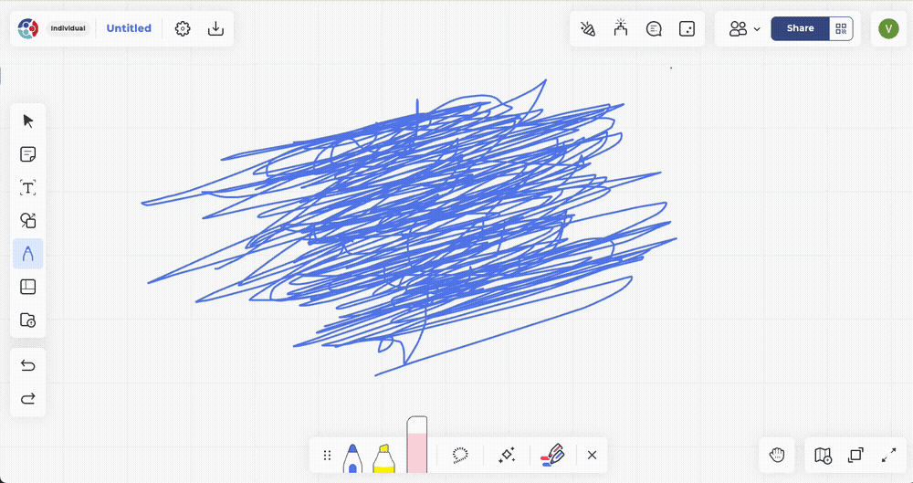
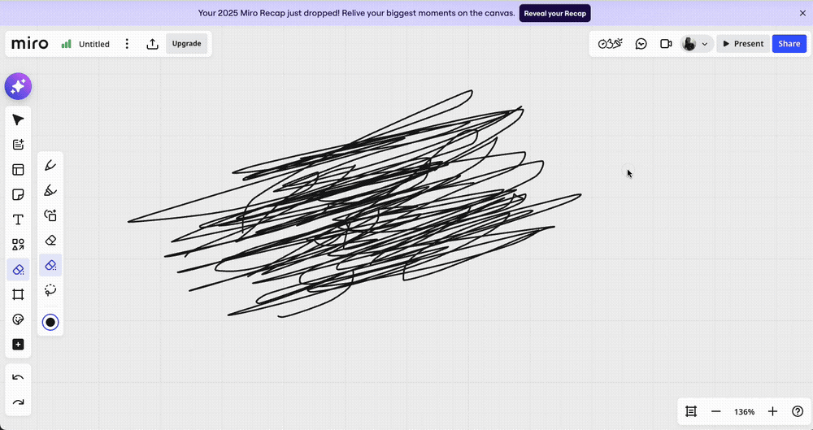

  <h1 class="resume-name">張永裕</h1>
  

    <a href="mailto:vntchang@gmail.com">vntchang@gmail.com</a>
    •
    +886 979-723-415
    •
    <a href="https://github.com/niuee" target="_blank">github.com/niuee</a>
    •
    臺北, 臺灣
  

## 工作經歷

### ViewSonic 優派科技 — 前端工程師

  2024年11月 - 至今
  •
  臺北, 臺灣

React • TypeScript • PixiJS • HTML Canvas • WebGL

**<a href="https://teamone.viewsonic.com" target="_blank">TeamOne</a>: 即時線上協作白板服務**

- 使用 **React**, **Next.js**, **TypeScript**, 和 **PixiJS** 開發並維護<a href="https://teamone.viewsonic.com" target="_blank">TeamOne</a>。
- 最佳化橡皮擦擦拭的計算方式，提供至少 30% 的效能提升，並且在使用體驗上不比 Miro 的精準橡皮擦遜色。
  

    <figure style="flex: 1; margin: 0; text-align: center;">
      
      <figcaption style="font-size: 0.85em; color: #666; margin-top: 4px;">TeamOne</figcaption>
    </figure>
    <figure style="flex: 1; margin: 0; text-align: center;">
      
      <figcaption style="font-size: 0.85em; color: #666; margin-top: 4px;">Miro</figcaption>
    </figure>
  

- 重構互動元素，將 DOM 元素轉換成 Canvas 元素，解決使用者操作同步問題，並減少主線程負載。
- 重新實作客製化 mesh ，用於同筆畫重疊筆跡時不疊加帶有透明色的色彩，消除色彩混合帶來的視覺瑕疵。
- 重構文字編輯器，將 Slate.js 轉換成 Lexical，提升未來功能開發的靈活性和可維護性。
- 與後端團隊合作，實作無需登入即可分享和協作白板的功能。

### <a href="https://www.jubohealth.com/home" target="_blank">Jubo 智齡科技</a> — 前端工程師

  2024年1月 - 2024年10月
  •
  10 個月
  •
  臺北, 臺灣

React • TypeScript • Golang • PostgreSQL • ASP.NET

- Maintained consumer-facing elderly care portal, [Jubo Care](https://www.jubo-care.com/), using **React**, **TypeScript**, and **Next.js**.
- 使用 **React**, **TypeScript**, 和 **Next.js** 開發和維護老年人照護平台 [Jubo Care 智齡照顧網](https://www.jubo-care.com/)。
- 使用 shaka-player，汰換 Azure Media Player，實作影音串流播放功能。
- 開發支援手機 APP、網頁 APP的跨平台畫面截圖匯出功能。
- 實作地區相關推播通知功能，並與資料團隊合作，半自動化資料爬蟲的流程。
- 支援後端團隊，以 **Golang** 開發相關 API。

### <a href="https://www.droxotech.com/" target="_blank">Droxo Tech 佐翼科技</a> — 軟體開發

  2021年1月 - 2022年7月
  •
  1 年 7 個月
  •
  臺南, 臺灣

Golang • TypeScript • MongoDB • React • ROS

**桶槽貼壁式檢測載具**

- 使用 **React**, **Electron**, 和 **threejs** 開發跨平台監控和視覺化應用程式，設計 **WebSocket**-based 的資料流和整合 **MongoDB** 儲存桶槽檢測數據。
- 整合外部測量儀器，實作桶槽貼壁式檢測載具的測量功能。

**農用植保機: 使用 ROS 整合感測器和飛行控制系統**

- 結合 GPS 和雜草熱點分析，使用 ROS 整合感測器和飛行控制系統，最佳化農用植保機的噴灑方式。
- 使用 arUco tags 實作無人機精準降落。
- 自動化飛行日誌處理。

## 學歷

### 普渡大學 Purdue University — 機械工程學士

  2014年8月 - 2018年12月
  •
  印第安納州 西拉法葉, 美國

因為系選修誤打誤撞，選了許多資工系的課程，之後照著資工系的輔系學程修了：資料結構、演算法、離散數學等課程，奠定了未來在資工領域探索的基礎。

## 技術能力

  <strong>程式語言:</strong> Java, C/C++, JavaScript/TypeScript, Golang, Python, PHP, HTML, CSS

  <strong>框架 & 函式庫:</strong> Express.js, Django, React, Electron.js, GraphQL

  <strong>工具 & 技術:</strong> Git, Mocha, JUnit, Jest, PostgreSQL, MongoDB

  <strong>語言:</strong> 中文 (母語), 英文 (流利)

## 個人專案

### <a href="https://github.com/ue-too/ue-too" target="_blank">ue-too</a>

This is a HTML canvas toolkit for creating interactive HTML canvas applications. It consists of the following components (all of the packages are organized in a monorepo on <a href="https://github.com/ue-too/ue-too" target="_blank">GitHub</a>):

一系列用來快速開發 HTML canvas 應用程式的工具，全部的 packages 都放在同一個 monorepo 裡面，原始碼放在 [GitHub](https://github.com/ue-too/ue-too)。每個套件也有發佈到 npm 上，如果有興趣可以去看看。 

套件列表:

- <a href="https://github.com/ue-too/board" target="_blank"><strong>board</strong></a>: HTML canvas 視窗管理工具（使 canvas 可以被縮放、平移、與旋轉）
- <a href="https://github.com/ue-too/ue-too/tree/main/packages/being" target="_blank"><strong>being</strong></a>: 有限狀態機的實作
- <a href="https://github.com/ue-too/ue-too/tree/main/packages/animate" target="_blank"><strong>animate</strong></a>: 動畫插值相關工具。
- <a href="https://github.com/ue-too/ue-too/tree/main/packages/curve" target="_blank"><strong>curve</strong></a>: 貝茲曲線相關計算工具。
- <a href="https://github.com/ue-too/ue-too/tree/main/packages/math" target="_blank"><strong>math</strong></a>: 2D 向量相關計算工具。

### <a href="https://github.com/ue-too/ue-too/tree/main/apps/banana" target="_blank"><strong>banana</strong></a>

這是目前我投入最多時間的 side project。目標是打造一個網頁版的都市建造遊戲，目前主要聚焦在鐵道系統的建設。

### 網頁版的賽馬模擬賽馬

以下一系列的專案最終會整合成一個網頁版的賽馬模擬遊戲。

- <a href="https://github.com/niuee/hrphysics-simulation" target="_blank"><strong>HR Physics Simulation</strong></a>: 簡化過的賽馬物理模擬實作。
- <a href="https://github.com/niuee/hrGraphql" target="_blank"><strong>HR GraphQL Server</strong></a>: 使用 gqlgen 實作的賽馬資料 graphql API。
- <a href="https://github.com/niuee/hrcrawler" target="_blank"><strong>HR Crawler</strong></a>: 使用 BeautifulSoup 實作的賽馬資料爬蟲，部分資料會被用於 graphql API。
- <a href="https://github.com/niuee/hrracetrack-maker" target="_blank"><strong>HR Racetrack Maker</strong></a>: 使用貝茲曲線編輯器實作的賽馬軌道編輯器。

